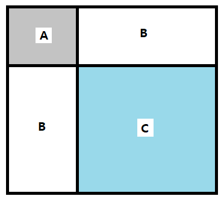

---
title: "11660 구간 합 구하기5 풀이"
categories: Algorithm
comments: true
---

## 사용언어
 > Visual studio 2019 C++ 

구간합을 모르고 풀었을 때에는 잘못된 풀이로 시간초과가 났다.

```c++
#include <iostream>

#define endl "\n"
using namespace std;

int N, M;
int arr[1025][1025];

void init() {
	ios::sync_with_stdio(false);
	cin.tie(0);
	cout.tie(0);
}

int main() {
	init();
	cin >> N >> M;

	for (int i = 1; i <= N; i++)
		for (int j = 1; j <= N; j++)
			cin >> arr[i][j];

	while (M--) {
		int x1, y1, x2, y2;
		cin >> y1 >> x1 >> y2 >> x2;
		int result = 0;

		for (int i = 1; i <= N; i++)
			for (int j = 1; j <= N; j++)
				if (i >= y1 && i <= y2 && j >= x1 && j <= x2)
					result += arr[i][j];

		cout << result << endl;
	}
}
```


## 생각하기
 이차원 배열의 구간합

  

 C = (A+B) + (A+B) - A = A + 2B

```
예제
1 2 3 4               1   3    6   10
2 3 4 5      - >     3   8   15  24
3 4 5 6               6   15  27  42
4 5 6 7              10  24  42  64

(2,2) ~ (3,4) 의 합
 : 42 - 10 - 6 + 1 = 27
```


## [14501 풀이]

```c++
#include <iostream>
#define endl "\n"
using namespace std;

int N, M;
int arr[1025][1025];

void init() {
	ios::sync_with_stdio(false);
	cin.tie(0);
	cout.tie(0);
}

int main() {
	init();
	cin >> N >> M;
	for (int i = 0; i < N; i++) {
		for (int j = 0; j < N; j++) {
			int n;
			cin >> n;

			arr[i + 1][j + 1] = arr[i + 1][j] + arr[i][j + 1] - arr[i][j] + n;
		}
	}

	for (int i = 0; i < M; i++) {
		int y1, x1, y2, x2;
		cin >> y1 >> x1 >> y2 >> x2;

		cout << arr[y2][x2] - arr[y1 - 1][x2] - arr[y2][x1 - 1] + arr[y1 - 1][x1 - 1] << endl;
	}
}
```