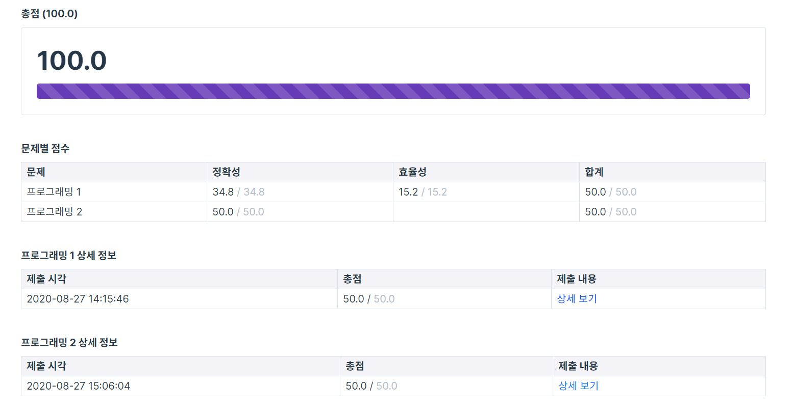

---
title: "프로그래머스(programmers) 스킬체크 레벨 2 (올바른 괄호 + 압축)"
categories: Algorithm
comments: true
---

## 사용언어
 > Visual studio 2019 C++  

## 1번. 올바른 괄호

이 문제는 BOJ난이도로 봐도 브론즈 레벨같은 stack문제ㅎㅎ!  
괄호가 짝지어서 잘 되어있는지를 true false로 나타내는 문제였음  
stack 없이도 stack size를 int형 cnt변수로 ++ --로 하면 더 간단히 풀 수 있을듯  
문제 풀 당시에는 아무생각없이 stack씀ㅜㅜ;;  

```c++
#include <string>
#include <stack>

using namespace std;

bool solution(string s) {
	bool answer = true;
	stack<char> st;

	for (int i = 0; i < s.size(); i++) {
		if (s[i] == ')') {
			if (st.size() == 0) {
				answer = false;
				break;
			}
			else
				st.pop();
		}
		else
			st.push(s[i]);
	}

	if (st.size() > 0)
		answer = false;

	return answer;
}
```


## 2번. 압축

이 문제는 어피치라구 써있는걸 보자마자 설마 카카오 문제인가.. 했는데 카카오문제였다..ㄷㄷ  
kakao tech 직접 문제보러가기 ->  <https://tech.kakao.com/2017/11/14/kakao-blind-recruitment-round-3/>  
1차 2차를 거친 3차 코테인지라 고수들만 모여서 정답률은 무려 95.8% ㄷㄷ  
엄청나게 잘짠 코드는 아니지만 그냥 무난한 코드같지않나요...?(응아님)

```c++
#include <string>
#include <vector>
#include <map>

using namespace std;

vector<int> solution(string msg) {
    vector<int> answer;
    map<string, int> m;
    int idx = 27;

    string ss = "";

    for (int i = 0; i < msg.size(); i++) {
        ss = "";
        ss += msg[i];
        ss += msg[i + 1];

        int j = 2;
        if (m.count(ss) > 0) {
            while (1) {
                ss += msg[i + j];
                if (m.count(ss) > 0) {
                    j++;
                }
                else {
                    answer.push_back(m[ss.substr(0, ss.length() - 1)]);
                    break;
                }
            }
            m.insert({ ss, idx++ });
            i += j - 1;
        }
        else {
            answer.push_back(msg[i] - 'A' + 1);
            m.insert({ ss, idx++ });
        }
    }
    return answer;
}
```

이렇게 스킬체크 Level 2 성공

