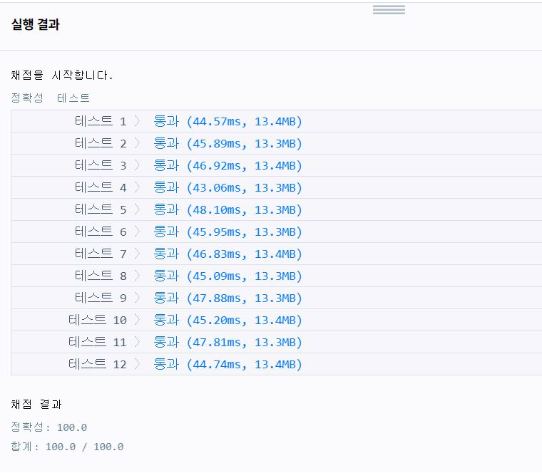

---
title: "프로그래머스(programmers) 소수 찾기 풀이"
categories: Algorithm
comments: true
---

## 사용언어
 > Visual studio 2019 C++  

프로그래머스로 푼지는 일주일도 안되었지만 느낀점은... 프로그래머스 레벨..?  
프로그래머스는 백준보다 레벨에 비해 좀 어려운거같다...ㅠㅠ  
이 문제도 level 2인데 체감은 실버 2 ~ 골드5정도 되는거같은...

## 소수찾기  

이 문제의 주어지는 테스트 케이스만으로는 약간의 오류를 범할 수 있는데  
"17" "011" 은 모두 자릿수가 낮고 두자리수로 소수들이 나타난다!  
그래서 반만 맞았을 수도 있다! 그럴때는 내 풀이를 보지말구 "7843"  
이 테스트 케이스에 12가 정답이 나오도록 해보는건 어떨까?  
아니면 2가 소수가 아니라구 생각한건 아닐까??  

아니라면 풀이보삼..

```c++
#include <string>
#include <vector>
#include <cstring>
#include <math.h>
#include <algorithm>
#include <iostream>

using namespace std;

vector<int> v;
bool visited[8];
bool arr[10000000];
vector<int> ans;

void sosu_find(int a, int idx, int tidx) {
	if (idx == tidx) {
		if (arr[a]) {
			// test case를 보면 11이 두번나올수 있는데 
			// 한번으로 계산되어있음으로 중복허용X
			if (find(ans.begin(), ans.end(), a) == ans.end()) // 찾지못했을 경우에만 넣기
				ans.push_back(a);
		}
		return;
	}

	int d = a * 10;
	for (int i = 0; i < v.size(); i++) {
		if (!visited[i]) {
			d += v[i]; 
			visited[i] = true;
			sosu_find(d, idx + 1, tidx);
			visited[i] = false;
			d -= v[i]; // 더했으면 다음for문을 위해 꼭 빼주기 안빼줘서 반만 맞았었음!ㅋㅋ
		}
	}
}

void sosu() { // 소수찾기
	memset(arr, true, sizeof(arr));
	arr[1] = false;
	for (int i = 2; i <= sqrt(10000000); i++)
		if (arr[i])
			for (int j = i + i; j < 10000000; j += i)
				arr[j] = false;
}

int solution(string numbers) {
	sosu();
	int answer = 0;
	for (int i = 0; i < numbers.size(); i++)
		v.push_back(numbers[i] - '0');

	for (int i = 1; i <= numbers.size(); i++) {
		for (int j = 0; j < numbers.size(); j++) {
			if (v[j] != 0) { // 첫번째 자리에 0이 올필욘 없다고 문제에서 주어짐 011 = 11
				visited[j] = true;
				sosu_find(v[j], 1, i);
				visited[j] = false;
			}
		}
	}
	answer = ans.size();
	return answer;
}

 // test해볼려고 만든 부분 없애고 제출해야됨!
int main() {
	int d = solution("7843"); // 12나와야됨
	cout << d;
}
```

테스트케이스가 어떻든 시간이랑 용량이 비슷하당...ㅎㅅㅎ 패스!

