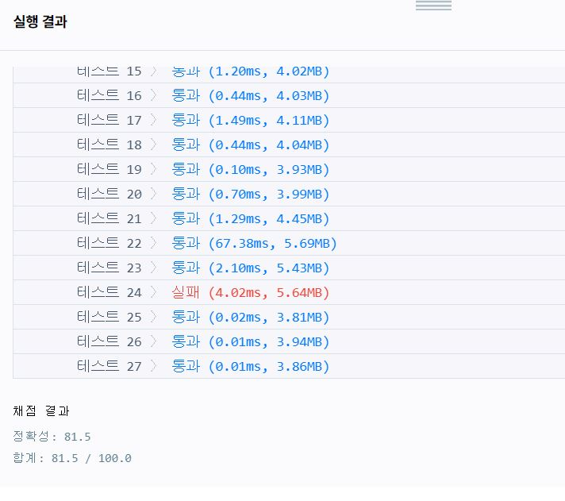
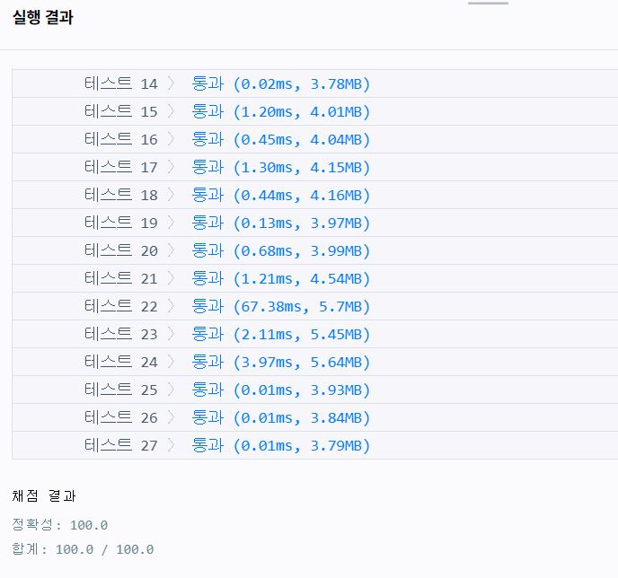

---
title: "프로그래머스(programmers) 2019 KAKAO BLIND RECRUITMENT 실패율 풀이"
categories: Algorithm
comments: true
---

## 사용언어
 > Visual studio 2019 C++  

## 실패율

문제를 풀었는데 초반에는 6, 7, 9, 13, 24번 문제가 틀려서 81.5점으로 틀렸었다.



질문하기에서 반례들과 예외처리부분에 대한 질문들을 읽고 해답을 찾았다.  
문제를 푼사람이 없으면 나누기 0은 에러값이 나오게된다.  
이 부분을 예외처리 해주면 해결된다!  

```c++
#include <string>
#include <vector>
#include <algorithm>
#include <iostream>

using namespace std;

int s[200001];
int num[200001];
pair<double, int> rst[200001];

bool compare(pair<double, int> a, pair<double, int> b) {
	if (a.first > b.first)
		return true;
	else if (a.first == b.first)
		return a.second < b.second;
	else
		return false;
}

vector<int> solution(int N, vector<int> stages) {
	for (int i = 0; i < stages.size(); i++) {
		for (int j = 1; j <= stages[i]; j++) {
			if (j > N)
				break;
			num[j]++;
		}
		if (stages[i] > N)
			continue;
		s[stages[i]]++;
	}
	
	for (int i = 1; i <= N; i++) {
		if (s[i] == 0 && num[i] == 0) {
			rst[i] = make_pair(0, i);
			continue;
		}
		rst[i] = make_pair((double)s[i] / num[i], i);
	}
	sort(rst + 1, rst + N + 1, compare);

	vector<int> answer;
	for (int i = 1; i <= N; i++)
		answer.push_back(rst[i].second);

	return answer;
}

////// 이 부분은 answer을 확인하기위해 넣어놓은 부분이다^^ 없애고 제출해야함! //////
int main() {
	vector<int> ss;
	/*ss.push_back(2);
	ss.push_back(1);
	ss.push_back(2);
	ss.push_back(6);
	ss.push_back(2);
	ss.push_back(4);
	ss.push_back(3);
	ss.push_back(3);*/

	// 이 부분이 예외가 되는 부분
	// result = 7 6 5 4 3 2 1 8 
	ss.push_back(1);
	ss.push_back(2);
	ss.push_back(3);
	ss.push_back(4);
	ss.push_back(5);
	ss.push_back(6);
	ss.push_back(7);

	vector<int> result = solution(8, ss);

	for (int i = 0; i < result.size(); i++)
		cout << result[i] << " ";
}
```

통 과 ~  
