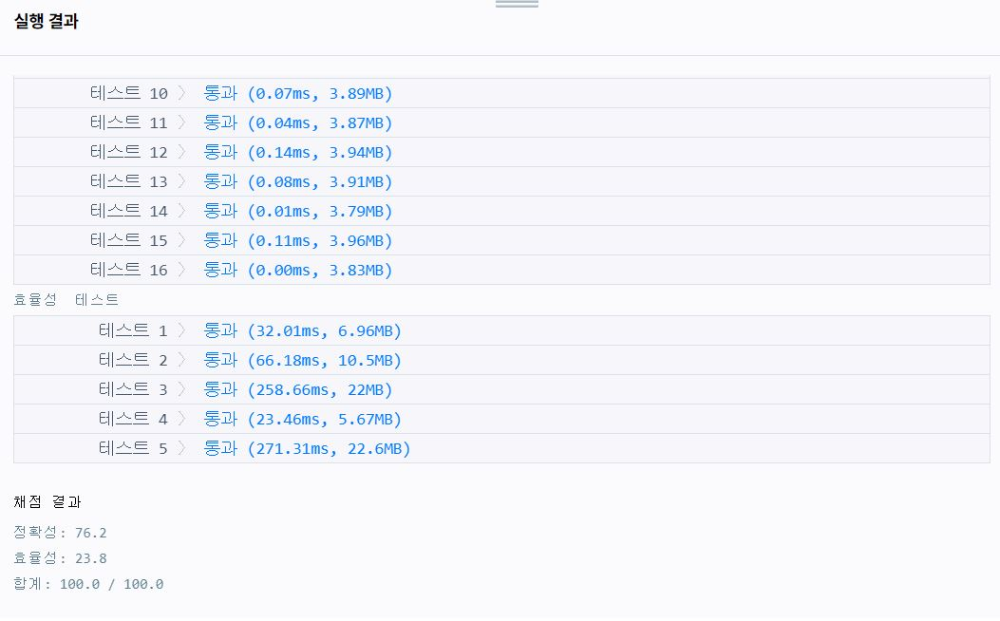

---
title: "프로그래머스(programmers) 더 맵게 풀이"
categories: Algorithm
comments: true
---

## 사용언어
 > Visual studio 2019 C++  

문제링크 : <https://programmers.co.kr/learn/courses/30/lessons/42626>

## 더 맵게 풀이

이 문제를 처음봤을 때는 vector에 sort를 해야되는건가 라고생각하고 풀고있었다.  
근데 한 5분쯤 풀면서 문제를 다시 보는데 그렇게 풀게되면 너무 효율적이지 못한것 같다고 느꼈다.  

그래서 사용한 방법이 `priority_queue` 이다!  
모든 원소를 집어넣고 제일작은 원소와 두번째로 작은원소를 뺀 후 공식에 맞게 계산후 다시 집어넣으면 알아서 정렬해주니까 !!

```c++
#include <vector>
#include <algorithm>
#include <queue>

using namespace std;

int solution(vector<int> scoville, int K) {
	priority_queue<int, vector<int>, greater<int>> pq; // 작은숫자부터 정렬!
	for (int i = 0; i < scoville.size(); i++)
		pq.push(scoville[i]);

	int answer = 0;
	while (1) {
		// pq의 size가 한개남았는데 top의 숫자가 K보다 작은경우 -1
		if (pq.size() == 1 && pq.top() < K)
			return -1;

		// 가장 작은수가 K이상이면 break 
		if (pq.top() >= K)
			break;

		int a = pq.top(); pq.pop();
		int b = pq.top(); pq.pop();
		pq.push(a + b * 2);
		answer++;
	}
	return answer;
}
```



간단한 문제는 빨리빨리 생각하고 풀수있게 좀더 화팅!!!