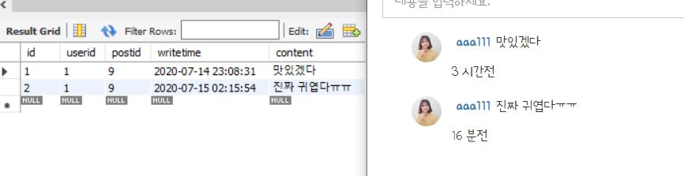

---
title: "JavaScript(자바스크립트) 날짜차이 계산하기 - timestamp를 new date로 바꾸기"
categories: Javascript_jQuery
comments: true
---

인스타그램 따라 만들다가 날짜 차이 계산하는게 많이 필요해서 작성하는 글  

## timestamp -> new date객체
db에 timestamp로 저장했더니 `2020-07-14T14:08:31.000+00:00` 이런식으로 date값이 저장된다.  

new date() 객체의 경우에는 `Tue Jul 14 2020 23:08:31 GMT+0900 (대한민국 표준시)` 이런식으로 나오게되고
date.getTime()과 같은 함수를 사용할 수 있다. (timestamp는 사용안되더라.. JS 기초가 없어서 안되는지도 몰랐음..)


```javascript
var date = value.writetime; // 작성시간 2020-07-14T14:08:31.000+00:00
var w_date = new Date(date.valueOf());
var w_time = w_date.getTime();

var cur = new Date(); // 현재시간
var c_time = cur.getTime();
```

## 날짜 차이계산

이제 차이를 구해보자~  
근데 완전 정확하진 않음 한달이 30일 31일인 날도 있는데 30일을 기준으로 했음  
정확하게 계산하면 넘 복잡...ㅠㅠ  

```javascript
var chai = c_time - w_time;

if(chai < 1000 * 60)
	a += Math.floor(chai / 1000) + ' 초전';
else if(chai < 1000 * 60 * 60)
	a += Math.floor(chai / (1000 * 60)) + ' 분전';
else if(chai < 1000 * 60 * 60 * 24)
	a += Math.floor(chai / (1000 * 60 * 60)) + ' 시간전';
else if(chai < 1000 * 60 * 60 * 24 * 30)
	a += Math.floor(chai / (1000 * 60 * 60 * 24)) + ' 일전';
else if(chai < 1000 * 60 * 60 * 24 * 30 * 12)
	a += Math.floor(chai / (1000 * 60 * 60 * 24 * 30)) + ' 달전';
```


  

이렇게 하면 해결된다... 벌써 두시반 ㅠㅠ 이거때매 2시간 멍때림ㅎㅠㅎ  