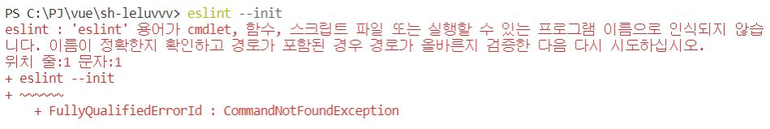
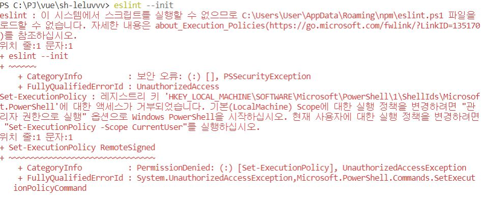
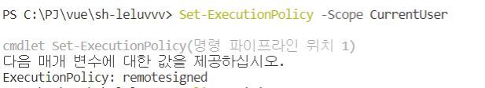
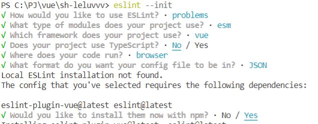

---
title: "[vue.js] 설치중 power shell에서 eslint --init 이 안되는경우"
categories: error
comments: true
---

eslint : 'eslint' 용어가 cmdlet, 함수, 스크립트 파일 또는 실행할 수 있는 프로그램 이름으로 인식되지 않습  
니다. 이름이 정확한지 확인하고 경로가 포함된 경우 경로가 올바른지 검증한 다음 다시 시도하십시오.  
위치 줄:1 문자:1  
+ eslint --init  
+ ~~~~~~  
    + FullyQualifiedErrorId : CommandNotFoundException  

 -> 위와 같이 뜰경우

` npm install -g eslint ` 을 해준다 

그러고 다시 `eslint --init` 을 실행했는데 또....

eslint : 이 시스템에서 스크립트를 실행할 수 없으므로 C:\Users\User\AppData\Roaming\npm\eslint.ps1 파일을  
로드할 수 없습니다. 자세한 내용은 about_Execution_Policies(https://go.microsoft.com/fwlink/?LinkID=135170   
)를 참조하십시오.  
위치 줄:1 문자:1  
+ eslint --init  
+ ~~~~~~  
    + CategoryInfo          : 보안 오류: (:) [], PSSecurityException  
    + FullyQualifiedErrorId : UnauthorizedAccess  
authorizedAccess : 'authorizedAccess' 용어가 cmdlet, 함수, 스크립트 파일 또는 실행할 수 있는 프로그램 이
름으로 인식되지 않습니다. 이름이 정확한지 확인하고 경로가 포함된 경우 경로가 올바른지 검증한 다음 다시 시
도하십시오.  
위치 줄:1 문자:1  
+ authorizedAccess  
+ ~~~~~~~~~~~~~~~~  
    + CategoryInfo          : ObjectNotFound: (authorizedAccess:String) [], CommandNotFoundException  
    + FullyQualifiedErrorId : CommandNotFoundException  

이런 보안오류가 뜨면...

`Set-ExecutionPolicy -Scope CurrentUser` -> `remotesigned` 입력해주면 드디어 실행된다...^^

