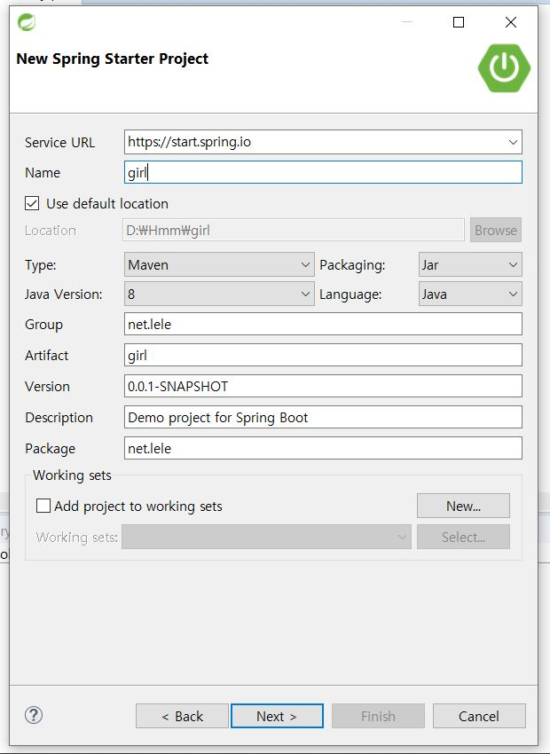
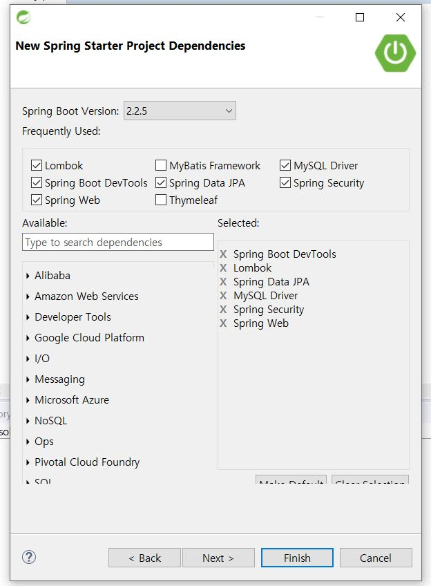
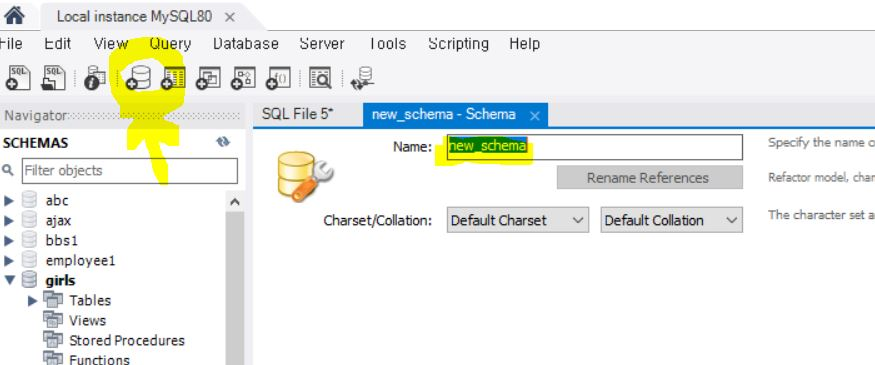
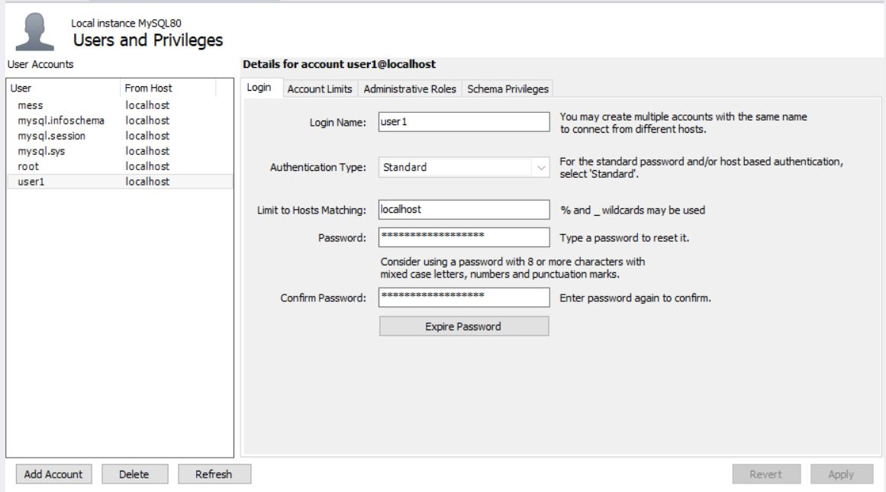
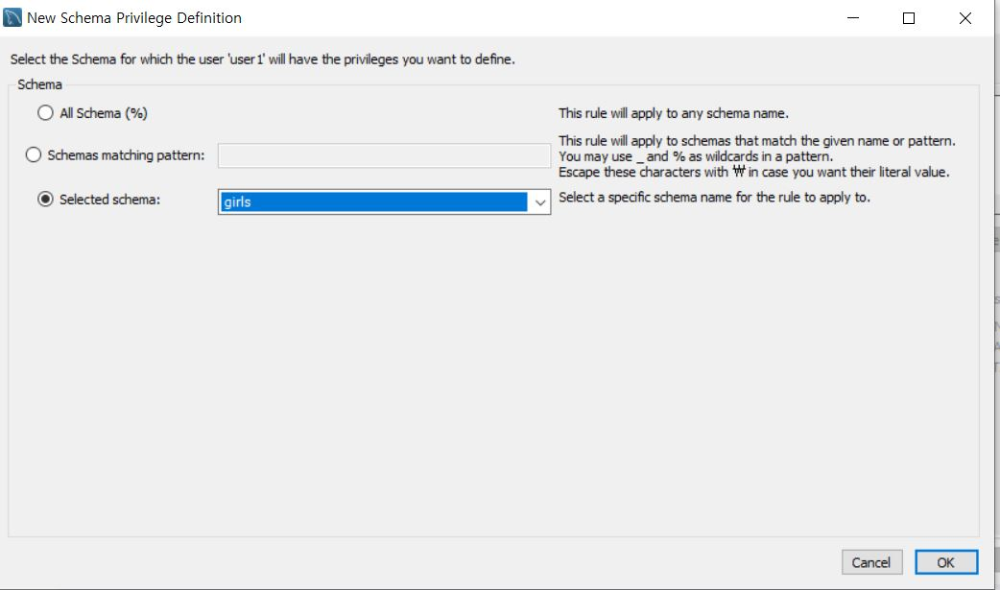
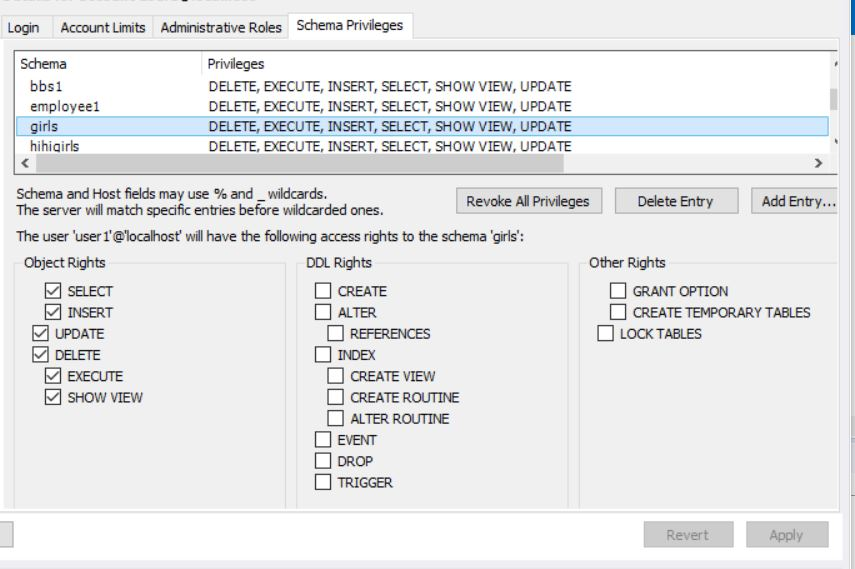

---
title: "spring boot & jpa & mysql & jsp 쇼핑몰 만들기(1)"
date: 2020-03-03 00:55:35 -0400
categories: springboot
comments: true
---

spring boot에 jpa와 mysql을 사용해서 쇼핑몰만들기를 포스팅해봅니당
sts3, mysql, jpa, jsp를 사용하였습니다.

## 1) Spring boot 프로젝트 만들기
File -> new -> spring starter project 를 선택하고




finish 버튼을 눌러줍니당!

## 2) MySQL에서 프로젝트에 쓸 schema/table 만들기

mysql workbench로 들어가서 쇼핑몰만들기를 할때 사용할 schema를 생성해볼게요.



동그라미표시한걸 누르고 Name에 schema이름을 설정합니다. 그러고 오른쪽아래에 apply를 눌러줄게요!

위에 Server > Users and Privileges 클릭합니다


Add Account를 해서 Login Name: user1으로하고 비밀번호를 설정해두고 기억합시당!
 Schema Privileges로 들어가서 Add Entry...를 클릭합니다


schema를 선택한뒤 ok를 눌러줍니다.


object Rights를 모두 선택한뒤 apply를 해줍니다 그러면 mysql설정 끝!!!

## 3) Spring boot application.properties/기본 설정

다시 sts로 들어와서 src > main > resources > application.properties 를 클릭합니다.

```html
spring.mvc.view.prefix=/WEB-INF/views/
spring.mvc.view.suffix=.jsp
spring.datasource.driver-class-name=com.mysql.jdbc.Driver
spring.datasource.url=jdbc:mysql://localhost:3306/your_schema_name?useUnicode=yes&zeroDateTimeBehavior=convertToNull&characterEncoding=UTF-8&allowMultiQueries=true&serverTimezone=Asia/Seoul
spring.datasource.username=user1
spring.datasource.password=your db_password
spring.jpa.hibernate.naming.physical-strategy=org.hibernate.boot.model.naming.PhysicalNamingStrategyStandardImpl
logging.level.org.hibernate.SQL=DEBUG
logging.level.org.hibernate.type.descriptor.sql.BasicBinder=TRACE
server.session.timeout = 600
```
이렇게 설정해줍니다 당연히 schema_name과 db_password는 자기걸로 바꿀게요!

`spring.mvc.view.prefix=/WEB-INF/views/` // 기본 view가 위치하는곳

`spring.mvc.view.suffix=.jsp` // 기본 view로 jsp를 사용한다

`server.session.timeout = 600` //세션이 600초(10분)이 되면 자동으로 만료된다

your_schema_name과 db_password를 자신의 것으로 설정하구 저장합니당

src > main 에 webapp/WEB-INF/views 폴더를 생성한다.

pom.xml로 가서 
```
<dependency>
  <groupId>org.springframework.security</groupId>
  <artifactId>spring-security-taglibs</artifactId>
</dependency>    
<dependency>
	<groupId>jstl</groupId>
	<artifactId>jstl</artifactId>
	<version>1.2</version>
</dependency>
```

 - Security
  spring security 확장 태그 라이브러리

 - JSTL
  JSTL 확장 태그를 사용하기 위해서 필요한 라이브러리 입니다. (ex. <c:forEach><c:if> )


스프링부트는 mvc에 비해 이미 설정된것이 많아서 기본 설정하는 부분은 좀 적다.!! 그럼안뇽뿅>_< 
