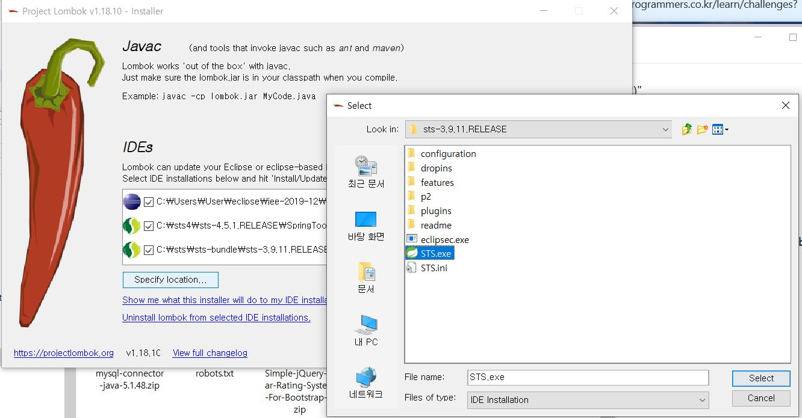

spring boot 쇼핑몰만들기 !
sts3, mysql, jpa, jsp를 사용하였습니다.

## 1) Mysql User테이블 생성하기
 workbench 로 와서 생성한 schema를 열고 Tables를 오른쪽마우스로 클릭 후 create table !

 

 이와 같이 작성해줍니다 그리고 apply > apply 

## 2) lombok 설치
 lombok은 getter, setter 메소드를 자동으로 생성해줘서 구현하지 않아도 된다
 
 클래스에  `@Data` 어노테이션만 붙여주면 된다!

 먼저, https://projectlombok.org/download.html 로 가서 lombok.jar를 다운로드한다

  

 lombok.jar를 열고 위에 사진처럼 specify location... > sts설치폴더에서 sts.exe를 클릭하고 select한다

 빠른시간에 설치가 완료되었다 설치가 되었는지 확인하고싶으면

 

sts폴더로 가서 STS.ini / SpringToolSuite3.ini 파일의 내용에서 형광팬친 부분이 있으면 성공 없으면 입력한다


## 3) Java 클래스 구현
### 1. JPA Entity 클래스 구현
 db에 생성했던 user 테이블을 설정해볼게요

 위치: src/main/java/net/lele/domain/User.java

 - User.java 

```java
package net.lele.domain;

import javax.persistence.Entity;
import javax.persistence.GeneratedValue;
import javax.persistence.GenerationType;
import javax.persistence.Id;

import lombok.Data;

@Data
@Entity
public class User {
	@Id //primary key설정
	@GeneratedValue(strategy = GenerationType.IDENTITY) //Auto increment설정
	int id;

	int enable;
	String userId;

	String password;
	String userType;
	String name;
	String email;
	String phone;
	String address;
	String address_detail;
	int postcode;
	String addrplus;
}
```  

### 2. Repository 클래스 구현

 위치: src/main/java/net/lele/repository/UserRepository.java

 - UserRepository.java

```java
package net.lele.repository;

import org.springframework.data.jpa.repository.JpaRepository;

import net.lele.domain.User;

public interface UserRepository extends JpaRepository<User, Integer> {

	User findOneByUserId(String userId); 
	// User 테이블에서 userId필드로 레코드를 조회하는 메소드
	// jpa query creation 기능에 의해 이 메소드가 자동으로 구현된다
	// 혹시 DB에 userId로 조회한 레코드가 2개 이상이면 이 메소드는 에러가 발생한다	

	User findByUserId(String userId);
}
```

### 3. Utility 클래스
 - 유틸리티 클래스는 뭐에요!!
  여러 프로젝트에서 공통으로 사용될 수 있는 범용 기능을 구현한 클래스

  비밀번호 암호화등 암호화/복호화 기능을 유틸리티 클래스에 모아서 구현

 위치: src/main/java/net/lele/utils/EncryptionUtils.java

 - EncryptionUtils.java

```java
package net.lele.utils;

import java.security.MessageDigest;

public class EncryptionUtils {

	public static String encryptSHA256(String s) { // 이게 더 강력함
		return encrypt(s, "SHA-256");
	}

	public static String encryptMD5(String s) {
		return encrypt(s, "MD5");
	}

	public static String encrypt(String s, String messageDigest) {
	// messageDigest 파라미터
	// 이 파라미터는 암호화 알고리즘을 지정한다
		try {
			MessageDigest md = MessageDigest.getInstance(messageDigest);
			//SHA-256 or MD5 알고리즘 지정가능
			byte[] passBytes = s.getBytes();
			md.reset();
			byte[] digested = md.digest(passBytes);
			StringBuffer sb = new StringBuffer();
			for (int i = 0; i < digested.length; i++)
				sb.append(Integer.toHexString(0xff & digested[i]));
			return sb.toString();
		} catch (Exception e) {
			return s;
		}
	}
}
```

### 4. Service 클래스
 - 서비스 클래스는 또 뭐에요!
  컨트롤러 클래스에 구체적인 작업내용이 아닌 지휘 통제에 해당하는 코드만 들어있어야한다.
구체적인 작업 내용은 서비스 클래스에 구현되어야 한다.

 위치: src/main/java/net/lele/service/UserService.java

 - UserService.java

```java
package net.lele.service;

import java.util.List;

import org.springframework.beans.factory.annotation.Autowired;
import org.springframework.stereotype.Service;
import org.springframework.validation.BindingResult;

import net.lele.domain.User;
import net.lele.model.UserRegistrationModel;
import net.lele.repository.UserRepository;
import net.lele.utils.EncryptionUtils;

@Service
public class UserService {
	@Autowired
	UserRepository userRepository;
	
	public User login(String userId, String password) {
		User user = userRepository.findOneByUserId(userId);
		if (user == null)
			return null;
		String pw = EncryptionUtils.encryptMD5(password); 
		// 패스워드를 암호화해서 암호화되서 저장된 db와 비교한다

		if (user.getPassword().equals(pw) == false)
			return null;
		return user;
	}

	public boolean hasErrors(UserRegistrationModel userModel, BindingResult bindingResult) {
		if (bindingResult.hasErrors())
			return true;
		if (userModel.getPasswd1().equals(userModel.getPasswd2()) == false) {
			bindingResult.rejectValue("passwd2", null, "비밀번호가 일치하지 않습니다.");
			return true;
		}

		User user = userRepository.findOneByUserId(userModel.getUserid());
		if (user != null) {
			bindingResult.rejectValue("userid", null, "사용자 아이디가 중복됩니다.");
			return true;
		}
		return false;
	}

	public User createEntity(UserRegistrationModel userModel) {
		User user = new User();
		String pw = EncryptionUtils.encryptMD5(userModel.getPasswd1());
		user.setUserId(userModel.getUserid());
		user.setPassword(pw);
		user.setUserType("user");
		user.setEnable(1);
		user.setEmail(userModel.getEmail());
		user.setAddress(userModel.getAddress());
		user.setName(userModel.getName());
		user.setPhone(userModel.getPhone());
		user.setAddress_detail(userModel.getAddress_detail());
		user.setPostcode(userModel.getPostcode());
		user.setAddrplus(userModel.getAddrplus());
		return user;
	}

	public void save(UserRegistrationModel userModel) {
		User user = createEntity(userModel);
		userRepository.save(user);
	}
}
```
 회원가입과 로그인 기능을 사용하기 위한 코드들이다.


 위치: src/main/java/net/lele/service/MyAuthenticationProvider.java

 - MyAuthenticationProvider.java

```java
package net.lele.service;

import java.util.ArrayList;
import java.util.List;

import org.springframework.beans.factory.annotation.Autowired;
import org.springframework.security.authentication.AuthenticationProvider;
import org.springframework.security.authentication.UsernamePasswordAuthenticationToken;
import org.springframework.security.core.Authentication;
import org.springframework.security.core.AuthenticationException;
import org.springframework.security.core.GrantedAuthority;
import org.springframework.security.core.authority.SimpleGrantedAuthority;
import org.springframework.stereotype.Component;

import net.lele.domain.User;

// 사용자가 입력한 로그인 아이디와 비밀번호를 검사할 때 사용되는 클래스
@Component
public class MyAuthenticationProvider implements AuthenticationProvider {

    @Autowired UserService userService;

    @Override
    public Authentication authenticate(Authentication authentication) throws AuthenticationException {
        String loginId = authentication.getName();
        String passwd = authentication.getCredentials().toString();
        return authenticate(loginId, passwd);
    }
    // 사용자가 입력한 로그인 아이디와 비밀번호를 검사해야 할 때 자동으로 호출
    // 사용자가 입력한 로그인 아이디와 비밀번호가 이 메소드의 파라미터로 전달됨

    public Authentication authenticate(String loginId, String password) throws AuthenticationException {
        User user = userService.login(loginId, password);
        if (user == null) return null; //검사가 실패하면 null 리턴

        List<GrantedAuthority> grantedAuthorities = new ArrayList<GrantedAuthority>();
        String role = "";
        switch (user.getUserType()) {
        case "admin": role = "ROLE_ADMIN"; break;
        case "user": role = "ROLE_STUDENT"; break;
        }
        // User 테이블의 userType 필드의 값은 '관리자', 'user'
        // spring security 권한을 ROLE_~~ 로 설정한다
        grantedAuthorities.add(new SimpleGrantedAuthority(role));
        return new MyAuthenticaion(loginId, password, grantedAuthorities, user);
    }

    @Override
    public boolean supports(Class<?> authentication) {
        return authentication.equals(UsernamePasswordAuthenticationToken.class);
    }

    public class MyAuthenticaion extends UsernamePasswordAuthenticationToken {
        private static final long serialVersionUID = 1L;
        User user;

        public MyAuthenticaion (String loginId, String passwd,
                                List<GrantedAuthority> grantedAuthorities, User user) {
            super(loginId, passwd, grantedAuthorities);
            this.user = user;
        }

        public User getUser() {
            return user;
        }

        public void setUser(User user) {
            this.user = user;
        }
    }
}
```

### 5. Java Config 클래스

위치: src/main/java/net/lele/config/SecurityConfig.java

- SecurityConfig.java

```java
package net.lele.config;

import org.springframework.beans.factory.annotation.Autowired;
import org.springframework.context.annotation.Configuration;
import org.springframework.security.config.annotation.web.builders.HttpSecurity;
import org.springframework.security.config.annotation.web.builders.WebSecurity;
import org.springframework.security.config.annotation.web.configuration.WebSecurityConfigurerAdapter;
import org.springframework.security.web.util.matcher.AntPathRequestMatcher;

import net.lele.service.MyAuthenticationProvider;

@Configuration
public class SecurityConfig extends WebSecurityConfigurerAdapter {
	@Autowired
	MyAuthenticationProvider myAuthenticationProvider;

	@Override
	public void configure(WebSecurity web) throws Exception {
		web.ignoring().antMatchers("/res/**");
	}
	// /res/** 패턴의 URL은 보안검사를 하지 말고 무시하라는 설정 (리소스파일들)

	@Override
    protected void configure(HttpSecurity http) throws Exception
    {
        http.authorizeRequests() //권한 설정 시작    /   앞>>>>뒤 - 우선순위
			.antMatchers("/admin/**").hasAuthority("ROLE_ADMIN")   /* .access("ROLE_ADMIN") */
            //admin/** 패턴은 ROLE_ADMIN권한소유자만 요청가능 아니면 거부당함
            .antMatchers("/guest/**").permitAll()
            // 로그인하지 않은 사용자도 허용
            .antMatchers("/").permitAll()
            // 모든 사용자 ㅇㅅㅇ
            .antMatchers("/**").authenticated();
        // /** 패턴은 로그인된 사용자에게만 허용

        http.csrf().disable();
        //CSRF 공격 검사하지않겠당 ~_~

        http.formLogin() //로그인 페이지 설정 시작
            .loginPage("/guest/login") //로그인 페이지 URL 설정
            .loginProcessingUrl("/guest/login_processing")
            // 로그인 페이지에서 '로그인' 버튼이 눌럿을때 요청할 URL 설정
            .failureUrl("/guest/login?error")
            // 로그인이 실패했을 때 redirect URL 설정
            .defaultSuccessUrl("/user/index", true)
            // 로그인이 성공했을 때 redirect URL 설정
            .usernameParameter("loginId")
            .passwordParameter("passwd");
        	// 로그인 페이지(view)에서 로그인 id input태그의 name값과 비밀번호 input태그의 name값 설정

        http.logout() //로그아웃 설정 시작
            .logoutRequestMatcher(new AntPathRequestMatcher("/user/logout_processing"))
            // 로그아웃 버튼이나 링크를 눌렀을 때 요청할 URL 설정
            .logoutSuccessUrl("/guest/index")
            //로그아웃된 후  redirect URL 설정
            .invalidateHttpSession(true);
        	// 로그아웃할 때 session에 들어있는 데이터를 전부 지우라는 설정

        http.authenticationProvider(myAuthenticationProvider);
    }
}
```

### 6. Controller 클래스

위치: src/main/java/net/lele/controller/GuestController.java

 - GuestController.java

```java
package net.lele.controller;

import javax.validation.Valid;

import org.springframework.beans.factory.annotation.Autowired;
import org.springframework.stereotype.Controller;
import org.springframework.ui.Model;
import org.springframework.validation.BindingResult;
import org.springframework.web.bind.annotation.RequestMapping;
import org.springframework.web.bind.annotation.RequestMethod;

import net.lele.model.UserRegistrationModel;
import net.lele.service.UserService;

@Controller
public class GuestController {

	@Autowired
	UserService userService;
	
	@RequestMapping({ "/", "guest/index" })
	public String index() {
		return "guest/index";
	}

	@RequestMapping("guest/login")
	public String login() {
		return "guest/login";
	}

	@RequestMapping(value = "guest/register", method = RequestMethod.GET)
	public String register(UserRegistrationModel userModel, Model model) {
		return "guest/register";
	}

	@RequestMapping(value = "guest/register", method = RequestMethod.POST)
	public String register(@Valid UserRegistrationModel userModel, BindingResult bindingResult, Model model) {
		if (userService.hasErrors(userModel, bindingResult)) {
			return "guest/register";
		}
		userService.save(userModel);
		return "redirect:index";
	}
}
```

 - UserController

```java
package net.lele.controller

import org.springframework.stereotype.Controller;
import org.springframework.web.bind.annotation.RequestMapping;

@Controller
public class UserController {

    @RequestMapping("user/index")
    public String index() {
        return "user/index";
    }
}
```

 후... ㅋㅋ 기본java설정은 끝낸거같으니... view는 다음에!! 안뇽뿅>_<★