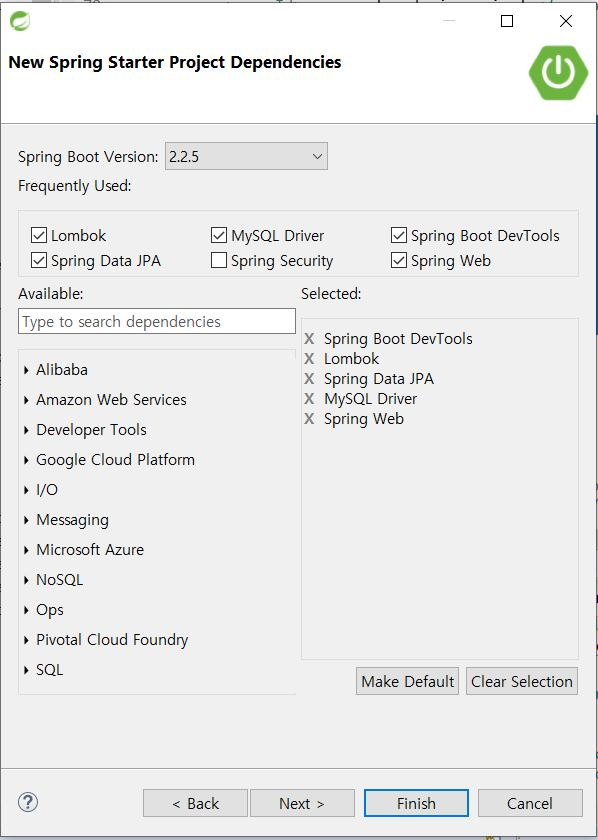
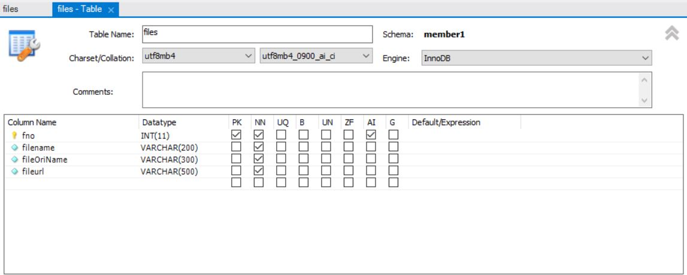
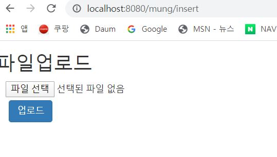
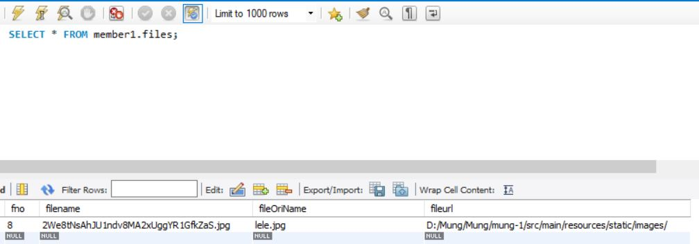
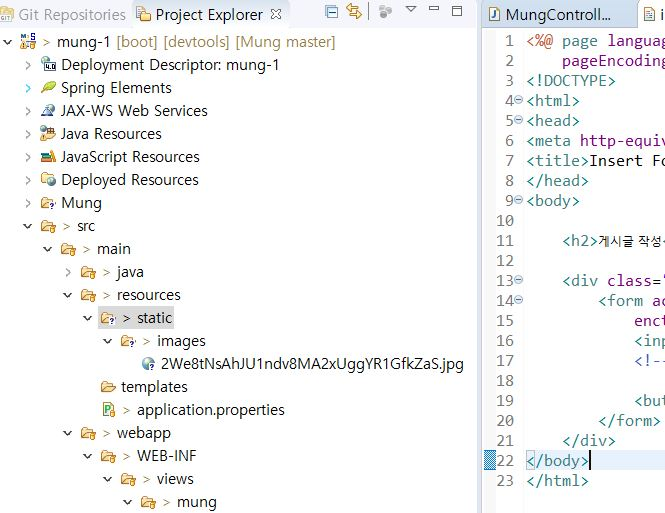

---
title: "스프링 부트 & jpa & mysql & jsp 파일(이미지)업로드"
categories: springboot
comments: true
---

 Spring boot에서 파일 업로드(MultipartFile)를 구글링해봐도 JPA는 나오지않구
 mybatis밖에 나오지 않아서 쓰는 글ㅠ 

 내가 못찾은 거일수도....ㅋㅋㅋ 똑똑한사람들은 응용해서 잘할수도잇고!!

 mybatis 파일업로드 게시글을 많이 참고했습니당~~ㅎ

 mybatis 파일업로드에대한 출처는 <https://private.tistory.com/59> 요기입니당

 이미 lombok은 설치된 상태입니다! 

없으신 분들은 
<https://leleluv1122.github.io/springboot/spring-boot-jpa-mysql-jsp-%EC%87%BC%ED%95%91%EB%AA%B0-%EB%A7%8C%EB%93%A4%EA%B8%B0(2)/> 게시글을 참조해주세요

## 1) Spring 프로젝트 생성하기

왼쪽 상단에 위치한 File > new > Other > Spring Starter Project

Name을 설정하고 Package: net.lele로 해주겠습니다 ~~

 

요렇게 설정해주고 Finish 버튼을 눌러줄게요!

 
## 2) Mysql Files 테이블 생성하기

Mysql을 열고 스키마로 생성할게용

 

 생성한 schema를 열고 Tables를 오른쪽마우스로 클릭 후 create table !

 

 apply > apply 해줍니다!

## 3) 기본 설정

 - pom.xml

```java
<!--Multipart File Up&Download -->
	<dependency>
		<groupId>org.apache.commons</groupId>
		<artifactId>commons-lang3</artifactId>
		<version>3.0</version>
	</dependency>

	<dependency>
		<groupId>commons-io</groupId>
		<artifactId>commons-io</artifactId>
		<version>2.5</version>
	</dependency>
```
 저장하고 프로젝트 이름에 오른쪽 마우스클릭을 하고  Maven > Update project 합시당

 - application.properties

```java
spring.mvc.view.prefix=/WEB-INF/views/
spring.mvc.view.suffix=.jsp
spring.datasource.driver-class-name=com.mysql.jdbc.Driver
spring.datasource.url=jdbc:mysql://localhost:3306/schema_name?useUnicode=yes&zeroDateTimeBehavior=convertToNull&characterEncoding=UTF-8&allowMultiQueries=true&serverTimezone=Asia/Seoul
spring.datasource.username=root
spring.datasource.password=db_password
spring.jpa.hibernate.naming.physical-strategy=org.hibernate.boot.model.naming.PhysicalNamingStrategyStandardImpl
logging.level.org.hibernate.SQL=DEBUG
logging.level.org.hibernate.type.descriptor.sql.BasicBinder=TRACE
```
db_password와 schema_name을 자기걸로 바꿔줄게용!

 - images: src/main/resources/static/ 위치에 폴더를 만들어줍니다

 - views: src/main/webapp/WEB-INF/ 위치에 생성합시당!

## 4) Class 설정

### 1. Files.java
 위치: src/main/java/net/lele/domain

```java
@Data
@Entity
public class Files {
	@Id
	@GeneratedValue(strategy = GenerationType.IDENTITY)
	int fno;
	
	String filename;
	String fileOriName;
	String fileurl;
}
```
Ctrl + Shift + O 를하면 자동 Import됩니다!!

### 2. FilesRepository.java
 위치: src/main/java/net/lele/repository

 업로드만 할때에는 굳이 필요는 없지만 만들어볼게용ㅎㅎ 

```java
public interface  FilesRepository extends JpaRepository<Files, Integer> {

	Files findByFno(int fno);
}
```

### 3. FilesService.java
 위치: src/main/java/net/lele/service

```java
@Service
public class FilesService {
	@Autowired
	FilesRepository filesRepository;
	
	public void save(Files files) {
		Files f = new Files();
		f.setFilename(files.getFilename());
		f.setFileOriName(files.getFileOriName());
		f.setFileurl(files.getFileurl());
		
		filesRepository.save(f);
	}
}
```

### 4. MungController
 위치: src/main/java/net/lele/controller

```java
@Controller
public class MungController {
	
	@Autowired
	FilesService filesService;

	@RequestMapping("mung/insert")
	public String Insert() {
		
		return "mung/insert";
	}
	
	@RequestMapping("mung/fileinsert")
	public String fileinsert(HttpServletRequest request, @RequestPart MultipartFile files) throws Exception{
		Files file = new Files();
		
		String sourceFileName = files.getOriginalFilename(); 
        		String sourceFileNameExtension = FilenameUtils.getExtension(sourceFileName).toLowerCase(); 
        		File destinationFile; 
        		String destinationFileName;
        		String fileUrl = "D:/mung-1/src/main/resources/static/images/";
		// mung-1은 자기 프로젝트이름으로 체인지!!

        		do { 
            			destinationFileName = RandomStringUtils.randomAlphanumeric(32) + "." + sourceFileNameExtension; 
            			destinationFile = new File(fileUrl + destinationFileName); 
        		} while (destinationFile.exists()); 
        
        		destinationFile.getParentFile().mkdirs(); 
        		files.transferTo(destinationFile);
        
        		file.setFilename(destinationFileName);
        		file.setFileOriName(sourceFileName);
        		file.setFileurl(fileUrl);
        		filesService.save(file);
			return "redirect:/mung/insert";
	}
}
```


## 5) views 설정

 먼저, views폴더에 insert.jsp 파일을 만들어 줄게요

 위치: src/main/webapp/WEB-INF/views/mung

```jsp
<%@ page language="java" contentType="text/html; charset=UTF-8"
	pageEncoding="UTF-8"%>
<!DOCTYPE>
<html>
<head>
<meta http-equiv="Content-Type" content="text/html; charset=UTF-8">
<title>file upload</title>
</head>
<body>

	<h2>파일업로드</h2>

	<div class="container">
		<form action="/mung/fileinsert" method="post"
			enctype="multipart/form-data">
			<input type="file" name="files"> 
			<!-- 여기서 files는 controller에 @RequestPart MultipartFile files -->

			<button type="submit" class="btn btn-dark">업로드</button>
		</form>
	</div>
</body>
</html>
```

프로젝트에 오른쪽마우스로 클릭하고 Run as > Spring Boot App

<http://localhost:8080/mung/insert> 로 들어가면

 

와 같이 뜹니다! 파일선택후 업로드를 클릭해주세용ㅎㅎ

그리고는 db를 먼저 확인해봅니다

 

내 경로는 github에 프로젝트를 올리다가 약간 경로가 이상해져서 그렇다ㅠㅠ

spring 프로젝트도 Refresh를 해주니 아주 잘 들어가있다

 

이제 이걸 눈으로 보고싶다 이말입니다~~~ 안보고 싶을수도있지만ㅠㅅㅠ

매우 간단해용ㅋㅋ 

 다시 MungController로 갈게요!

```java
@RequestMapping("mung/index5")
public String index5(Model model) {
	model.addAttribute("file", filesService.findByFno(8));
	return "mung/index5";
}
```
저는 fno번호가 db에 8번으로 저장되어있어서 8을 사용합니다!

이제 views쪽으로 갈게요!

위치: /src/main/webapp/WEB-INF/views/mung/

 - index5.jsp

```jsp
<%@ page language="java" contentType="text/html; charset=UTF-8"
	pageEncoding="UTF-8"%>
<!DOCTYPE>
<html>
<head>
<meta http-equiv="Content-Type" content="text/html; charset=UTF-8">
<title>사진 확인</title>
</head>
<body>
	<div>
		
	</div>
</body>
</html>
```

자 이제 프로젝트 실행하고 <localhost:8080/mung/index5> 고고!

 

내가 업로드한 너무 귀여운 그림이 뜬다♥

성공적으로 끝냈으니 이만 안뇽뿅>_<★