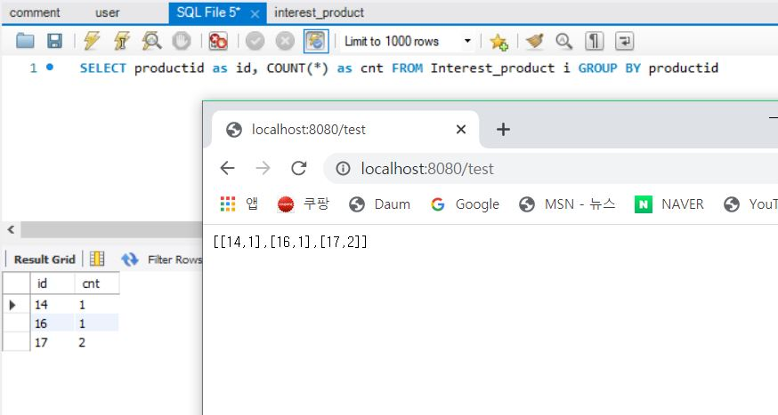

spring boot로 뭔가를 만들다가 JPA문법으로는 되지않아서 JPQL을 쓸일이 있어서 쓰게되었다

근데 사용하고 실행시켜보니 계속 오류가 나는거시다....ㅠㅠㅠ

내가 참고하고있는 예제에는 오류가 안나는데....  새로운 프로젝트 하나를 만들어서 다시 생성해보니

나는 `@Controller`를 사용하고있었는데 예제에서는 json객체로만 출력하면 되서 `@RestController`로 사용하고 있는 거였다..

## 1) domain
### 1. Product.java

```java
@Data
@Entity
public class Product {
	@Id
	@GeneratedValue(strategy = GenerationType.IDENTITY)
	int id;

	String title;
	int price;
	String detail;

	Timestamp writedate;

	int click;
}
```

### 2. Interest_product.java

```java
@Data
@Entity
public class Interest_product {
	@Id
	@GeneratedValue(strategy = GenerationType.IDENTITY)
	int id;

	@ManyToOne
	@JoinColumn(name = "productid")
	Product product;
}
```

## 2) Repository
### 1. ProductRepository

```java
public interface ProductRepository extends JpaRepository<Product, Integer> {

}
```

### 2. Interest_productRepository

```java
public interface Interest_productRepository extends JpaRepository<Interest_product, Integer> {
	@Query("SELECT i.product.id as id, COUNT(i.product.id) as cnt FROM Interest_product i GROUP BY i.product")
	List<Object[]> countByproductidgroup();
}
```

오류를 찾고싶은 거여서 service코드는 만들지않았다

## 3) Controller

```java
@RestController
public class MainController {
	@Autowired
	Interest_productRepository ipr;

	@RequestMapping("test")
	public List<Object[]> test(){

		return ipr.countByproductidgroup();
	}
}
```

 

json객체로는 잘 나온다... 근데 이걸

`@Controller`로 설정하고

```java
model.addAttribute("cnt", ipr.countByproductidgroup());
```

이렇게 view에 전달되서 실행하게되면 

 

이렇게 object객체로 나오게된다..

어찌어찌 구글링해서

```java
List<Object[]> results = ips.countByproductidgroup();
for (Object[] result : results) {
	int id = ((Number) result[1]).intValue();
	int count = ((Number) result[1]).intValue();
	model.addAttribute("cnt", result);
}
```

이런 방법으로 형변환을 시도했는데 마지막 값만 전달되어서 

 

이렇게 id:17인 값 2만 전달이 된다...

restcontroller를 써서 할수도없고 그냥 controller를 쓸수도없는...ㅠ.ㅠ

진짜 답답하다~~~~

아직 해결방법은 찾지못했는데 .... 어찌해야되지... ㅠ