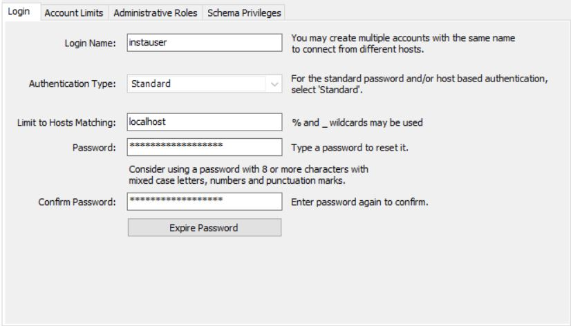
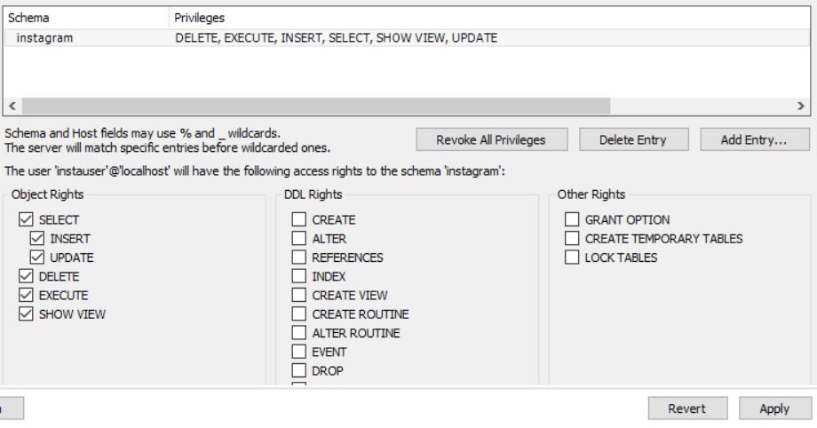
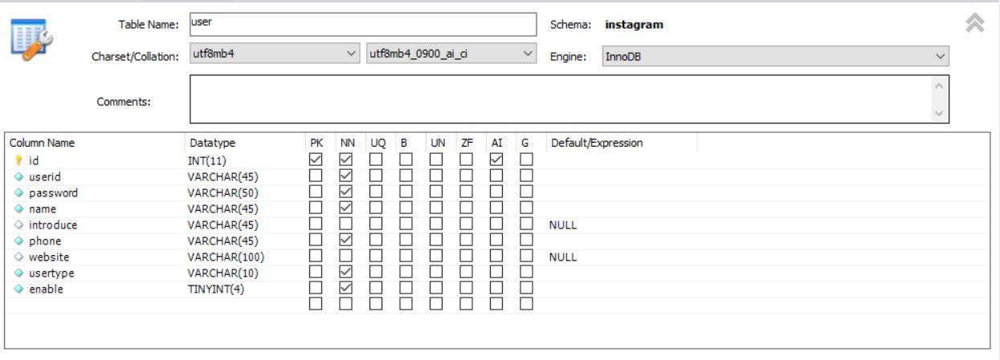
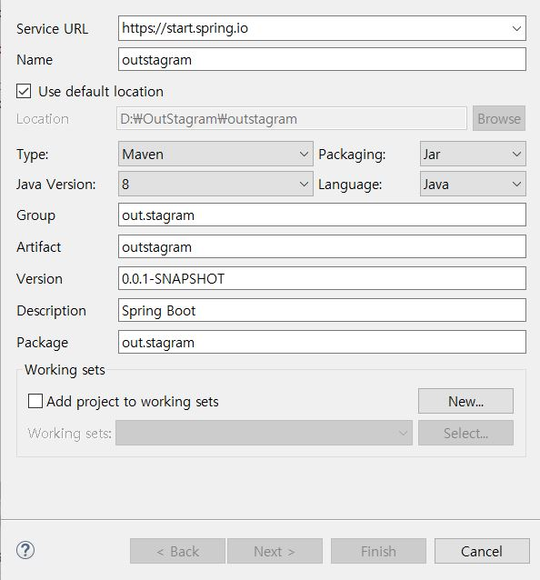
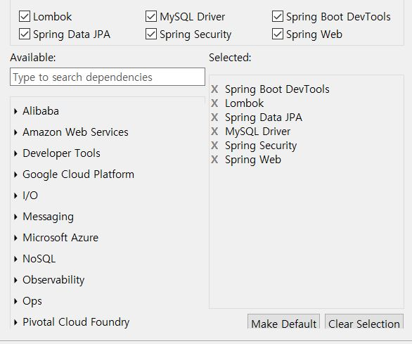

---
title: "스프링부트 Jsp JPA Spring Security 인스타그램 따라해보기 (1) "
categories: springboot
comments: true
---

## 실행 환경
 > STS3, MySQL

## 사용언어(환경)
 > Spring boot(JAVA, JSP), JPA, Bootstrap(부트스트랩), 스프링 시큐리티


3개월 반만에 spring boot로 웹페이지 만들기 도전!! 

요즘 C++만해서 자바랑 jsp 다 너무 오랜만에 하는듯ㅠㅠ

쇼핑몰 만들기는 하고싶은데 만든지 5개월지나서 포스팅하기 불가능에 가까워진다ㅠ_ㅠ
그래서 이번엔 만들면서 포스팅해야겠으ㅠ^ㅠ

인스타 하다가 안되면 쇼핑몰 포스팅 고고해야쥐 (아무도 안본다는 학계의 정설)


## MySql 준비하기
 mysql을 서버를 키고 workbench를 켠 다음 내 유저에 로그인한 다음에 위에보이는 Server > Users and Privileges

 그러고 Add Account



 비밀번호는 하고싶은걸로~ 그러고 Apply 해주기

 이제 다시 위에 잘 찾아보면 원통모양+ 로 된거에 올리면 Add a new Schema 누르고 instagram스키마를 생성한다

 다시 Administration - Users and Privileges 에 들어간 후 내가만든 user를 누른 후 Schema Privileges를 누른다 그러고 Add Entry... 클릭!

Selected schema > instagram 하고 OK 그러고는 누르고 SELECT INSERT 그쪽줄 다 체크하고 Apply!



instagram에 Table > Create Table 테이블을 생성해준다.



DB 생성하구 User table 생성했음~ user table의 구조는 변경가능성 짱높다 이점 참고...ㅎㅎㅎ

## Lombok 설치하기
 이건머 필수지 setter getter생성하기 너무귀찮으니까 꼭 하자 쇼핑몰만들기때 했던 포스팅 참고하삼~

<https://leleluv1122.github.io/springboot/spring-boot-jpa-mysql-jsp-2/#2-lombok-%EC%84%A4%EC%B9%98>

## sts를 열어보자
 Instagram으로 이름하기 싫어서 D://Outstagram으로 폴더를 만들어서 열었다

 Server밖에 없을 폴더에 File > New > Spring Starter Project




Finish 하면 프로젝트가 생성된다

## DB랑 sts 연결하자
 - 위치: /outstargram/src/main/resources/application.properties

```
spring.mvc.view.prefix=/WEB-INF/views/
spring.mvc.view.suffix=.jsp
spring.datasource.driver-class-name=com.mysql.jdbc.Driver
spring.datasource.url=jdbc:mysql://localhost:3306/너의스키마이름★?useUnicode=yes&zeroDateTimeBehavior=convertToNull&characterEncoding=UTF-8&allowMultiQueries=true&serverTimezone=Asia/Seoul
spring.datasource.username=instauser
spring.datasource.password=너의 비밀번호★
spring.jpa.hibernate.naming.physical-strategy=org.hibernate.boot.model.naming.PhysicalNamingStrategyStandardImpl
logging.level.org.hibernate.SQL=DEBUG
logging.level.org.hibernate.type.descriptor.sql.BasicBinder=TRACE
server.session.timeout = 1000
```

★ 별표친부분은 본인의 것을 적어넣으면 된다

## 기초 설정하기
 - 파일 위치: /outstagram/pom.xml

```
<dependency>
	<groupId>org.springframework.security</groupId>
	<artifactId>spring-security-test</artifactId>
	<scope>test</scope>
</dependency>
```

여기까지 되어있을 것이다 안되있으면 삭제하고 처음으로 가슈

되어있다면 그 밑에 바로

```
<dependency>
	<groupId>org.springframework.security</groupId>
	<artifactId>spring-security-taglibs</artifactId>
</dependency>
<dependency>
	<groupId>jstl</groupId>
	<artifactId>jstl</artifactId>
	<version>1.2</version>
</dependency>
<dependency>
	<groupId>org.apache.tomcat.embed</groupId>
	<artifactId>tomcat-embed-jasper</artifactId>
	<scope>provided</scope>
</dependency>

<!-- BootStrap -->
<dependency>
	<groupId>org.webjars</groupId>
	<artifactId>bootstrap</artifactId>
	<version>4.1.0</version>
</dependency>
<dependency>
	<groupId>org.webjars</groupId>
	<artifactId>jquery</artifactId>
	<version>3.3.1</version>
</dependency>

<!--Multipart File Up&Download -->
<dependency>
	<groupId>org.apache.commons</groupId>
	<artifactId>commons-lang3</artifactId>
	<version>3.10</version>
</dependency>
<dependency>
	<groupId>commons-fileupload</groupId>
	<artifactId>commons-fileupload</artifactId>
	<version>1.3.3</version>
</dependency>

<dependency>
	<groupId>commons-io</groupId>
	<artifactId>commons-io</artifactId>
	<version>2.5</version>
</dependency>

<dependency>
	<groupId>javax.validation</groupId>
	<artifactId>validation-api</artifactId>
	<version>2.0.1.Final</version>
</dependency>
<dependency>
	<groupId>org.hibernate</groupId>
	<artifactId>hibernate-validator</artifactId>
	<version>5.3.5.Final</version>
</dependency>
```

지금 당장은 안쓰더라도 필요할 거같아서 이것저것 Maven 해본다ㅎㅎ 붙여넣었다면

outstagram 오른쪽마우스 click > Maven > Update Project

자 이제 인스타그램의 첫페이지를 보자 첫 페이지부터 로그인페이지 ..

모든 프로젝트의 시작이자 로그인만 하다 프로젝트가 끝난다는게 학계의 정설..

다음 포스팅에서 계속하겠삼

오늘의 추천곡은 슈퍼주니어 - Miracle  (틀니닦으러 가야지... )