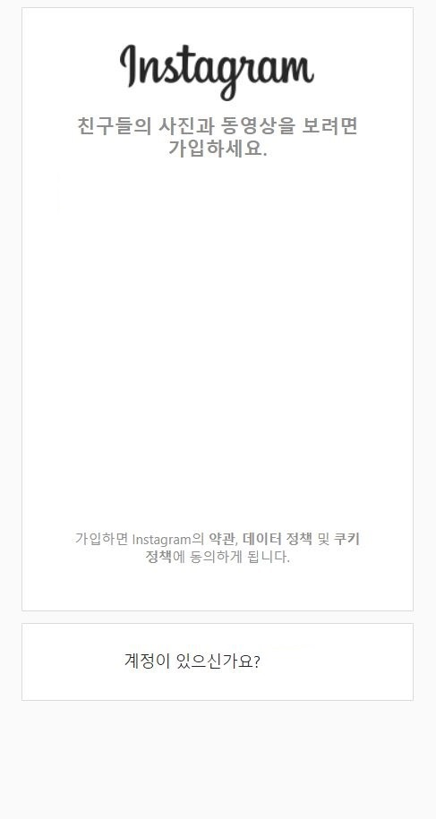

---
title: "스프링부트 Jsp JPA 인스타그램 따라해보기 (2) "
categories: springboot
comments: true
---

## 실행 환경
 > STS3, MySQL





input부분만 없앴다. 그리고 우리는 웹 디자인을 하는 게 아니기때문에 사이즈가 좀 화면 크기에 따라 안맞고 그럴 수 있다...^^(변명)

캡쳐해서 저장하거나 이미지 새탭에서 열어서 저장하기하자 (안해도 아무상관없움)

저장할 사람들은 `/outstagram/src/main/resources/static/images/insta_register.JPG`
`/outstagram/src/main/resources/static/images/main_insta_login.jpg`

폴더가 없을것이다... 만들어서 저장하자~


## java쪽 기초셋팅

### User.java
 DB 테이블과 연결하..

파일 위치: /outstagram/src/main/java/out/stagram/domain

```java
@Data // lombok에 의해 getter setter 생성
@Entity
@org.hibernate.annotations.DynamicUpdate // 나중에 필요해서 미리 설정 / 수정가능하게 해줌
public class User {
	@Id // pk
	@GeneratedValue(strategy = GenerationType.IDENTITY) // auto increase
	int id;
	
	String userId;
	String password;
	String name;
	String introduce;
	String phone;
	String website;
	String userType;
	int enable;
}
```

### UserRepository.java

파일 위치: /outstagram/src/main/java/out/stagram/repository

jpa를 사용해서 db의 데이터를 가져옴

```java
public interface UserRepository extends JpaRepository<User, Integer> {
	User findOneByUserId(String userId); //userid로 user를 찾음
	User findById(int id); //id로 user를 찾음
	User findByUserId(String userId);	
}
```

### UserService.java

파일 위치: /outstagram/src/main/java/out/stagram/Service

```java
@Service // 이거 필수!
public class UserService {
	@Autowired
	UserRepository userRepository;
	
	public User login(String userId, String password) {
		User user = userRepository.findOneByUserId(userId);
		if (user == null) // 유저를 찾아봤는데 없으면 오류
			return null;
		String pw = EncryptionUtils.encryptMD5(password); // 찾았으면 비밀번호를 암호화해서

		if (user.getPassword().equals(pw) == false) //  암호화된 비밀번호와 비교
			return null;
		return user;
	}
	
	// repository에 있는 findbyuserid를 서비스에서 불러서.. db에 바로 접근 못하게 하려고 service가 있는 거 같아요~^^ 밑에 이런 것들도 마찬가지
	public User findByUserId(String userId) {
		return userRepository.findByUserId(userId);
	}
	
	public User findById(int id) {
		return userRepository.findById(id);
	}
	
	public boolean hasErrors(UserRegistrationModel userModel, BindingResult bindingResult) {
		if (bindingResult.hasErrors())
			return true;

		User user = userRepository.findOneByUserId(userModel.getUserid()); // 유저를 찾음
		if (user != null) { // 유저가 존재하면 중복
			bindingResult.rejectValue("userid", null, "사용자 아이디가 중복됩니다.");
			return true; // 에러 true(존재)
		}
		return false;
	}
	
	public User createEntity(UserRegistrationModel userModel) { // 유저모델객체에서 유저받아온다
		User user = new User(); // 새로운 유저생성
		String pw = EncryptionUtils.encryptMD5(userModel.getPasswd1()); // 비번은 암호화해서 저장
		user.setUserId(userModel.getUserid());
		user.setPassword(pw);
		user.setName(userModel.getName());
		user.setPhone(userModel.getPhone());
		user.setEnable(1); // 생성되서 활동하므로 1 
		user.setUserType("user"); // 유저로 가입
		
		return user;
	}

	public void save(UserRegistrationModel userModel) {
		User user = createEntity(userModel); // 유저모델객체를 보내서 유저 생성
		userRepository.save(user); // 레포지토리의 save는 따로 코드를 치지않아도 jpa라서 바로 저장됨^^
	}
}
```

### MyAuthenticationProvider.java

파일 위치: /outstagram/src/main/java/out/stagram/Service

```java
@Component
public class MyAuthenticationProvider implements AuthenticationProvider {

    @Autowired UserService userService;

    @Override
    public Authentication authenticate(Authentication authentication) throws AuthenticationException {
        String loginId = authentication.getName();
        String passwd = authentication.getCredentials().toString();
        return authenticate(loginId, passwd);
    }

    public Authentication authenticate(String loginId, String password) throws AuthenticationException {
        User user = userService.login(loginId, password);
        if (user == null) return null; //검사가 실패하면 null 리턴

        List<GrantedAuthority> grantedAuthorities = new ArrayList<GrantedAuthority>();
        String role = "";
        switch (user.getUserType()) {
        case "admin": role = "ROLE_ADMIN"; break;
        case "user": role = "ROLE_USER"; break;
        }

        grantedAuthorities.add(new SimpleGrantedAuthority(role));
        return new MyAuthenticaion(loginId, password, grantedAuthorities, user);
    }

    @Override
    public boolean supports(Class<?> authentication) {
        return authentication.equals(UsernamePasswordAuthenticationToken.class);
    }

    public class MyAuthenticaion extends UsernamePasswordAuthenticationToken {
        private static final long serialVersionUID = 1L;
        User user;

        public MyAuthenticaion (String loginId, String passwd,
                                List<GrantedAuthority> grantedAuthorities, User user) {
            super(loginId, passwd, grantedAuthorities);
            this.user = user;
        }

        public User getUser() {
            return user;
        }

        public void setUser(User user) {
            this.user = user;
        }
    }
}
```

### UserRegistrationModel.java

파일 위치: /outstagram/src/main/java/out/stagram/model

```java
@Data
public class UserRegistrationModel {
	@NotEmpty(message = "ID를 입력하세요")
	@Size(min = 3, max = 12)
	String userid;

	@NotEmpty(message = "비밀번호를 입력하세요")
	@Size(min = 8, max = 20, message = "8 자리 이상 20 자리 이하이어야 합니다.")
	String passwd1;
	@NotEmpty(message = "이름을 입력하세요")
	@Size(min = 2, max = 10)
	String name;
	String phone;
}
```

### EncryptionUtils.java
파일 위치: /outstagram/src/main/java/out/stagram/utils

```java
public class EncryptionUtils {
	public static String encryptSHA256(String s) {
		return encrypt(s, "SHA-256");
	}

	public static String encryptMD5(String s) {
		return encrypt(s, "MD5");
	}

	public static String encrypt(String s, String messageDigest) {
		try {
			MessageDigest md = MessageDigest.getInstance(messageDigest);
			byte[] passBytes = s.getBytes();
			md.reset();
			byte[] digested = md.digest(passBytes);
			StringBuffer sb = new StringBuffer();
			for (int i = 0; i < digested.length; i++)
				sb.append(Integer.toHexString(0xff & digested[i]));
			return sb.toString();
		} 
		catch (Exception e) {
			return s;
		}
	}
}
```

### SecurityConfig
파일 위치: /outstagram/src/main/java/out/stagram/config

```java
@Configuration
public class SecurityConfig extends WebSecurityConfigurerAdapter {
	@Autowired
	MyAuthenticationProvider myAuthenticationProvider;

	@Override
	public void configure(WebSecurity web) throws Exception {
		web.ignoring().antMatchers("/res/**");
	}

	@Override
    protected void configure(HttpSecurity http) throws Exception
    {
        http.authorizeRequests()
	.antMatchers("/admin/**").hasAuthority("ROLE_ADMIN")
            .antMatchers("/guest/**").permitAll()
            .antMatchers("/").permitAll()
        	.antMatchers("/", "/images/**", "/resources/**", "/resources/images/**")    
        	.permitAll()
            .antMatchers("/**").authenticated();

        http.csrf().disable();

        http.formLogin()
            .loginPage("/guest/login")
            .loginProcessingUrl("/guest/login_processing")
            .failureUrl("/guest/login?error")
            .defaultSuccessUrl("/main", true)
            .usernameParameter("loginId")
            .passwordParameter("passwd");

        http.logout()
            .logoutRequestMatcher(new AntPathRequestMatcher("/main/logout_processing"))
            .logoutSuccessUrl("/guest/login")
            .invalidateHttpSession(true);

        http.authenticationProvider(myAuthenticationProvider);
    }
}
```

### GuestController.java
파일 위치: /outstagram/src/main/java/out/stagram/controller

```java
@Controller
public class GuestController {
	@Autowired
	UserService userService;

	@RequestMapping({ "/", "/guest/login" }) // 이렇게 되면 localhost:8080에 접속해도 이 페이지 나옴
	public String login(Model model) throws Exception {
		return "/guest/login";
	}
}
```

자 이제 완전 기초설정이....(후덜덜) 끝난거... 같쥬..?

그럼이제 view를 만들겠습니다~

## View

### login.jsp
 파일 위치: outstagram/src/webapp/WEB-INF/views/guest

먼저 login이미지 보이게하기~

```html
<div class="layer">
	
</div>
```

그리고 그 위에 로그인 폼 생성

```html
<div>
	<div>
		<span>
			<a href="/" style="color: black; text-decoration: none;">Outstagram</a>
		</span>
	</div>
	<form method="post" action="login_processing"> <!-- action에 있는 링크는 securityconfig에 보면 있다  --> 
		<div class="form-group">
			<input type="text" name="loginId" placeholder="아이디" class="form-control w300" />
		</div>
		<div class="form-group">
			<input type="password" name="passwd" placeholder="비밀번호" class="form-control w300" />
		</div>
		<div>
			<button type="submit" class="btn">로그인</button>
		</div>
	</form>
	<div>
		<a href="/guest/register" class="btn btn-dark">가입하기</a>
	</div>
	<c:if test="${ param.error != null }"> 
		<div class="mt5">로그인 실패</div>
	</c:if>

</div>
```

이렇게 생성하고 css를 좀 만져서 실행을 해봅시당

outstagram에 오른쪽마우스 > Run as > Spring boot App

chrome에서 <http://localhost:8080> 에 접속해보자


로그인페이지 완성!!

하 드디어 시작부분이 끝났다... 이제 사용자 등록은 다음으로... 

이틀동안했는데 진짜 css부분만지는게 10% 진짜코딩은 1% 대망의 89%는 딴짓하기^^..

오늘의 추천곡은 임한별, 김재환 - 너는 나의 시작이자 마지막이다 

더킹종영한거 너무 슬프다...ㅠ_ㅠ