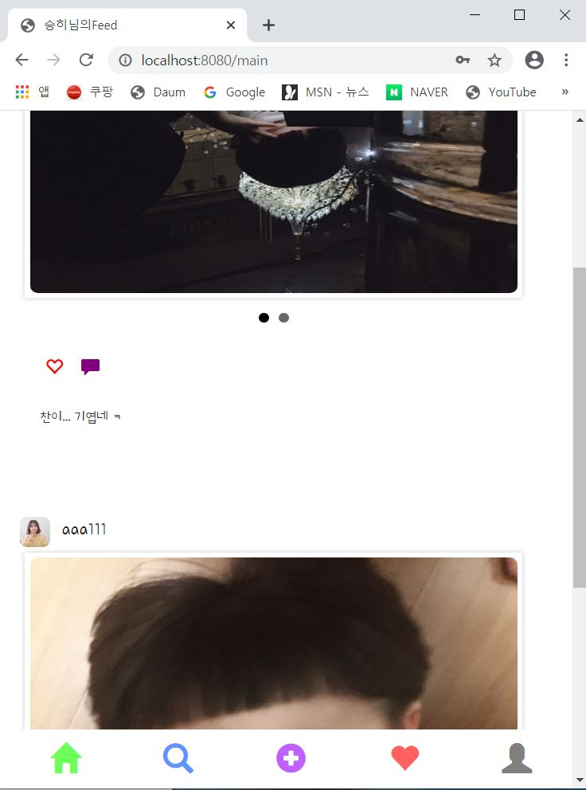

## 실행 환경
 > STS3, MySQL

## 사용언어(환경)
 > Spring boot(JAVA, JSP), JPA, Bootstrap(부트스트랩), 스프링 시큐리티


이제 유저로그인까지 가능하다  그럼 바로 메인페이지 틀부터 잡아야 하지않을까???  


## MainController.java
 파일위치: outstagram/src/main/java/out/stagram/controller

```java
@Controller
public class MainController {
	@Autowired
	UserService userService;

	@RequestMapping("/main")
	public String main_page(Model model) throws Exception {
		String userId = SecurityContextHolder.getContext().getAuthentication().getName();
		// 현재 로그인 되어있는 유저의 아이디를 구해주는 메소드다.

		model.addAttribute("user", userService.findByUserId(userId)); 
		// 유저아이디를 통해 유저테이블에 존재하는 현재 유저의 모든 정보를 main.jsp로 보내준다.
		return "/main"; // main.jsp와 연결
	}
```


## main.jsp
 파일위치: outstagram/src/webapp/WEB-INF/views/main.jsp

인스타그램의 하단부를 보면 고정되어있는 틀이존재한다.

```html
<head>
~~~
<style>
#footer {
	position: fixed;
	background-color: white; /*임의색상*/
	left: 0;
	right: 0;
	bottom: 0;
	height: 6rem;
}

#contents {
	bottom: 6rem;
}
</style>
</head>
<body>
	<div id="contents"></div>
	<div id="footer">
		<%@ include file="include/bottom.jsp"%>
	</div>
</body>
```

이렇게 하게되면 하단부분을 고정해주는 css가 설정된다.  
이제 bottom.jsp를 작성해서 공통적으로 들어갈 하단부분을 작성하도록 해보자.  

## bottom.jsp
 파일위치: outstagram/src/main/webapp/WEB-INF/views/include/bottom.jsp

```html
 <!-- 현재 로그인 된 user의 id를 ${currentid}로 설정 -->
<sec:authentication property="user.id" var="currentid" />

<a href="/main">
	<span class="glyphicon glyphicon-home" aria-hidden="true"></span>
</a>
<a href=""> <!-- 아직 링크부분을 정하지 않아서 비워두었다 -->
	<span class="glyphicon glyphicon-search" aria-hidden="true"></span>
</a>
<a href=""> <!-- 아직 링크부분을 정하지 않아서 비워두었다 -->
	<span class="glyphicon glyphicon-plus-sign" aria-hidden="true"></span>
</a>
<a href=""> <!-- 아직 링크부분을 정하지 않아서 비워두었다 -->
	<span class="glyphicon glyphicon-upload" aria-hidden="true"></span>
</a>
<a href="/main/user/${currentid}"> <!-- 현재 로그인된 유저의 page로 갈 링크 -->
	<span class="glyphicon glyphicon-user" aria-hidden="true"></span>
</a>
```

이제 실행해보면 메인화면의 틀이 완성된다!  
밑에 고정된 화면이 존재하고 안에 content부분은 임의로 틀을 만들었을 뿐 아무것도 없는것이 정상이다.  



보다시피 스크롤을 내려도 하단부는 고정되어있다.  


피드가 채워지려면 먼저 사용자 페이지가 존재해야겠지? (내기준..)  

위에 `bottom.jsp` 부분에 /main/user/${user.id} 가 유저page 로 갈 링크이다.  
눌렀을 경우 http://localhost:8080/main/user/1 (1의 경우 내가 로그인한 유저의 id가 1번이기때문에..)  
이런 링크와 함께 에러 페이지가 뜬다! 아직 연결을 안해주고 페이지가 없어서 그렇다!  

바로 만들자~~~  


## MainController.java
 파일위치: outstagram/src/main/java/out/stagram/controller

### `@PathVariable`
 `@PathVariable` 를 사용하면 url의 일부를 변수로 전달할 수 있다.

위의 `bottom.jsp`의  `/main/user/${user.id}` 이 부분과 연결된다.  
이용해서 controller를 작성해보자  

```java
@RequestMapping("/main/user/{id}")
public String main_user(@PathVariable("id") int id, Model model) throws Exception {
	String userId = SecurityContextHolder.getContext().getAuthentication().getName();
	model.addAttribute("user", userService.findByUserId(userId));
	
	return "/main/user";
}
```

## user.jsp
 파일위치: outstagram/src/webapp/WEB-INF/views/main/user.jsp

먼저 틀을 만들어줬다.  
`c:choose` 문이 궁금하다면 <https://leleluv1122.github.io/springboot/spring-boot-jstl-c-choose/>  참고  

```html
<body>
	<div class="contents">
		<div class="nav">
			<span class="title"> 
				<a href="/main/user/${user.id}" class="title_ft">${user.userId}</a>
			</span>
		</div>

		<div class="profile">
			<div class="title_image">
				<c:choose>
					<c:when test="${user.profile_photo == null}">
						
					</c:when>
					<c:otherwise>
						
					</c:otherwise>
				</c:choose>
			</div>

			<div class="txt">
				<span>0</span><br> <!-- 아직 만들지 않아서 0으로 셋팅 -->
				<span>게시물</span>
			</div>

			<div class="txt">
				<span>0</span><br> <!-- 아직 만들지 않아서 0으로 셋팅 -->
				<span>팔로워</span>
			</div>

			<div class="txt">
				<span>0</span><br> <!-- 아직 만들지 않아서 0으로 셋팅 -->
				<span>팔로잉</span>
			</div>
		</div>

		<div class="_info">
			<span>${user.introduce}</span><br /> 
			<span>${user.website}</span>
		</div>

		<div class="fix">
			<a href="update/${user.id}" class="btn btn-default">프로필 수정</a>
		</div>
	</div>
	<div id="footer">
		<%@ include file="../include/bottom.jsp"%>
	</div>
</body>
```


틀이 완성되었다 !  
다음에는 프로필 수정페이지를 통해 프로필 사진변경 + 개인정보변경 을 해봐야겠다~