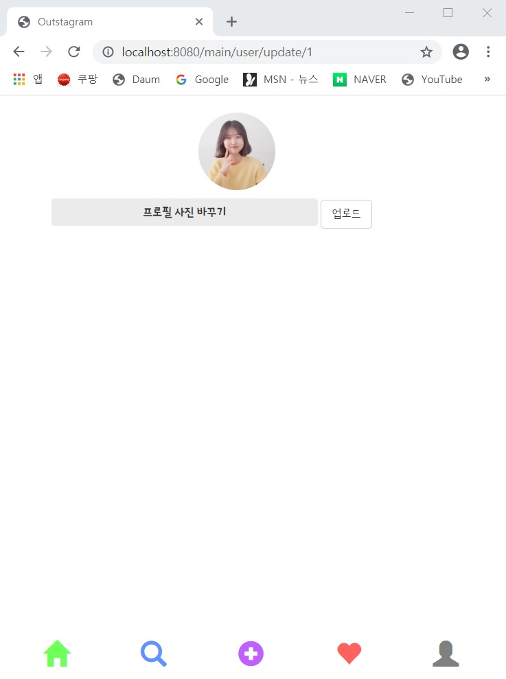
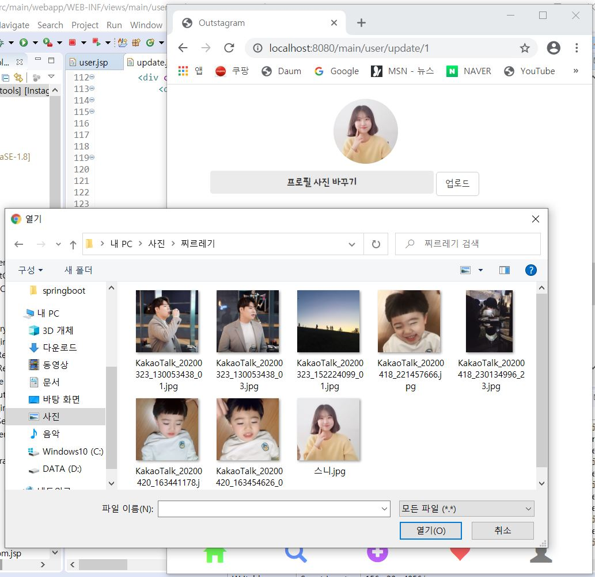
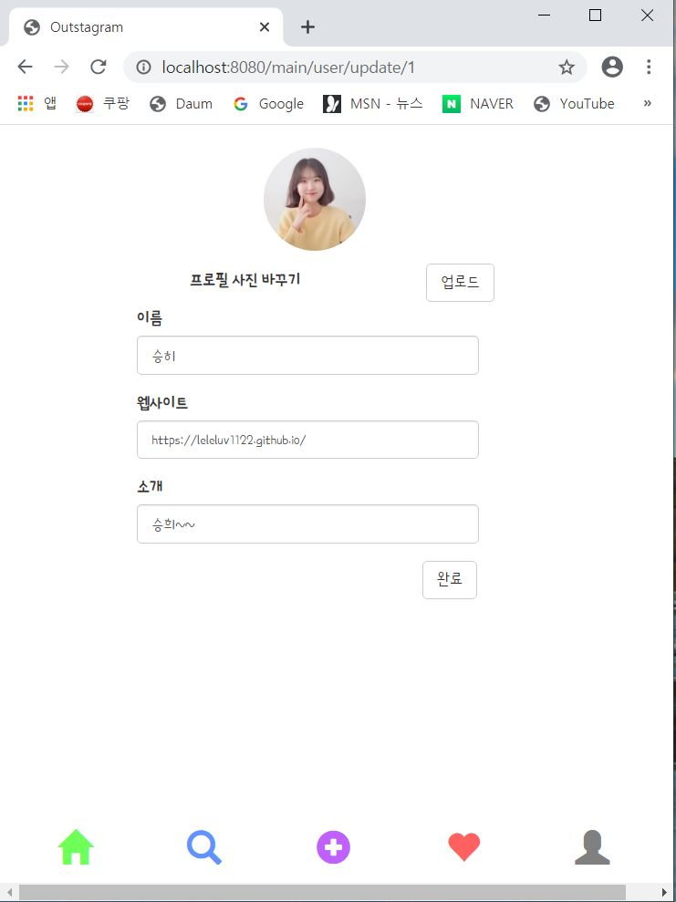
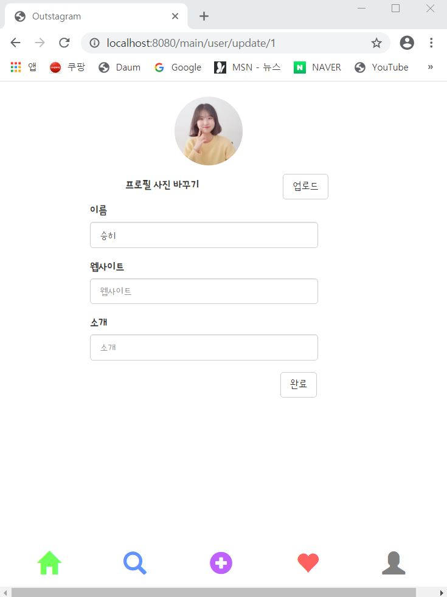
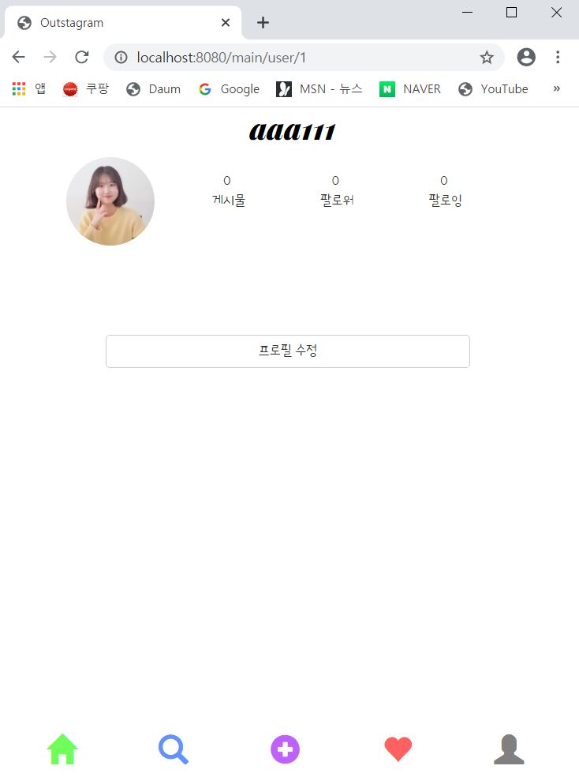

---
title: "스프링 부트 Jsp JPA Spring Security 인스타그램 따라해보기 (5) - 프로필사진수정 & 프로필수정"
categories: springboot
comments: true
---


## 실행 환경
 > STS3, MySQL


## 사용언어(환경)
 > Spring boot(JAVA, JSP), JPA, Bootstrap(부트스트랩), 스프링 시큐리티

## 이전포스팅  
<https://leleluv1122.github.io/springboot/spring-boot-instagram-1/>

<https://leleluv1122.github.io/springboot/spring-boot-instagram-2/>

<https://leleluv1122.github.io/springboot/spring-boot-instagram-3/>

<https://leleluv1122.github.io/springboot/spring-boot-instagram-4/>

  
# 프로필 이미지 변경
 이전 포스팅의 user.jsp 에서 `<a href="update/${user.id}">프로필 수정</a>` 부분이 있었다.  
이 부분과 연결되어 만드는 부분이다  

Repository에 들어가는 JPA 문법이 궁금하다면... <https://leleluv1122.github.io/jpa/jpa-query-creation/>

## UserService.java
 파일위치: src/main/java/out/stagram/service/UserService.java

db에서 user 프로필사진 이름 변경  

```java
public void img_update(String userId, String profile_photo) {
	User user = findByUserId(userId); // 유저아이디로 유저찾음
	user.setProfile_photo(profile_photo);
		
	save_u(user);
}

public void save_u(User user) {
	userRepository.save(user);
}
```

## MainController.java
 파일위치: src/main/java/out/stagram/controller/MainController.java

```java
@RequestMapping(value = "/main/user/update/{id}", method = RequestMethod.GET)
public String update_user(@PathVariable("id") int id, Model model) throws Exception {
	String userId = SecurityContextHolder.getContext().getAuthentication().getName();

	model.addAttribute("user", userService.findByUserId(userId));
	return "/main/user/update";
}

@RequestMapping(value = "/main/user/image_insert")
public String image_insert(HttpServletRequest request, @RequestParam("filename") MultipartFile mFile, Model model) throws Exception {
	String upload_path = "D:/OutStagram/Instagram/outstagram/src/main/resources/static/images/profile/"; // 프로필 사진들 모아두는 폴더
	String userId = SecurityContextHolder.getContext().getAuthentication().getName();
	User user = userService.findByUserId(userId);
	String redirect_url = "redirect:/main/user/update/" + user.getId(); // 사진업로드 이후 redirect될 url

	try {
		if (user.getProfile_photo() != null) { // 이미 프로필 사진이 있을경우
			File file = new File(upload_path + user.getProfile_photo()); // 경로 + 유저 프로필사진 이름을 가져와서
			file.delete(); // 원래파일 삭제
		}
		mFile.transferTo(new File(upload_path + mFile.getOriginalFilename()));  // 경로에 업로드
	} catch (IllegalStateException | IOException e) {
		e.printStackTrace();
	}

	userService.img_update(userId, mFile.getOriginalFilename()); // 프로필 사진이름 db에 update
	return redirect_url;
}
```


## update.jsp
 파일위치: src/main/webapp/WEB-INF/views/main/user/update.jsp

```html
<div class="contents">
	<div class="img">
		<div class="title_image">
			<c:choose>
				<c:when test="${user.profile_photo == null}">
					
				</c:when>
				<c:otherwise>
					
				</c:otherwise>
			</c:choose>
		</div>
	</div>
	<div class="filebox">
		<form action="/main/user/image_insert" id="form" name="form"
			method="post" enctype="multipart/form-data" autocomplete="off">
			<label for="ex_file">프로필 사진 바꾸기</label> 
			<input type="file" id="ex_file" name="filename" required />
			<button type="submit" class="btn btn-default">업로드</button>
		</form>
	</div>
</div>
<div id="footer">
	<%@ include file="../../include/bottom.jsp"%>
</div>
```

### update page  



파일을 선택하고  



업로드를 누르면 변경된 사진을 볼 수 있다.  


# 프로필 정보 변경
## UserService.java
 파일위치: src/main/java/out/stagram/service/UserService.java

```java
public void profile_update(String userId, String name, String website, String introduce) {
	User user = findByUserId(userId);
	user.setName(name);
	user.setWebsite(website);
	user.setIntroduce(introduce);
		
	save_u(user);
}
```


## MainController.java
 파일위치: src/main/java/out/stagram/controller/MainController.java

```java
@RequestMapping(value = "/main/user/info_update")
public String profile_update(HttpServletRequest request, Model model) throws Exception {
	String userId = SecurityContextHolder.getContext().getAuthentication().getName();
	User user = userService.findByUserId(userId);
	String redirect_url = "redirect:/main/user/" + user.getId();

	String name = request.getParameter("name");
	String website = request.getParameter("website");
	String introduce = request.getParameter("intro");

	userService.profile_update(userId, name, website, introduce);
	return redirect_url;
}
```

## update.jsp
 파일위치: src/main/webapp/WEB-INF/views/main/user/update.jsp

```html
<div class="info">
	<form action="/main/user/info_update">
		<div class="form-group">
			<label for="name">이름</label>
			<input type="text" class="form-control w200" id="name" 
				name="name" placeholder="이름" value="${user.name}" />
		</div>
		<div class="form-group">
			<label for="website">웹사이트</label>
			<input type="text" class="form-control w200" id="website" 
				name="website" placeholder="웹사이트" value="${user.website}" />
		</div>
		<div class="form-group">
			<label for="intro">소개</label>
			<input type="text" class="form-control w200" id="intro" 
				name="intro" placeholder="소개" value="${user.introduce}" />
		</div>
		<button type="submit" class="btn btn-default">완료</button>
	</form>
</div>
```

### update page  

프로필 수정페이지  


웹사이트 이름과 소개를 지우고 완료버튼 누르면  


업데이트 되서 아무것도 나오지 않게된다.  



 다음시간에는 인스타그램 게시물 등록하는 걸 해봐야겠다..!!