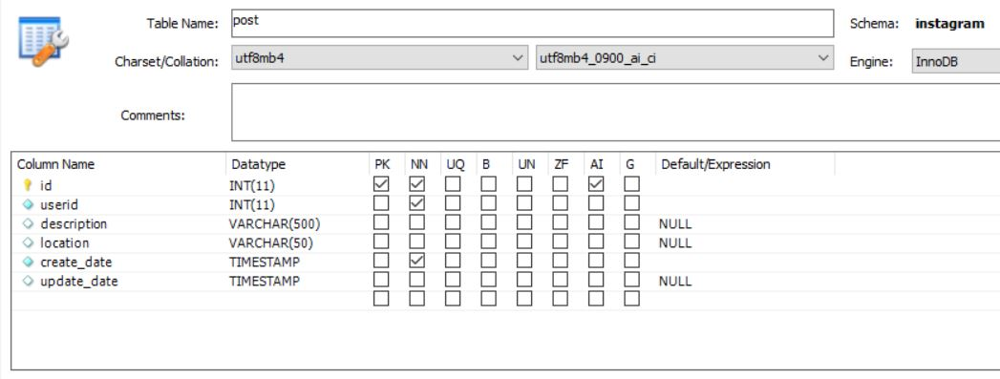
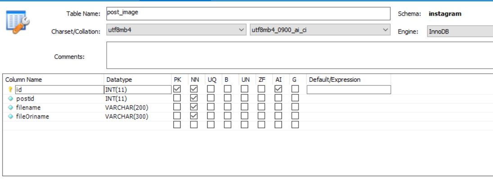
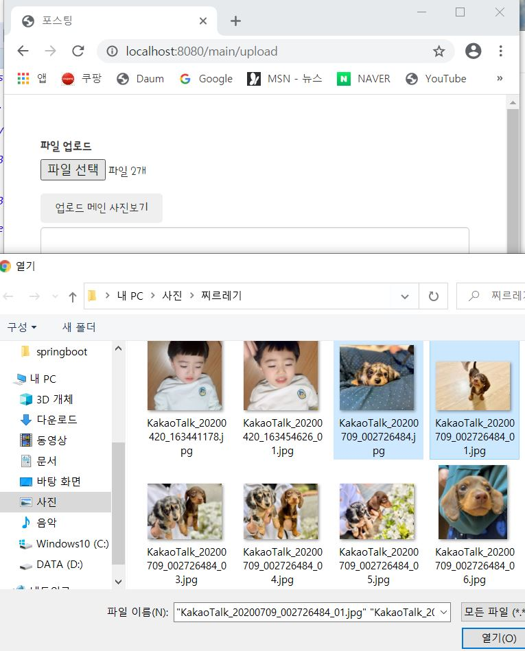
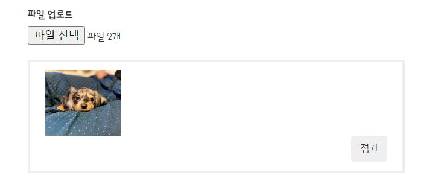
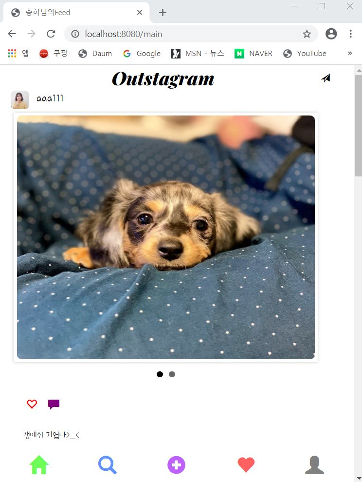
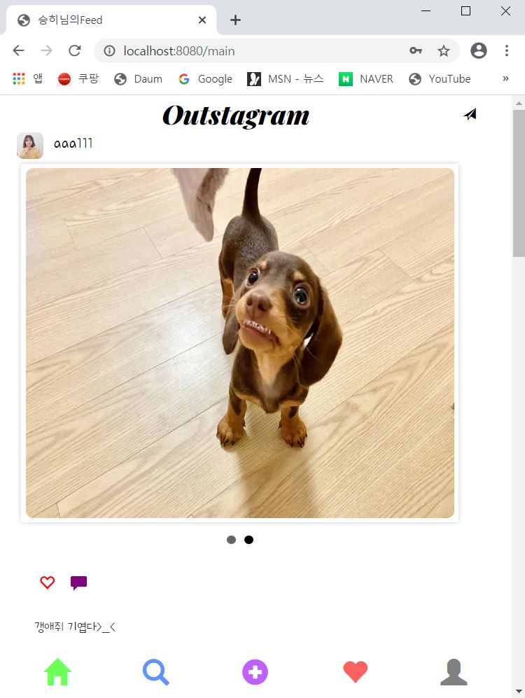
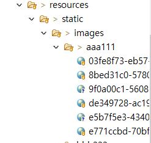

---
title: "스프링 부트 Jsp JPA Spring Security 인스타그램 따라해보기 (6) - 게시물 등록"
categories: springboot
comments: true
---

## 실행 환경
 > STS3, MySQL

## 사용언어(환경)
 > Spring boot(JAVA, JSP), JPA, Bootstrap(부트스트랩), 스프링 시큐리티


## 이전포스팅  
<https://leleluv1122.github.io/springboot/spring-boot-instagram-1/>

<https://leleluv1122.github.io/springboot/spring-boot-instagram-2/>

<https://leleluv1122.github.io/springboot/spring-boot-instagram-3/>

<https://leleluv1122.github.io/springboot/spring-boot-instagram-4/>

<https://leleluv1122.github.io/springboot/spring-boot-instagram-5/>


# 게시물 등록

## DB생성
게시물을 업로드 할려면 DB가 있어야 한다.   
MySQL workbench 로 가서 Post 와 Post_image DB를 다음 사진과 같이 등록한다.





등록을 했으면 sts로 넘어온다.  

## Post.java
 파일위치: src/main/java/out/stagram/domain/Post.java

```java
@Data
@Entity
@org.hibernate.annotations.DynamicUpdate
public class Post {
	@Id
	@GeneratedValue(strategy = GenerationType.IDENTITY)
	int id;

	@ManyToOne
	@JoinColumn(name = "userid")
	User user;

	String description;
	String location;

	Timestamp create_date;
	Timestamp update_date;
}
```

## Post_image.java
 파일위치: src/main/java/out/stagram/domain/Post_image.java

```java
@Data
@Entity
@org.hibernate.annotations.DynamicUpdate
public class Post_image {
	@Id
	@GeneratedValue(strategy = GenerationType.IDENTITY)
	int id;
	
	int postId;
	
	String filename;
	String fileOriname;
	
}
```

## PostRepository.java
 파일위치: src/main/java/out/stagram/repository/PostRepository.java

```java
public interface PostRepository extends JpaRepository<Post, Integer> {
	 // user의 id가 id와 일치하는 것을 id를 기준으로 거꾸로 정렬해서 List로 내보낸다.
	List<Post> findByUserIdOrderByIdDesc(int id); // main에서 게시물을 볼때 필요함
}
```

## Post_imageRepository.java
 파일위치: src/main/java/out/stagram/repository/Post_imageRepository.java

```java
public interface Post_imageRepository extends JpaRepository<Post_image, Integer> {
	List<Post_image> findBypostId(int id);
}
```

## PostService.java
 파일위치: src/main/java/out/stagram/service/PostService.java

```java
@Service
public class PostService {
	@Autowired
	PostRepository postRepository;

	public int save(Post p) {
		Post pi = new Post();
		Timestamp timestamp = new Timestamp(System.currentTimeMillis());
		
		pi.setUser(p.getUser());
		pi.setDescription(p.getDescription());
		pi.setLocation(p.getLocation());
		pi.setCreate_date(timestamp);
		
		postRepository.save(pi);
		
		return pi.getId();
	}

	public void flush() {
		postRepository.flush();
	}

	public List<Post> findByUserIdOrderByIdDesc(int id){
		return postRepository.findByUserIdOrderByIdDesc(id);
	}
}
```

## Post_imageService.java
 파일위치: src/main/java/out/stagram/service/Post_imageService.java

```java
@Service
public class Post_imageService {
	@Autowired
	Post_imageRepository piRepository;

	public void save(Post_image pi) {
		Post_image p = new Post_image();
		p.setFilename(pi.getFilename());
		p.setFileOriname(pi.getFileOriname());
		p.setPostId(pi.getPostId());

		piRepository.save(p);
	}
}
```
 
db와의 연결 service들을 설정했으니 먼저, 프론트를 설정하러 가자

## bottom.jsp

bottom의 plus-sign 부분의 href를 "/main/upload" 로 바꿔준다.

```html
<a href="/main/upload">
	<span class="glyphicon glyphicon-plus-sign" aria-hidden="true"></span>
</a>
```

## upload.jsp
 파일위치: src/main/webapp/WEB-INF/views/main/upload.jsp

```html
<div class="contents">
	<sec:authentication property="user.id" var="currentid" />
	<!-- 2장이상의 사진을 저장하려면 enctype="multipart/form-data" 필수  -->
	<form action="/main/posting" method="post" enctype="multipart/form-data" autocomplete="off">
		<input type="hidden" id="userid" name="userid" value="${currentid}"> 
		<div class="form-group">
			<label for="file">파일 업로드 </label> 
			<input multiple="multiple" type="file" id="gdsImg" name="files" required />
		</div>
		<div class="miribogi">
			<div class="select_img">
				 <!-- 이곳에 타이틀 사진이미지가 보인다 -->
			</div>
			<script>
			$("#gdsImg").change(
			function() {
				if (this.files && this.files[0]) {
					var reader = new FileReader;
					reader.onload = function(data) {
						$(".select_img img").attr("src", data.target.result).width(100);
					}
					reader.readAsDataURL(this.files[0]);
				}
			});
			</script>
			<button type="button" class="btn cancel_btn">접기</button>
			<script>
				$(".cancel_btn").click(function() {
					$(".miribogi").slideUp();
					$(".orderOpne_bnt").slideDown();
				});
			</script>
		</div>

		<div class="orderOpne">
			<button type="button" class="btn orderOpne_bnt">
				<span style="margin: 4px;">업로드 메인 사진보기</span>
			</button>
			<script>
				$(".orderOpne_bnt").click(function() {
					$(".miribogi").slideDown();
					$(".orderOpne_bnt").slideUp();
				});
			</script>
		</div>

		<div class="form-group">
			<input type="text" class="form-control w300" id="description"
				name="description" placeholder="문구 입력..." />
		</div>

		<div class="form-group">
			<input type="text" class="form-control w200" id="location"
				name="location" placeholder="위치 추가" />
		</div>
		<button class="btn btn-primary">완료</button>
	</form>
</div>

<div id="footer">
	<%@ include file="../include/bottom.jsp"%>
</div>
```

## MainController.java
 파일위치: src/main/java/out/stagram/controller/MainController.java

```java
@RequestMapping(value = "/main/upload", method = RequestMethod.GET)
public String upload(Model model) throws Exception {

	return "/main/upload";
}
```

를 추가하고 로그인 후 하단 부에 위치한 upload 버튼을 클릭하게 되면  

  

업로드 메인 사진보기를 클릭해보면  
  


이제 java쪽으로 가서 올린것들을 db로 저장할 수 있게하자.


## MainController.java
 파일위치: src/main/java/out/stagram/controller/MainController.java

upload.jsp form의 action="/main/posting" 으로 해놓았으므로 그 링크로 업로드 파일들이 전송되게 만들어보자

폴더 만드는 방법이 궁금하다면 [java 폴더만들기](https://leleluv1122.github.io/springboot/mkdir/) 로 고고

파일올리는 방법이 궁금하면 [파일올리기](https://leleluv1122.github.io/springboot/spring-boot-jpa-mysql-jsp-fileupload/) 고고씽

```java
@Autowired
PostService postService;
@Autowired
Post_imageService piService;

@RequestMapping("/main/posting")
public String posting(HttpServletRequest request, MultipartHttpServletRequest mtfRequest, Model model) throws Exception {
	// userId로 images 폴더에 userId로 폴더만들기
	String userId = SecurityContextHolder.getContext().getAuthentication().getName();
	String path = "D:/OutStagram/Instagram/outstagram/src/main/resources/static/images/" + userId;
	
	File file = new File(path);
	if (!file.exists()) { // userId의 폴더가 없다면
		file.mkdirs(); // 폴더생성
	}

	Post post = new Post();

	// "userid"는 upload.jsp의 input의 name="userid" <- 부분 값을 가져온다
	// request.getParameter는 String으로 받아오므로 Integer.parseInt를 통해 형변환 해준다
	String u = request.getParameter("userid");
	int user_id = Integer.parseInt(u);
	User user = userService.findById(user_id);
	String description = request.getParameter("description");
	String location = request.getParameter("location");

	post.setDescription(description);
	post.setLocation(location);
	post.setUser(user);

	post.setId(postService.save(post));
	postService.flush();

	List<MultipartFile> fileList = mtfRequest.getFiles("files");
	for (MultipartFile f : fileList) { // 사진리스트를 하나씩 풀어서 post_image에 따로따로저장
		Post_image pi = new Post_image();

		String original_name = f.getOriginalFilename();
		pi.setFileOriname(original_name);

		// 임의의 파일이름은 혹시나 중복된 파일이름을 방지하기위함이다.
		String newFile_name = rnd(original_name, f.getBytes(), path);
		pi.setFilename(newFile_name);
		pi.setPostId(post.getId());

		piService.save(pi);
	}

	return "redirect:/main";
}

// 임의의 파일이름 생성하는 메소드
private String rnd(String originalName, byte[] fileData, String path) throws Exception {
	UUID uuid = UUID.randomUUID();
	String savedName = uuid.toString() + "_" + originalName;
	File target = new File(path, savedName);

	FileCopyUtils.copy(fileData, target);
	return savedName;
}
```

그러고 "/main"에 추가해야될 것들이 있다. (main_page함수)

```java
User u = userService.findByUserId(userId);

model.addAttribute("posting", postService.findByUserIdOrderByIdDesc(u.getId()));
```

## main.jsp
 파일위치: src/main/webapp/WEB-INF/views/main.jsp

```html
<div class="post">
	<div class="nav">
		<span class="title"> 
			<a href="/main" class="title_ft">Outstagram</a>
		</span> 
		<a href="/main">
			<span class="glyphicon glyphicon-send" aria-hidden="true"></span>
		</a>
	</div>

	<c:forEach var="p" items="${posting}"> <!-- java의 for문과 같다 posting list를 for문돌림 -->
		<div class="r">
			<div class="ii">
				<div class="title_image">
					<a href="/main/user/${p.user.id}"> 
						
					</a>
				</div>
				<div class="userid_txt">
					<a href="/main/user/${p.user.id}">${p.user.userId}</a>
				</div>
			</div>
			<div id="gallery_wrap">
				<ul class="slide_gallery">
					<c:forEach var="img" items="${img}">
						<c:if test="${p.id == img.postId}">
							<li></li>
						</c:if>
					</c:forEach>
				</ul>
			</div>
			<div class="bar">
				<span class="glyphicon glyphicon-heart-empty" aria-hidden="true"></span> <!-- 이부분은 나중에 하트 설정할때 할거다 --> 
				<span class="glyphicon glyphicon-comment" aria-hidden="true"></span>
			</div>
			<div class="write">
				<span>${p.description}</span>
			</div>
		</div>
	</c:forEach>

</div>
```

이제 업로드 하면 redirect로 /main페이지로 가지는걸 볼 수 있다!  


두번째 사진까지 잘 나온다~  
  

static/images 에 userId폴더인 aaa111 에 사진이 잘 들어가짐을 확인할 수 있다~~
  

아주 잘 나온다 !! 다음시간에는 팔로우&팔로잉을 해봐야겠다~_~  