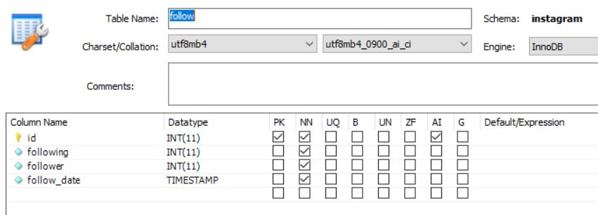
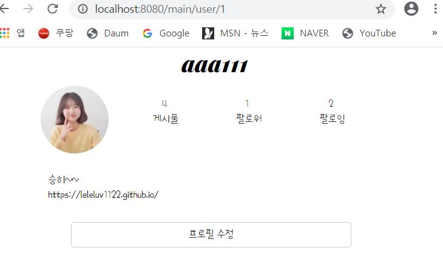
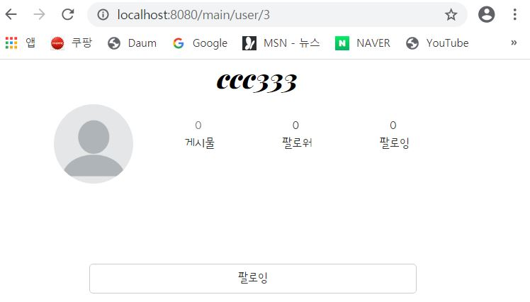
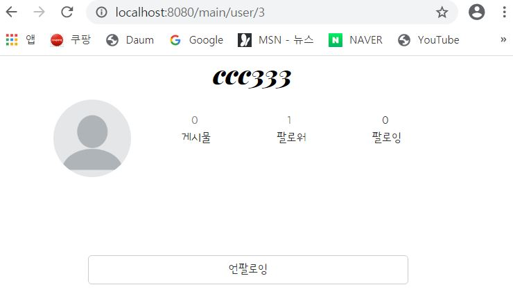

---
title: "스프링 부트 Jsp JPA Spring Security 인스타그램 따라해보기 (7) - 팔로우&팔로잉"
categories: springboot
comments: true
---

## 실행 환경
 > STS3, MySQL

## 사용언어(환경)
 > Spring boot(JAVA, JSP), JPA, Bootstrap(부트스트랩), 스프링 시큐리티


## 이전포스팅  
<https://leleluv1122.github.io/springboot/spring-boot-instagram-1/>

<https://leleluv1122.github.io/springboot/spring-boot-instagram-2/>

<https://leleluv1122.github.io/springboot/spring-boot-instagram-3/>

<https://leleluv1122.github.io/springboot/spring-boot-instagram-4/>

<https://leleluv1122.github.io/springboot/spring-boot-instagram-5/>

<https://leleluv1122.github.io/springboot/spring-boot-instagram-6/>


# 팔로우&팔로잉

## DB 생성
 MySQL workbench로 가서 follow DB를 생성하자



생성했으면 연결해보자~

## Follow.java
 파일위치: src/main/java/out/stagram/domain/Follow.java
 
```java
@Data
@Entity
@org.hibernate.annotations.DynamicUpdate
public class Follow {
	@Id
	@GeneratedValue(strategy = GenerationType.IDENTITY)
	int id;
	
	@ManyToOne
	@JoinColumn(name = "following")
	User following;
	
	@ManyToOne
	@JoinColumn(name = "follower")
	User follower;

	Timestamp follow_date;
}
```

## FollowRepository.java
 파일위치: src/main/java/out/stagram/repository/FollowRepository.java

```java
public interface FollowRepository extends JpaRepository<Follow, Integer> {
	int countByFollowerIdAndFollowingUserId(int id, String userId); // 팔로우 되어있는지 count하는 메서드

	@Modifying
	@Transactional
	void deleteByFollowingIdAndFollowerId(int id1, int id2); // 언팔로우 메서드
}
```

## FollowService.java
 파일위치: src/main/java/out/stagram/service/FollowService.java

```java
@Service
public class FollowService {
	@Autowired
	FollowRepository followRepository;
	@Autowired
	UserService userService;
	
	public void save(int login_id, int page_id) { // 팔로우
		Follow f = new Follow();
		Timestamp timestamp = new Timestamp(System.currentTimeMillis());
		
		f.setFollowing(userService.findById(login_id));
		f.setFollower(userService.findById(page_id));
		f.setFollow_date(timestamp);
		
		followRepository.save(f);
	}
	public void deleteByFollowingIdAndFollowerId(int id1, int id2) { // 언팔로우
		followRepository.deleteByFollowingIdAndFollowerId(id2, id1);
	}

	public boolean find(int id, String userId) { // 팔로우가 되어있는지를 확인하기위해
		if(followRepository.countByFollowerIdAndFollowingUserId(id, userId) == 0)
			return false; // 팔로우 안되어있음
		return true; // 되어있음
	}
}
```

로그인유저와 페이지유저가 같을경우에는 프로필수정을 할 수 있게 해주고 다르면 팔로우/언팔로우가 뜨도록 해보자

## MainController.java

```java
@RequestMapping("/main/user/{id}")
public String main_user(@PathVariable("id") int id, Model model) throws Exception {
	String userId = SecurityContextHolder.getContext().getAuthentication().getName();
	
	model.addAttribute("page_id", id); // PathVariable로 넘어온 id - 이 페이지의 id
	model.addAttribute("follow", followService.find(id, userId)); // false or true
}
```

## user.jsp
 파일위치: outstagram/src/webapp/WEB-INF/views/main/user.jsp

```html
<sec:authentication property="user.id" var="currentid" /> <!-- 현재 로그인user의 id -->
<c:choose>
	<c:when test="${page_id == currentid}">
		<div class="fix">
			<a href="update/${user.id}" class="btn btn-default">프로필 수정</a>
		</div>
	</c:when>
	<c:otherwise>
		<div class="fix">
			<c:choose>
				<c:when test="${follow == true}"> <!-- 0이 아니므로 팔로우 되어있음 -->
					<form action="/unfollow" name="form" method="post"> <!-- 언팔로우 버튼 -->
						<input type="hidden" value="${currentid}" name="user_id"> <!-- 현재로그인id -->
						<input type="hidden" value="${page_id}" name="page_id"> <!-- 현재페이지id -->
						<button class="btn btn-default" type="submit">언팔로잉</button>
					</form>
				</c:when>
				<c:otherwise>
					<form action="/follow" name="form" method="post">
						<input type="hidden" value="${currentid}" name="user_id">
						<input type="hidden" value="${page_id}" name="page_id">
						<button class="btn btn-default">팔로잉</button>
					</form>
				</c:otherwise>
			</c:choose>
		</div>
	</c:otherwise>
</c:choose>
```

현재 로그인 된 id와 페이지의 id가 같다면 프로필 수정이 나올것이다.  
  

url의 1을 다른 id로 바꿔보자  
아직 팔로우가 안되어있으므로 밑의 사진처럼 팔로잉 버튼이 나오면 성공이다!  


이제 버튼을 눌러서 팔로잉을 할 수 있게 만들어보자~

## FollowController.java
 파일위치: src/main/java/out/stagram/controller/FollowController.java

MainController에 안만드는 이유는 너무 복잡해지고... 팔로우만 할수있는 컨트롤러도 필요할듯 싶어서~ㅎㅎ

```java
@Controller
public class FollowController {
	@Autowired
	FollowService followService;

	@RequestMapping("/follow")
	public String follow(HttpServletRequest request, Model model) throws Exception {
		String l = request.getParameter("user_id");
		String p = request.getParameter("page_id");

		int login_id = Integer.parseInt(l);
		int page_id = Integer.parseInt(p);

		followService.save(login_id, page_id);

		String redirect_url = "redirect:/main/user/" + page_id;

		return redirect_url;
	}

	@RequestMapping("/unfollow")
	public String unfollow(HttpServletRequest request, Model model) throws Exception {
		String l = request.getParameter("user_id");
		String p = request.getParameter("page_id");

		int login_id = Integer.parseInt(l);
		int page_id = Integer.parseInt(p);

		followService.deleteByFollowingIdAndFollowerId(page_id, login_id);
		String redirect_url = "redirect:/main/user/" + page_id;

		return redirect_url;
	}
}
```

save와 delete밖에 없기때문에 매우간단하므로 설명은 건너뛰겠다.  

자 이제 팔로우를 해보자  
  

redirect되서 페이지가 바로 새로고침되어 `<c:when test="${follow == true}">` 가 성립하므로 언팔로잉 표시가 나타난다.  

다음번엔 user 아이디로 검색하기해야쥐