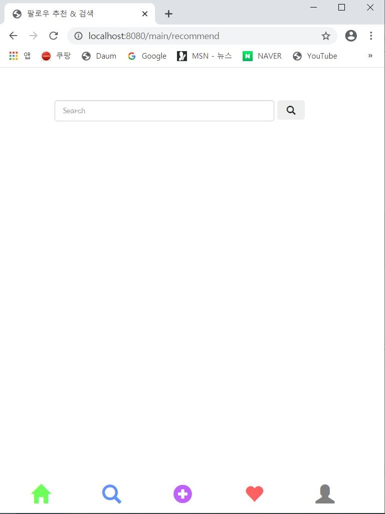
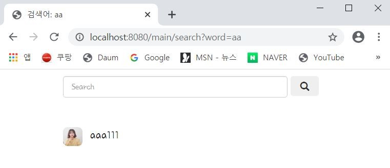
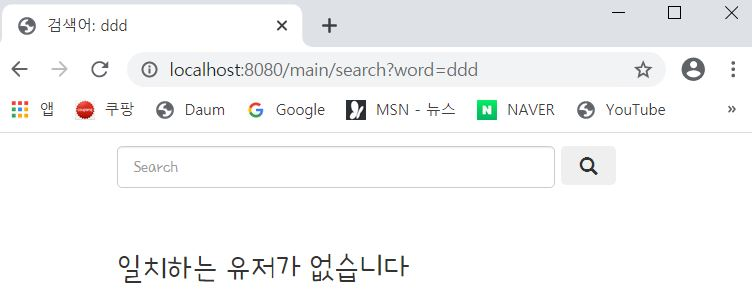

---
title: "스프링 부트 Jsp JPA Spring Security 인스타그램 따라해보기 (8) - 유저검색"
categories: springboot
comments: true
---

## 실행 환경
 > STS3, MySQL

## 사용언어(환경)
 > Spring boot(JAVA, JSP), JPA, Bootstrap(부트스트랩), 스프링 시큐리티

## 이전포스팅  
<https://leleluv1122.github.io/springboot/spring-boot-instagram-1/>

<https://leleluv1122.github.io/springboot/spring-boot-instagram-2/>

<https://leleluv1122.github.io/springboot/spring-boot-instagram-3/>

<https://leleluv1122.github.io/springboot/spring-boot-instagram-4/>

<https://leleluv1122.github.io/springboot/spring-boot-instagram-5/>

<https://leleluv1122.github.io/springboot/spring-boot-instagram-6/>

<https://leleluv1122.github.io/springboot/spring-boot-instagram-7/>


# User 검색
 user검색은 생각보다 간단하다! 먼저 bottom.jsp에 검색할 페이지를 만들어준다.

## bottom.jsp
 파일위치: outstagram/src/webapp/WEB-INF/views/include/bottom.jsp

```html
<a href="/main/recommend">
	<span class="glyphicon glyphicon-search" aria-hidden="true"></span>
</a>
```

## recommend.jsp
 파일위치: outstagram/src/webapp/WEB-INF/views/main/recommend.jsp

```html
<div id="contents">
	<div class="search">
		<form action="/main/search" class="form-inline my-2 my-lg-0" autocomplete="off">
			<input class="form-control mr-sm-2" type="search" name="word"
				placeholder="Search" aria-label="Search">
			<button class="btn btn-outline-success my-2 my-sm-0">
				<span class="glyphicon glyphicon-search"></span>
			</button>
		</form>
	</div>
</div>
<div id="footer">
	<%@ include file="../include/bottom.jsp"%>
</div>
```

## MainController.java
 파일위치: src/main/java/out/stagram/controller/MainController.java

```java
@RequestMapping("/main/recommend")
public String recommend(Model model) throws Exception {

	return "/main/recommend";
}
```

  

검색할 페이지를 만들어줬으면 페이지가 작동하도록 만들어보자.  

## UserRepository.java
 파일위치: src/main/java/out/stagram/repository/UserRepository.java

```java
List<User> findByUserIdContains(String word); // word가 포함되는 유저id List찾기
int countByUserIdContains(String word); // word가 포함되는 유저id 개수찾기
```

## UserService.java
 파일위치: src/main/java/out/stagram/service/UserService.java

```java
public List<User> findByUserIdContains(String word) {
	return userRepository.findByUserIdContains(word);
}
	
public int countByUserIdContains(String word) {
	return userRepository.countByUserIdContains(word);
}
```

## MainController.java
 파일위치: src/main/java/out/stagram/controller/MainController.java

이번에 검색은 RequestParam으로 받아올 것이다.  

### @RequestParam
 단일 HTTP요청 파라미터를 메소드 파라미터에 넣어주는 애노테이션이고, 사용하려면
 해당 파라미터가 반드시 존재해야한다.!

```java
@RequestMapping(value = "main/search")
public String search(@RequestParam("word") String word, Model model) throws Exception {
	if (word == "") { // 만약 검색한 단어가 빈칸이면 다시 추천페이지로 redirect하기
		return "redirect:/main/recommend";
	}
		
	model.addAttribute("find_user", userService.findByUserIdContains(word)); // 단어가 포함된 유저list 
	model.addAttribute("ucnt", userService.countByUserIdContains(word)); // 단어포함된 user의 수
	model.addAttribute("word", word);

	return "main/search";
}
```

이제 검색버튼을 누르게 되면 search페이지로 이동하여 검색한 내용을 찾아오도록 search페이지를 만들어보자

## search.jsp
 파일위치: outstagram/src/webapp/WEB-INF/views/main/search.jsp

```html
<div id="contents">
	<div class="search"> <!-- 바로 검색할 수 있게 search폼을 똑같이 만들어줌 -->
		<form action="/main/search" class="form-inline my-2 my-lg-0" autocomplete="off">
			<input class="form-control mr-sm-2" type="search" name="word"
				placeholder="Search" aria-label="Search">
			<button class="btn btn-outline-success my-2 my-sm-0" type="submit">
				<span class="glyphicon glyphicon-search"></span>
			</button>
		</form>
	</div>

	<div class="find_user">
		<c:choose>
			<c:when test="${ucnt == 0}"> <!-- 만약 word에 해당하는 유저가 0일 경우 -->
				<span>일치하는 유저가 없습니다</span>
			</c:when>
			<c:otherwise>
				<c:forEach var="u" items="${find_user}"> <!-- word가 포함된 유저들의 list -->
					<div class="f">
						<div class="title_image">
							<a href="/main/user/${u.id}">  <!-- 클릭시 유저페이지로 이동 -->
								<c:choose>
									<c:when test="${u.profile_photo != null}"> <!-- 사진이 있을경우 -->
										
									</c:when>
									<c:otherwise>  <!-- 사진이 없을경우 -->
										
									</c:otherwise>
								</c:choose>

							</a>
						</div>
						<div class="userid_txt"> <!-- 유저id -->
							<a href="/main/user/${u.id}">${u.userId}</a>
						</div>
					</div>
				</c:forEach>
			</c:otherwise>
		</c:choose>
	</div>
</div>

<div id="footer">
	<%@ include file="../include/bottom.jsp"%>
</div>
```

aa를 검색했을 때 aaa111에 aa가 포함되므로 잘 나왔다.  
  

ddd를 검색했을 경우 해당되는 유저가 없으므로 없다고 나오게된다.  
  

이제 좀 인스타그램 비슷무리 해지는거같다 외관상은..ㅎㅎ