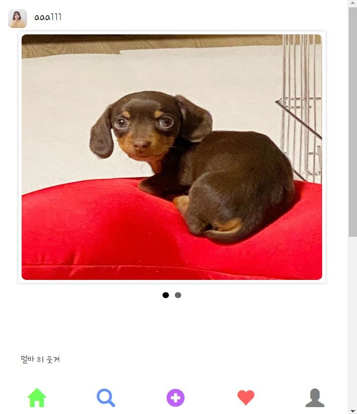

## 실행 환경
 > STS3, MySQL

## 사용언어(환경)
 > Spring boot(JAVA, JSP), JPA, Bootstrap(부트스트랩), 스프링 시큐리티

## 이전포스팅  
<https://leleluv1122.github.io/springboot/spring-boot-instagram-1/>

<https://leleluv1122.github.io/springboot/spring-boot-instagram-2/>

<https://leleluv1122.github.io/springboot/spring-boot-instagram-3/>

<https://leleluv1122.github.io/springboot/spring-boot-instagram-4/>

<https://leleluv1122.github.io/springboot/spring-boot-instagram-5/>

<https://leleluv1122.github.io/springboot/spring-boot-instagram-6/>

<https://leleluv1122.github.io/springboot/spring-boot-instagram-7/>

<https://leleluv1122.github.io/springboot/spring-boot-instagram-8/>


오늘은 post page내에서 동적으로 좋아요 누르는 걸 해볼거다,,, 졸 라 힘 듬

먼저 main페이지에서 post페이지로 가는걸 onclick 이벤트를 달아줘서 설정했다  

## main.jsp

```html
<span class="glyphicon glyphicon-comment" aria-hidden="true"
	onclick="location.href='/main/post/${p.id}'"></span> <!-- 코멘트 도형 -->


<div class="write" style="cursor: pointer;"> <!-- 코멘트 자체부분을 눌러도 갈수있게 하기 -->
	<span onclick="location.href='/main/post/${p.id}'">${p.description}</span>
</div>
```

## MainController.java

이 부분은 main페이지의 post보기를 거의 비슷하게 가져왔다

```java
@RequestMapping(value = "main/post/{id}")
public String post(@PathVariable("id") int id, Model model) throws Exception {
	String userId = SecurityContextHolder.getContext().getAuthentication().getName();
	User user = userService.findByUserId(userId);

	model.addAttribute("postuserid", postService.findById(id).getUser().getId());
	model.addAttribute("p", postService.findById(id));
	model.addAttribute("img", piService.findBypostId(id));

	return "main/post";
}
```

## post.jsp
 파일위치: /src/main/webapp/WEB-INF/views/main/post.jsp

```html
<sec:authentication property="user.id" var="currentid" />
<div id="contents">
	<div class="r">
		<div>
			<div class="title_image">
				<c:choose>
					<c:when test="${p.user.profile_photo == null}">
						<a href="/main/user/${p.user.id}"> 
						</a>
					</c:when>
					<c:otherwise>
						<a href="/main/user/${p.user.id}"> 
							
						</a>
					</c:otherwise>
				</c:choose>
			</div>
			<div class="userid_txt">
				<a href="/main/user/${p.user.id}">${p.user.userId}</a>
			</div>
		</div>
		<div id="gallery_wrap">
			<ul class="slide_gallery">
				<c:forEach var="img" items="${img}">
					<c:if test="${p.id == img.postId}">
						<li></li>
					</c:if>
				</c:forEach>
			</ul>
		</div>
		<div class="bar">
			<div class="like"></div>
		</div>
		<div class="write">
			<span>${p.description}</span>
		</div>
	</div>
	<div class="comment"></div>
</div>
<div id="footer">
	<%@ include file="../include/bottom.jsp"%>
</div>
<!-- <%@ include file="like.jsp"%> --> <!-- 아직 설정안해서 주석처리 파일이없어서 에러남 -->
```



이렇게 나올 것이다.. 이제 좋아요버튼을 동적으로 만들어볼것이다

## pom.xml
 혹시 없으면 확인하고 추가해주자!!

```
<!-- JSON 데이터 자동 처리 -->
<dependency>
	<groupId>com.fasterxml.jackson.core</groupId>
	<artifactId>jackson-databind</artifactId>
</dependency>
```


## HeartController.java
 파일위치: src/main/java/out/stagram/controller/HeartController.java

```java
@Controller
public class HeartController {
	@Autowired
	UserService userService;
	@Autowired
	PostService postService;
	@Autowired
	HeartService heartService;

	@RequestMapping("/like/view")
	@ResponseBody // Json전달가능
	private Map<String, Object> like_view(Model model, int id) throws Exception {
		String userId = SecurityContextHolder.getContext().getAuthentication().getName();
		User u = userService.findByUserId(userId);
		
 		// 현재 로그인 유저가 좋아요를 눌렀는지 1 = 누름, 0 = 안누름
		int cnt = heartService.countByPostIdAndUserId(id, u.getId());
		// 이 게시물 자체의 좋아요 개수
		int total_cnt = heartService.countByPostId(id);
		
		// Map으로 만들어준다음 return
		Map<String, Object> m = new HashMap<String, Object>();
		m.put("cnt", cnt); // 헷갈리지 않게 이름은 똑같이..설정
		m.put("total_cnt", total_cnt);
		
		return m;
	}
}
```

`post.jsp`의 `<%@ include file="like.jsp"%>` 주석을 풀고 like.jsp를 만들자

## like.jsp
 파일위치: /src/main/webapp/WEB-INF/views/main/like.jsp

```java
<%@ page language="java" contentType="text/html; charset=UTF-8"
	pageEncoding="UTF-8"%>
<script>
	var id = '${id}'; // postid

	function likeview() {
		$.ajax({
			url : '/like/view',
			type : 'post',
			async : true,
			data : {'id' : id}, // postid 보냄
			dataType : "json", // data가 json타입
			success : function(data) {
				var a = '';
				if (data.cnt == 1) {   // 현재 로그인 유저가 포스팅 좋아요를 눌렀음
					a += '<a onclick="likeDelete('+ id +');"' // likeDelete는 밑에서
						+ 'class="glyphicon glyphicon-heart heart" aria-hidden="true"></a>'
					a += '<span class="glyphicon glyphicon-comment" aria-hidden="true"></span> <br />'
					a += '<span><b>좋아요 ' + data.total_cnt + '개</b></span>' // 총 좋아요 개수
				} else if (data.cnt == 0) { // 안눌렀음
					a += '<a onclick="likeInsert('+ id +');"' // likeInsert는 밑에서
						+'class="glyphicon glyphicon-heart-empty heart" aria-hidden="true"></a>'
					a += '<span class="glyphicon glyphicon-comment" aria-hidden="true"></span> <br />'
					a += '<span><b>좋아요 ' + data.total_cnt + '개</b></span>'		
				}
				$('.like').html(a); // <div class="like></div> 이부분에 나타남
			}
		});
	}
	$(document).ready(function() { // 페이지가 준비되면
		likeview(); // 함수 likeview ㄱ
	});
</script>
```

좋아요를 누른상태가 아니므로 비어있는 하트가 나타난다  


이제 하트를 누르고 없애는 작업을 해볼것이다,,,,


## HeartController.java
 파일위치: src/main/java/out/stagram/controller/HeartController.java

```java
@RequestMapping("/like/insert/{id}")
@ResponseBody
private int like_insert(@PathVariable int id) throws Exception {
	String userId = SecurityContextHolder.getContext().getAuthentication().getName();
	User u = userService.findByUserId(userId);
	Post p = postService.findById(id);

	heartService.save(p, u);
	return 1;
}

@RequestMapping("/like/delete/{id}")
@ResponseBody
private int like_delete(@PathVariable int id) throws Exception {
	String userId = SecurityContextHolder.getContext().getAuthentication().getName();
	User u = userService.findByUserId(userId);
	
	heartService.deleteByPostIdAndUserId(id, u.getId());
	return 1;
}
```

## like.jsp
 파일위치: /src/main/webapp/WEB-INF/views/main/like.jsp

```java
function likeInsert(pid){
	$.ajax({
		// onclick="likeInsert('+ id +');  // view에서 이런식으로 한 이유는..(밑에줄)
		url : '/like/insert/' + pid, // pathvariable로 설정했으므로 postid값을 넘겨줘야됨
		type : 'post',
		success : function(data){
			if(data == 1)
				likeview();
		}
	});
}
	
function likeDelete(pid){
	$.ajax({
		url : '/like/delete/' + pid,
		type : 'post',
		success : function(data){
			if(data == 1)
				likeview();
		}
	});
}
```

설정해주면... 좋아요 동적으로 누르기 완성이다~


