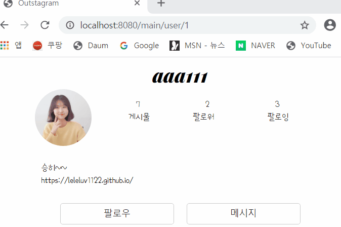
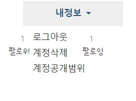
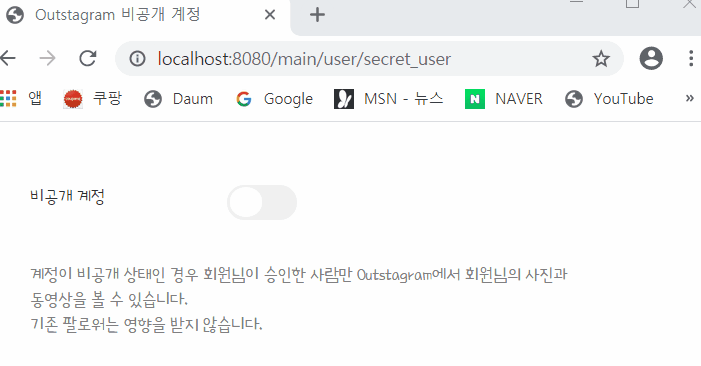

---
title: "스프링 부트 Jsp JPA Spring Security 인스타그램 따라해보기 (10) - 팔로우(re) & 비공개 계정"
categories: springboot
comments: true
---

## 실행 환경
 > STS3, MySQL

## 사용언어(환경)
 > Spring boot(JAVA, JSP), JPA, Bootstrap(부트스트랩), 스프링 시큐리티

## 이전포스팅  
<https://leleluv1122.github.io/springboot/spring-boot-instagram-1/>

<https://leleluv1122.github.io/springboot/spring-boot-instagram-2/>

<https://leleluv1122.github.io/springboot/spring-boot-instagram-3/>

<https://leleluv1122.github.io/springboot/spring-boot-instagram-4/>

<https://leleluv1122.github.io/springboot/spring-boot-instagram-5/>

<https://leleluv1122.github.io/springboot/spring-boot-instagram-6/>

<https://leleluv1122.github.io/springboot/spring-boot-instagram-7/>

<https://leleluv1122.github.io/springboot/spring-boot-instagram-8/>

<https://leleluv1122.github.io/springboot/spring-boot-instagram-9/>


# 유저 페이지에서 팔로우하기
 팔로우를 다시생각해봤는데 ajax로 해야될 것같아서 좀 바꾸기로 했다 ㅠ_ㅠ

## FollowController.java
 파일 위치: /outstagram/src/main/java/out/stagram/controller/FollowController.java

```java
@Controller
public class FollowController {
	@Autowired
	UserService userService;

	@RequestMapping("/follow/view/{id}") // pageid
	@ResponseBody
	private Map follow_view(@PathVariable int id, Model model) throws Exception {
		String userId = SecurityContextHolder.getContext().getAuthentication().getName();
		int follower = followService.countByFollowerId(id);
		
		Map<String, Object> m = new HashMap<String, Object>();
		m.put("booool", followService.find(id, userId));
		m.put("follower", follower); // 팔로워도 업뎃되야 되므로 
		
		return m;
	}

	@RequestMapping("/follow/insert/{id}")
	@ResponseBody
	private int follow_insert(@PathVariable int id) throws Exception {
		String userId = SecurityContextHolder.getContext().getAuthentication().getName();
		User u = userService.findByUserId(userId);
		
		followService.save(u.getId(), id);
		return 1;
	}
	
	@RequestMapping("/follow/delete/{id}")
	@ResponseBody
	private int follow_delete(@PathVariable int id) throws Exception {
		String userId = SecurityContextHolder.getContext().getAuthentication().getName();
		User u = userService.findByUserId(userId);
		
		followService.deleteByFollowingIdAndFollowerId(id, u.getId());
		return 1;
	}
}
```

## user.jsp
 파일위치: outstagram/src/webapp/WEB-INF/views/main/user.jsp

`<c:otherwise>` 부분을 다 주석처리 한 후 설정해보자

```html
<div class="follower_d"></div> <!-- 팔로워 부분 -->


<c:otherwise>
	<div class="follow_d"></div>
</c:otherwise>

<%@ include file="follow_s.jsp"%>
```

## follow_s.jsp
 파일위치: outstagram/src/webapp/WEB-INF/views/main/follow_s.jsp

```javascript
<%@ page language="java" contentType="text/html; charset=UTF-8"
	pageEncoding="UTF-8"%>
<script>
	var pageid = '${id}';
	
	function followview(){
		$.ajax({
			url : '/follow/view/' + pageid,
			type : 'post',
			async : true,
			data : {'id' : pageid},
			dataType : "json",
			success : function(data){
				var a = '';
				var b = '';
				if(data.booool == true){
					a += '<a class="btn btn-default" onclick="followDelete('+ pageid +')">' 
						+ '팔로우 취소</a>'
				}
				else{
					a += '<a class="btn btn-default" onclick="followInsert('+ pageid +')">' 
						+ '팔로우</a>'
				}
				b += '<span style="margin-left: 20px;">'+ data.follower +'</span><br> <span>팔로워</span>';
				a += '<a href="/main/user/message/${page_id}" class="btn btn-default">메시지</a>'
				
				$('.follow_d').html(a);
				$('.follower_d').html(b);
			}
		});
	}
	
	function followInsert(id){
		$.ajax({
			url : '/follow/insert/' + id,
			type : 'post',
			success : function(data){
				if(data == 1)
					followview();
			}
		});
	}
	
	function followDelete(id){
		$.ajax({
			url : '/follow/delete/' + id,
			type : 'post',
			success : function(data){
				if(data == 1)
					followview();
			}
		});
	}
	
	$(document).ready(function(){
		followview();
	});
</script>
```



팔로우도 성공~~~


# 비공개 계정 설정

완전한 설정은 아니고... 설정만!!!!

## user.jsp

상단부에 nav바를 설정하자~

```html
<c:if test="${currentid == page_id}">
	<ul class="navbar-nav">
		<li class="nav-item dropdown"><a
			class="nav-link dropdown-toggle" href="#" data-toggle="dropdown">
				내정보 </a>
			<div class="dropdown-menu">
				<a class="dropdown-item" href="/main/logout_processing">로그아웃</a>
				<a class="dropdown-item" href="#">계정삭제</a> 
				<a class="dropdown-item" href="/main/user/secret_user">계정공개범위</a>
			</div></li>
	</ul>
</c:if>
```



이제 누르면 공개범위쪽으로 갈 수 있게 파일생성하자

## UserService.java
 파일 위치: /outstagram/src/main/java/out/stagram/service/UserService.java

```java
public void enable_user(int id, int t) {
	User user = findById(id);
	user.setEnable(t);
		
	save_u(user);
}
public void save_u(User user) { // 혹시 저번에 안적었으면 꼭적기...!
	userRepository.save(user);
}
```

## SecretuserController.java
 파일 위치: /outstagram/src/main/java/out/stagram/controller/SecretuserController.java

```java
@Controller
public class SecretuserController {
	@Autowired
	UserService userService;

	@RequestMapping("/secret/view/{id}")
	@ResponseBody
	private boolean secret_view(@PathVariable int id) throws Exception {
		boolean b = userService.IsSecret(id);

		return b;
	}

	@RequestMapping("/secret/insert/{id}")
	@ResponseBody
	private int secret_insert(@PathVariable int id) throws Exception {
		userService.enable_user(id, 2); // 2는 비공개계정
		
		return 1;
	}
	
	@RequestMapping("/secret/delete/{id}")
	@ResponseBody
	private int secret_delete(@PathVariable int id) throws Exception {
		userService.enable_user(id, 1); // 1은 공개계정
		
		return 1;
	}
}
```

## secret_user.jsp
 파일위치: outstagram/src/webapp/WEB-INF/views/main/user/secret_user.jsp

```html
<div id="contents">
	<span style="float: left;margin-top:50px;">비공개 계정</span>
	<div class="secret_d"></div>
	<br /> 
	<span style="color: gray;">계정이 비공개 상태인 경우 회원님이 승인한 사람만
		Outstagram에서 회원님의 사진과<br /> 동영상을 볼 수 있습니다. 
		<br />기존 팔로워는 영향을 받지 않습니다. </span>
</div>
<div id="footer">
	<%@ include file="../../include/bottom.jsp"%>
</div>
<%@ include file="secret_s.jsp"%>
```

## secret_s.jsp
 파일위치: outstagram/src/webapp/WEB-INF/views/main/user/secret_s.jsp

[토글설정](https://codepen.io/mallendeo/pen/eLIiG) 원 코드를 보고싶다면 고고씽 !!

```javascript
<%@ page language="java" contentType="text/html; charset=UTF-8"
	pageEncoding="UTF-8"%>
<script>
	var id = '${id}'; // userid

	function secretview(){
		$.ajax({
			url : '/secret/view/' + id,
			type : 'post',
			dataType : "json",
			async : true,
			success : function(data){
				var a = '';
				// ul과 li의 css는 위에 토글링크 들어가서 확인하기
				a += '<ul class="tg-list">' +
					'<li class="tg-list-item">';
				
				if(data == true){
					a += '<input onclick="SecretInsert('+ id +')"' 
						+'class="tgl tgl-light" id="cb1" type="checkbox" />'+
						'<label class="tgl-btn" for="cb1"></label>';
				}
				else{
					a += '<input onclick="SecretDelete(' + id + ')"'
						+ 'class="tgl tgl-light" id="cb1" type="checkbox" checked="checked" />'+
					'<label class="tgl-btn" for="cb1"></label>';
				}
				a += '</li></ul>';
				$('.secret_d').html(a);
			}
		});
	}

	function SecretInsert(uid){
		$.ajax({
			url : '/secret/insert/' + uid,
			type : 'post',
			success : function(data){
				if(data == 1){
					alert("비공개 계정으로 전환됩니다.");
					secretview();
				}
			}
		});
	}
	
	function SecretDelete(uid){
		$.ajax({
			url : '/secret/delete/' + uid,
			type : 'post',
			success : function(data){
				if(data == 1){
					alert("공개 계정으로 전환됩니다.");
					secretview();
				}
			}
		});
	}

	$(document).ready(function() {
		secretview();
	});
</script>
```


