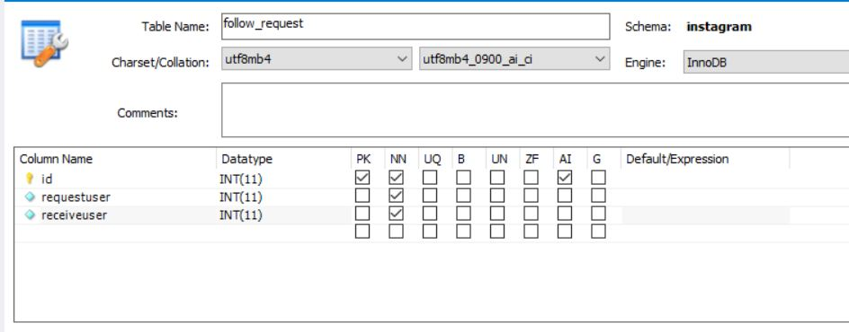
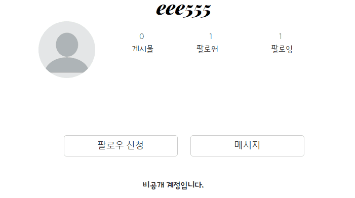

---
title: "스프링 부트 Jsp JPA Spring Security 인스타그램 따라해보기 (11) - 비공개 계정(요청하기)"
categories: springboot
comments: true
---

## 실행 환경
 > STS3, MySQL

## 사용언어(환경)
 > Spring boot(JAVA, JSP), JPA, Bootstrap(부트스트랩), 스프링 시큐리티

## 이전포스팅  
<https://leleluv1122.github.io/springboot/spring-boot-instagram-1/>

<https://leleluv1122.github.io/springboot/spring-boot-instagram-2/>

<https://leleluv1122.github.io/springboot/spring-boot-instagram-3/>

<https://leleluv1122.github.io/springboot/spring-boot-instagram-4/>

<https://leleluv1122.github.io/springboot/spring-boot-instagram-5/>

<https://leleluv1122.github.io/springboot/spring-boot-instagram-6/>

<https://leleluv1122.github.io/springboot/spring-boot-instagram-7/>

<https://leleluv1122.github.io/springboot/spring-boot-instagram-8/>

<https://leleluv1122.github.io/springboot/spring-boot-instagram-9/>

<https://leleluv1122.github.io/springboot/spring-boot-instagram-10/>


# 유저 페이지 조건에 따라 표시하기

## MainController.java
 파일위치: src/main/java/out/stagram/controller/MainController.java

"/main/user/{id}" - main_user 함수에 추가하기

```java
String userId = SecurityContextHolder.getContext().getAuthentication().getName();
User user = userService.findById(id);

model.addAttribute("post", postService.findByUserIdOrderByIdDesc(id));
model.addAttribute("post_image", piService.findByGroupbyPostId());
model.addAttribute("post_count", postService.countByUserId(id));

model.addAttribute("page_id", id);
model.addAttribute("user", user);
```

## user.jsp
 파일위치: /src/main/webapp/WEB-INF/views/main/user.jsp

```html
<c:choose>
	<c:when test="${page_id == currentid}"> <!-- 페이지id == 내아이디 -->
		<div class="fix">
			<a href="update/${user.id}" class="btn btn-default">프로필 수정</a>
		</div>
	</c:when>
	<c:otherwise> <!-- 페이지id != 내아이디 -->
		<div class="follow_d"></div> 
	</c:otherwise>
</c:choose>
<div class="posting">
<c:choose> 
	<c:when test="${currentid == page_id}"> <!-- 페이지id == 내아이디 -->
		<c:choose>
			<c:when test="${post_count != 0}"> <!-- 포스팅이 되어있으면 -->
				<c:forEach var="p" items="${post}">
					<c:forEach var="pi" items="${post_image}">
						<c:if test="${p.id == pi.postId}">
							<div onclick="location.href='/main/post/${p.id}'">
								
							</div>
						</c:if>
					</c:forEach>
				</c:forEach>
			</c:when>
			<c:otherwise> <!-- 포스팅개수가 0이면 -->
				<span>사진 공유</span>
				<br />
				<span>사진과 동영상을 공유하면 프로필에 표시됩니다.</span>
				<br />
				<a href="/main/upload">첫 번째 사진을 공유해보세요</a>
			</c:otherwise>
		</c:choose>
	</c:when>
	<c:otherwise> <!-- 다른사람 user페이지이다 -->
		<c:choose>
			<c:when test="${user.enable == 2}">  <!-- 비공개 계정일경우 -->
				<c:choose>
					<c:when test="${follow == true}"> <!-- 팔로우 되어있으면 -->
						<c:choose>
							<c:when test="${post_count != 0}"> <!-- 포스팅이 있으면 -->
								<c:forEach var="p" items="${post}">
									<c:forEach var="pi" items="${post_image}">
										<c:if test="${p.id == pi.postId}">
											<div onclick="location.href='/main/post/${p.id}'">
												
											</div>
										</c:if>
									</c:forEach>
								</c:forEach>
							</c:when>
							<c:otherwise> <!-- 포스팅이 없으면 -->
								<span>게시물 없음</span>
								<br />
								<br />
								<span>${user.userId}님이 게시하는 사진과 동영상이 여기에 표시됩니다.</span>
							</c:otherwise>
						</c:choose>
					</c:when>
					<c:otherwise> <!-- 팔로우가 안되어있으면 -->
						<span><b>비공개 계정입니다.</b></span>
					</c:otherwise>
				</c:choose>
			</c:when>
			<c:otherwise> <!-- 비공개 계정이 아님 -->
				<c:choose>
					<c:when test="${post_count != 0}">
						<c:forEach var="p" items="${post}">
							<c:forEach var="pi" items="${post_image}">
								<c:if test="${p.id == pi.postId}">
									<div onclick="location.href='/main/post/${p.id}'">
										
									</div>
								</c:if>
							</c:forEach>
						</c:forEach>
					</c:when>
					<c:otherwise>
						<span>게시물 없음</span>
						<br />
						<br />
						<span>${user.userId}님이 게시하는 사진과 동영상이 여기에 표시됩니다.</span>
					</c:otherwise>
				</c:choose>
			</c:otherwise>
		</c:choose>
	</c:otherwise>
</c:choose>
```

하하.... c:choose문 졸라많이 썼다....ㅜㅜ 더 간단하게 하는 법 ... 그거 어떻게 하는건대,,,,

쨌든 이렇게 해두고.... `<div class="follow_d"></div>` 여기부분 하러가야지...

## 비공개 계정에게 팔로우 요청하기
 요청을 해야 알림에 떠서 팔로잉 수락하니까... 요청하기부터 해보자

팔로우 요청 db를 따로 만들어야될 것같다..  



## Follow_request.java
 파일 위치: /outstagram/src/main/java/out/stagram/domain/Follow_request.java

```java
@Data
@Entity
@org.hibernate.annotations.DynamicUpdate
public class Follow_request {
	@Id
	@GeneratedValue(strategy = GenerationType.IDENTITY)
	int id;

	@ManyToOne
	@JoinColumn(name = "requestuser")
	User request;

	@ManyToOne
	@JoinColumn(name = "receiveuser")
	User receive;
}
```

## Follow_requestRepository.java
 파일 위치: /outstagram/src/main/java/out/stagram/domain/Follow_requestRepository.java

```java
public interface Follow_requestRepository extends JpaRepository<Follow_request, Integer> {
	// 요청user의 id와 요청받는user의 id가 id1, id2인 개수
	int countByRequestIdAndReceiveId(int id1, int id2); 
	
	// 요청받은 user의 id가 있는 db의 개수
	int countByReceiveId(int id);
	
	// 요청받은 user의 id가 있는 db list
	List<Follow_request> findByReceiveId(int id);

	// 삭제
	@Modifying
	@Transactional
	void deleteByRequestIdAndReceiveId(int id1, int id2);
}
```

## Follow_requestService.java
 파일 위치: /outstagram/src/main/java/out/stagram/domain/Follow_requestService.java

```java
@Service
public class Follow_requestService {
	@Autowired
	Follow_requestRepository follow_requestRepository;
	@Autowired
	UserService userService;

	public int request_save(int requestid, int receiveid) { // 요청 저장하기
		Follow_request fr = new Follow_request();
		User requestuser = userService.findById(requestid);
		User receiveuser = userService.findById(receiveid);

		fr.setReceive(receiveuser);
		fr.setRequest(requestuser);

		follow_requestRepository.save(fr);
		return 1;
	}

	public boolean request(int requstid, int receiveid) { 
		// 요청이있으면 true반환
		if(follow_requestRepository.countByRequestIdAndReceiveId(requstid, receiveid) == 1)
			return true;
		else
			return false;
	}
}
```


## FollowController.java
 파일 위치: /outstagram/src/main/java/out/stagram/controller/FollowController.java

```java
@Autowired
Follow_requestService frService; // 위에부분에 추가해주기
```

`follow_view` 함수에 추가해야되는 부분~

```java
User u = userService.findByUserId(userId);
User pageuser = userService.findById(id);
boolean isrequest = frService.request(u.getId(), id);

m.put("pageuser", pageuser);
m.put("isrequest", isrequest);
```

```java
@RequestMapping("/follow/request/{id}") // 페이지id
@ResponseBody
private int follow_request(@PathVariable int id) throws Exception {
	String userId = SecurityContextHolder.getContext().getAuthentication().getName();
	User u = userService.findByUserId(userId); // 로그인user

	return frService.request_save(u.getId(), id); // 요청save
}
```


## follow_s.jsp
 파일위치: outstagram/src/webapp/WEB-INF/views/main/follow_s.jsp

```java
function followview(){
	$.ajax({
		url : '/follow/view/' + pageid,
		type : 'post',
		async : true,
		data : {'id' : pageid},
		dataType : "json",
		success : function(data){
			var a = '';
			var b = '';
			if(data.booool == true){
				a += '<a class="btn btn-default" onclick="followDelete('+ pageid +')">팔로우 취소</a>'
			}
			else{
				if(data.pageuser.enable == 2){ // 페이지유저의 상태가 비공개계정이면
					if(data.isrequest == true){ // 요청상태가 있으면
						a += '<a class="btn btn-default">' 
							+ '요청됨</a>';
					}
					else{ // 요청이 없으면
						a += '<a class="btn btn-default" onclick="follow_request('+ pageid +')">팔로우 신청</a>';
					}
				}
				else{ // 페이지유저가 비공개계정XXX
					a += '<a class="btn btn-default" onclick="followInsert('+ pageid +')">팔로우</a>';
				}
			}
			b += '<span>'+ data.follower +'<br> 팔로워</span>';
			a += '<a href="/main/user/message/${page_id}" class="btn btn-default">메시지</a>'
				
			$('.follow_d').html(a);
			$('.follower_d').html(b);
		}
	});
}

function follow_request(id){
	$.ajax({
		url : '/follow/request/' + id,
		type : 'post',
		success : function(data){
			if(data == 1){
				alert('팔로우를 요청합니다.');
				followview(); // 이때 followview는 요청됨으로 바뀐다
			}
		}
	});
}
```



여기서 1은 현재로그인 유저의 id이고 6은 eee555 유저의 id이다.

다음엔 요청된 팔로우 요청을 받을 수 있게... 졸 라 힘 들 다 ~!!>_<  
빼먹은 내용은 없겠지ㅠㅠ?  