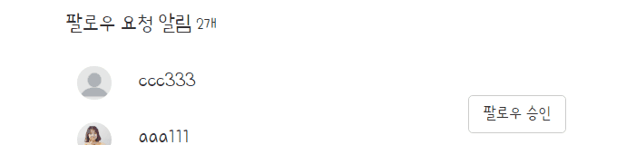

---
title: "스프링 부트 Jsp JPA Spring Security 인스타그램 따라해보기 (12) - 비공개 계정(요청받기)"
categories: springboot
comments: true
---

## 실행 환경
 > STS3, MySQL

## 사용언어(환경)
 > Spring boot(JAVA, JSP), JPA, Bootstrap(부트스트랩), 스프링 시큐리티

## 이전포스팅  
<https://leleluv1122.github.io/springboot/spring-boot-instagram-1/>

<https://leleluv1122.github.io/springboot/spring-boot-instagram-2/>

<https://leleluv1122.github.io/springboot/spring-boot-instagram-3/>

<https://leleluv1122.github.io/springboot/spring-boot-instagram-4/>

<https://leleluv1122.github.io/springboot/spring-boot-instagram-5/>

<https://leleluv1122.github.io/springboot/spring-boot-instagram-6/>

<https://leleluv1122.github.io/springboot/spring-boot-instagram-7/>

<https://leleluv1122.github.io/springboot/spring-boot-instagram-8/>

<https://leleluv1122.github.io/springboot/spring-boot-instagram-9/>

<https://leleluv1122.github.io/springboot/spring-boot-instagram-10/>

<https://leleluv1122.github.io/springboot/spring-boot-instagram-11/>


# 비공개계정 팔로우 요청받기

## bottom.jsp
 파일위치: /src/main/webapp/WEB-INF/views/include/bottom.jsp

```html
<a href="/main/heart"><span class="glyphicon glyphicon-heart" 
	aria-hidden="true"></span></a>
```

## MainController.java
 파일위치: src/main/java/out/stagram/controller/MainController.java

```java
@RequestMapping("main/heart")
public String heart(Model model) throws Exception {
	int followcount = frService.countByReceiveId(user.getId());
	model.addAttribute("followcount", followcount);

	return "main/heart";
}
```

## heart.jsp
 파일위치: /src/main/webapp/WEB-INF/views/main/heart.jsp

```html
<c:if test="${followcount != 0}">
	<div class="follow_txt">
		<div class="request_alarm"></div>
	</div>
	<div class="request_user"></div>
</c:if>
```

## Follow_requestRepository.java
 파일위치: src/main/java/out/stagram/repository/Follow_requestRepository.java

```java
List<Follow_request> findByReceiveId(int id); // 요청받은 list

int countByReceiveId(int id); // 팔로우 요청받은 개수

@Modifying
@Transactional
void deleteByRequestIdAndReceiveId(int id1, int id2);
```

## Follow_requestService.java
 파일위치: src/main/java/out/stagram/service/Follow_requestService.java

```java
public int countByReceiveId(int id) {
	return follow_requestRepository.countByReceiveId(id);
}
public List<Follow_request> findByReceiveId(int id){
	return follow_requestRepository.findByReceiveId(id);
}
public void deleteByRequestIdAndReceiveId(int id1, int id2) {
	follow_requestRepository.deleteByRequestIdAndReceiveId(id1, id2);
}
```

## FollowController.java
 파일위치: src/main/java/out/stagram/controller/FollowController.java

```java
// 팔로우 요청을 보여주는 view
@RequestMapping("/follow/request/view")
@ResponseBody
private Map follow_request_view() throws Exception {
	String userId = SecurityContextHolder.getContext().getAuthentication().getName();
	User user = userService.findByUserId(userId);
		
	Map<String, Object> m = new HashMap<String, Object>();
	int followcount = frService.countByReceiveId(user.getId());
		
	m.put("followcnt", followcount);
	m.put("fr", frService.findByReceiveId(user.getId()));
	return m;
}

// 요청받으면 요청목록에서 지우고 follow하기
@RequestMapping("/follow/request/accept/{id}")
@ResponseBody
private User follow_request_accept(@PathVariable int id) throws Exception {
	String userId = SecurityContextHolder.getContext().getAuthentication().getName();
	User u = userService.findByUserId(userId);

	User followuser = userService.findById(id);

	frService.deleteByRequestIdAndReceiveId(id, u.getId());
	followService.save(followuser.getId(), u.getId());

	return followuser;
}
```

## followrequest.jsp
 파일위치: /src/main/webapp/WEB-INF/views/main/followrequest.jsp

```javascript
<%@ page language="java" contentType="text/html; charset=UTF-8"
	pageEncoding="UTF-8"%>
<script>
	function followrequestview(){
		$.ajax({
			url : '/follow/request/view',
			type : 'post',
			async : true,
			success : function(data){
				var a = '';
				var b = '';
				$.each(data.fr, function(key, value){
					a += '<div>';
					a += '<div class="img" onclick="location.href=\'/main/user/'+
						value.request.id +'\'">';
					if(value.request.profile_photo == null)
						a += '';
					else
						a += '';
					
					a += '<span>' + value.request.userId +'</span>';
					a += '</div>'
					a += '<a class="btn btn-default" onclick="follow_accept('+ value.request.id +');">팔로우 승인</a>';			
					a += '</div>';
				});
				b += '<span">팔로우 요청 알림 </span><span>'+ data.followcnt +'개</span>';

				$('.request_user').html(a);
				$('.request_alarm').html(b);
			}
		});
	}
	
	function follow_accept(id){
		$.ajax({
			url : '/follow/request/accept/' + id,
			type : 'post',
			async : true,
			success : function(data){
				alert(data.name + '님 팔로우를 승인하였습니다.');
				followrequestview();
			}
		});
	}


	$(document).ready(function() {
		followrequestview();
	});
</script>
```



