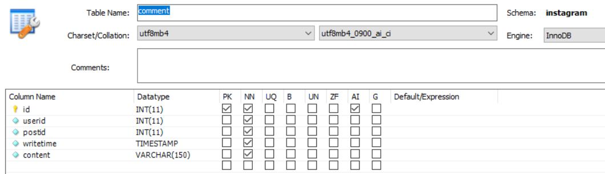

---
title: "스프링 부트 Jsp JPA Spring Security 인스타그램 따라해보기 (13) - 댓글남기기(ajax)"
categories: springboot
comments: true
---

## 실행 환경
 > STS3, MySQL

## 사용언어(환경)
 > Spring boot(JAVA, JSP), JPA, Bootstrap(부트스트랩), 스프링 시큐리티

## 이전포스팅  
<https://leleluv1122.github.io/springboot/spring-boot-instagram-1/>

<https://leleluv1122.github.io/springboot/spring-boot-instagram-2/>

<https://leleluv1122.github.io/springboot/spring-boot-instagram-3/>

<https://leleluv1122.github.io/springboot/spring-boot-instagram-4/>

<https://leleluv1122.github.io/springboot/spring-boot-instagram-5/>

<https://leleluv1122.github.io/springboot/spring-boot-instagram-6/>

<https://leleluv1122.github.io/springboot/spring-boot-instagram-7/>

<https://leleluv1122.github.io/springboot/spring-boot-instagram-8/>

<https://leleluv1122.github.io/springboot/spring-boot-instagram-9/>

<https://leleluv1122.github.io/springboot/spring-boot-instagram-10/>

<https://leleluv1122.github.io/springboot/spring-boot-instagram-11/>

<https://leleluv1122.github.io/springboot/spring-boot-instagram-12/>


# 댓글



## Comment.java
 파일위치: src/main/java/out/stagram/domain/Comment.java

```java
@Data
@Entity
@org.hibernate.annotations.DynamicUpdate
public class Comment {
	@Id
	@GeneratedValue(strategy = GenerationType.IDENTITY)
	int id;
	
	@ManyToOne
	@JoinColumn(name = "userid")
	User user;
	
	@ManyToOne
	@JoinColumn(name = "postid")
	Post post;
	
	Timestamp writetime;
	String content;
}
```

## CommentRepository.java
 파일위치: src/main/java/out/stagram/src/main/repository/CommentRepository.java

```java
public interface CommentRepository extends JpaRepository<Comment, Integer> {
	List<Comment> findByPostId(int pid);

	@Modifying
	@Transactional
	void deleteById(int id);
}
```

## CommentService.java
 파일위치: src/main/java/out/stagram/src/main/service/CommentService.java

```java
@Service
public class CommentService {
	@Autowired
	CommentRepository commentRepository;
	@Autowired
	PostService postService;
	@Autowired
	UserService userService;
	
	public void save(int pid, int uid, String s) {
		Comment c = new Comment();
		Timestamp timestamp = new Timestamp(System.currentTimeMillis());
		
		c.setContent(s);
		c.setWritetime(timestamp);
		c.setPost(postService.findById(pid));
		c.setUser(userService.findById(uid));
		
		commentRepository.save(c);
	}

	public List<Comment> findByPostId(int pid){
		return commentRepository.findByPostId(pid);
	}
	
	public int deleteById(int id) {
		commentRepository.deleteById(id);
		return 1;
	}
}
```

## CommentController.java
 파일위치: src/main/java/out/stagram/controller/CommentController.java

```java
@Controller
@RequestMapping("/comment")
public class CommentController {
	@Autowired
	CommentService commentService;

	@RequestMapping("/insert")
	@ResponseBody
	private int c_insert(@RequestParam int pid, @RequestParam String content, @RequestParam int uid) throws Exception {

		commentService.save(pid, uid, content);
		return 1;
	}
	
	@RequestMapping("/list")
	@ResponseBody
	private List<Comment> comment_list(Model model, int id) throws Exception {
		
		return commentService.findByPostId(id);
	}
	
	@RequestMapping("/delete/{id}")
	@ResponseBody
	private int comment_delete(@PathVariable int id) throws Exception {
		
		return commentService.deleteById(id);
	}
}
```

## post.jsp
 파일위치: /src/main/webapp/WEB-INF/views/main/post.jsp

```html
<div class="comment">
	<div class="container">
		<label for="content">comment</label>
		<form name="commentInsertForm">
			<div class="input-group">
				<input type="hidden" name="pid" id="pid" value="${p.id}" /> 
				<input type="text" class="form-control" id="content" name="content"
					placeholder="내용을 입력하세요."> 
				<input type="hidden" name="uid" value="${currentid}" />
				<span class="input-group-btn">
					<button class="btn btn-default" type="button"
						name="commentInsertBtn">등록</button>
				</span>
			</div>
		</form>
	</div>
	<div class="container">
		<div class="commentList"></div>
	</div>
</div>

<%@ include file="comment.jsp"%>
```

## comment.jsp
 파일위치: /src/main/webapp/WEB-INF/views/main/comment.jsp

```javascript
<%@ page language="java" contentType="text/html; charset=UTF-8"
	pageEncoding="UTF-8"%>
<%@ taglib uri="http://java.sun.com/jsp/jstl/core" prefix="c"%>
<script>
	var id = '${id}'; // postid

	$('[name=commentInsertBtn]').click(function() {
		var insertData = $('[name=commentInsertForm]').serialize();
		commentInsert(insertData);
	});

	function commentList(){
		$.ajax({
			url : '/comment/list',
			type:'get',
			data : {'id': id},
			success : function(data){
				var a = '';
				$.each(data, function(key, value){ // value가 list형태라서 for문같은 each돌림
					var confirms = "댓글을 삭제하시겠습니까?"
					var userid = value.user.id;
					var date = value.writetime;
					var wd = new Date(date.valueOf());
					var w_time = wd.getTime();
					
					var cur = new Date();
					var c_time = cur.getTime();
					
					var chai = c_time - w_time;
					
					a += '<div class="commentArea">';
					a += '<div class="img"><a href="/main/user/'+ value.user.id +'">'; 
					
					if(value.user.profile_photo != null)
						a += '</a>';
					else
						a += '</a>';
					a += '</div>';
	                a += '<div class="commentContent'+value.id+'"> <a href="/main/user/'
	                	+ value.user.id +'"><p> <b>' 
	                	+ value.user.userId + '</b></p></a>' + ' <p>' + value.content +'</p>';
	                a += '<div>';
	                
	                if(chai < 1000 * 60)
	                	a += Math.floor(chai / 1000) + ' 초전';
	                else if(chai < 1000 * 60 * 60)
	                	a += Math.floor(chai / (1000 * 60)) + ' 분전';
	                else if(chai < 1000 * 60 * 60 * 24)
	                	a += Math.floor(chai / (1000 * 60 * 60)) + ' 시간전';
	                else if(chai < 1000 * 60 * 60 * 24 * 30)
	                	a += Math.floor(chai / (1000 * 60 * 60 * 24)) + ' 일전';
	                else if(chai < 1000 * 60 * 60 * 24 * 30 * 12)
	                	a += Math.floor(chai / (1000 * 60 * 60 * 24 * 30)) + ' 달전';
	                
	                if(${currentid} == userid)
	                	a += '<a onclick="commentDelete('+ value.id + ');">삭제</a>';
	                a += '</div></div></div>';
		   });
		   $(".commentList").html(a);
	           }
	     });
	}
	
	//댓글 등록
	function commentInsert(insertData){
	    $.ajax({
	        url : '/comment/insert',
	        type : 'post',
	        data : insertData,
	        success : function(data){
	            if(data == 1) {
	                commentList();
	                $('#content').val('');
	            }
	        }
	    });
	}
	
	function commentDelete(cmt){
		$.ajax({
			url : '/comment/delete/' + cmt,
			type : 'post',
			success : function(data){
				if(data == 1)
					commentList(id);
			}
		});
	}
	
	$(document).ready(function(){
	    commentList();
	});
</script>
```


이제 거의 끝나간다,,,^^