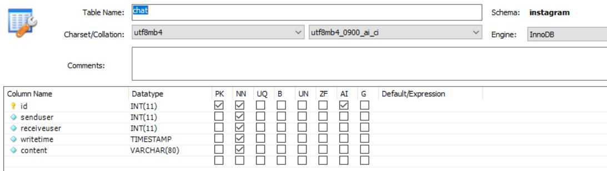
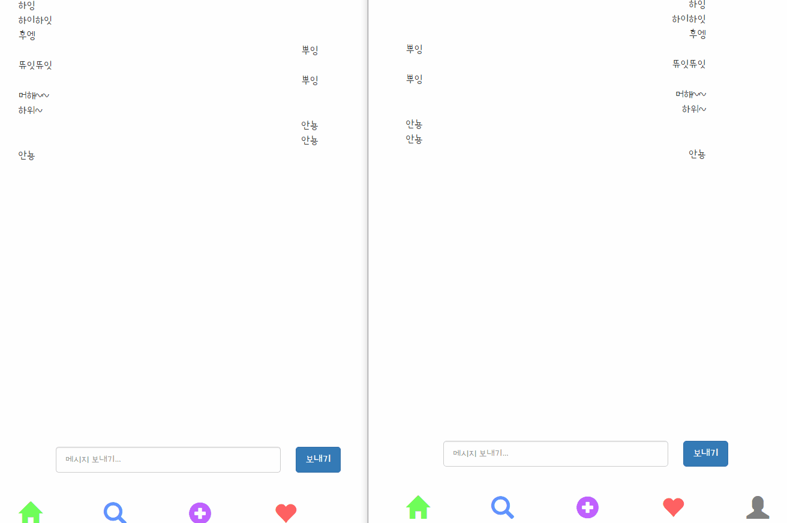

---
title: "스프링 부트 Jsp JPA Spring Security 인스타그램 따라해보기 (16) - 실시간 채팅"
categories: springboot
comments: true
---

## 실행 환경  
 > STS3, MySQL  

## 사용언어(환경)  
 > Spring boot(JAVA, JSP), JPA, Bootstrap(부트스트랩), 스프링 시큐리티  

## 이전포스팅  
<https://leleluv1122.github.io/springboot/spring-boot-instagram-1/>

<https://leleluv1122.github.io/springboot/spring-boot-instagram-2/>

<https://leleluv1122.github.io/springboot/spring-boot-instagram-3/>

<https://leleluv1122.github.io/springboot/spring-boot-instagram-4/>

<https://leleluv1122.github.io/springboot/spring-boot-instagram-5/>

<https://leleluv1122.github.io/springboot/spring-boot-instagram-6/>

<https://leleluv1122.github.io/springboot/spring-boot-instagram-7/>

<https://leleluv1122.github.io/springboot/spring-boot-instagram-8/>

<https://leleluv1122.github.io/springboot/spring-boot-instagram-9/>

<https://leleluv1122.github.io/springboot/spring-boot-instagram-10/>

<https://leleluv1122.github.io/springboot/spring-boot-instagram-11/>

<https://leleluv1122.github.io/springboot/spring-boot-instagram-12/>

<https://leleluv1122.github.io/springboot/spring-boot-instagram-13/>

<https://leleluv1122.github.io/springboot/spring-boot-instagram-14/>

<https://leleluv1122.github.io/springboot/spring-boot-instagram-15/>

# 실시간 채팅

실시간 채팅을 만들긴 할건데 소켓통신은 잘 몰라서 간단하게 만들어 볼 예정!

먼저 mysql로 가서 table을 만들자~



## Chat.java
 파일위치: src/main/java/out/stagram/domain/Chat.java

```java
@Data
@Entity
@org.hibernate.annotations.DynamicUpdate
public class Chat implements Comparator<Chat> {
	@Id
	@GeneratedValue(strategy = GenerationType.IDENTITY)
	int id;
	
	@ManyToOne
	@JoinColumn(name = "senduser")
	User send;
	
	@ManyToOne
	@JoinColumn(name = "receiveuser")
	User receive;
	
	Timestamp writetime;
	String content;
	
	@Override
	public int compare(Chat c1, Chat c2) { // chating을 정렬하기 위해 compare method를 만들어놓음
		long l1 = c1.getWritetime().getTime();
		long l2 = c2.getWritetime().getTime();
		
		if(l1 > l2)
			return 1;
		else
			return -1;
	}
}
```

## ChatRepository.java
 파일위치: src/main/java/out/stagram/repository/ChatRepository.java

```java
public interface ChatRepository extends JpaRepository<Chat, Integer> {
	List<Chat> findBySendIdAndReceiveId(int s, int r);
}
```

## ChatService.java
 파일위치: src/main/java/out/stagram/service/ChatService.java

```java
@Service
public class ChatService {
	@Autowired
	ChatRepository chatRepository;

	public void save(int r, int s, String c) {
		Chat chat = new Chat();
		Timestamp timestamp = new Timestamp(System.currentTimeMillis());

		chat.setWritetime(timestamp);
		chat.setSend(userService.findById(s));
		chat.setReceive(userService.findById(r));
		chat.setContent(c);

		chatRepository.save(chat);
	}
}
```

## ChatController.java
 파일위치: src/main/java/out/stagram/controller/ChatController.java

```java
@RequestMapping("/main/user/message/{id}")
public String message(@PathVariable("id") int id, Model model) throws Exception {
	model.addAttribute("page_id", id);

	return "/main/user/message";
}

@RequestMapping("/chat/insert")
@ResponseBody
private int chat_insert(@RequestParam int sendid, @RequestParam int receiveid, @RequestParam String message) throws Exception {
	chatService.save(receiveid, sendid, message);
	return 1;
}

@RequestMapping("/chat/list/{id}")
@ResponseBody
private List<Chat> chatlist(@PathVariable int id) throws Exception {
	String userId = SecurityContextHolder.getContext().getAuthentication().getName();
	User login_user = userService.findByUserId(userId);

	List<Chat> chatting = chatService.findBySendIdAndReceiveId(login_user.getId(), id);
	List<Chat> c = chatService.findBySendIdAndReceiveId(id, login_user.getId());
	for (Chat t : c)
		chatting.add(t);
	Chat ccc = new Chat();
	Collections.sort(chatting, ccc); // 역순으로 정렬하기

	return chatting;
}
```

## message.jsp
 파일위치: src/main/webapp/WEB-INF/views/main/user/message.jsp

```html
<body>
	<sec:authentication property="user.id" var="currentid" />
	<sec:authentication property="user.name" var="currentname" />
	<div class="chat-page">
		<div class="msg_view"></div> <!-- 여기에 msg view가 나타남 ajax로! -->
		<div id="msg_input">
			<form name="chatinput">
				<input type="hidden" name="sendid" value="${currentid}"> 
				<input type="hidden" name="receiveid" value="${page_id}"> <input
					type="text" class="form-control w200" name="message"
					class="textiiii" placeholder="메시지 보내기..." required>
				<button type="button" name="chatbtn" class="btn btn-primary">보내기</button>
			</form>
		</div>
	</div>
	<div id="footer">
		<%@ include file="../../include/bottom.jsp"%>
	</div>
	<%@ include file="chat.jsp"%>
</body>
</html>
```

## chat.jsp
 파일위치: src/main/webapp/WEB-INF/views/main/user/chat.jsp

```html
<%@ page language="java" contentType="text/html; charset=UTF-8"
	pageEncoding="UTF-8"%>
<script>
	var id = '${id}';

	$('[name=chatbtn]').click(function() {
		var insertData = $('[name=chatinput]').serialize();
		chatInsert(insertData);
	});
	
	function chatInsert(insertData) {
		$.ajax({
			url: '/chat/insert',
			type: 'post',
			data: insertData,
			success : function(data){
				if(data == 1){
					chatlist();
					 // 메시지를 보내면 메시지 입력창은 초기화
					$('.textiiii').val('');
				}
			}
		});
	}
	
	function chatlist() {
		$.ajax({
			url: '/chat/list/' + id,
			type: 'post',
			async : true,
			data : {'id' : id},
			dataType : "json",
			success : function(data) {
				var a = '';
				$.each(data, function(key, value){
					a += '<div class="hmhm">';
					if(value.send.id == id) { // 보낸건 오른쪽
						a += '<div class="sasa">';
						a += '<span>'+ value.content +'</span>';
						a += '</div>';
					}
					else // 받은건 왼쪽
						a += '<span>' + value.content + '</span>';
					a += '<br /></div>';
				});
				$('.msg_view').html(a);
			}
		});
	}
	$(document).ready(function() {
		setInterval(chatlist, 3000); // 1초로 하면 렉많이걸려서 3초...ㅎㅎ
	});
</script>
```

