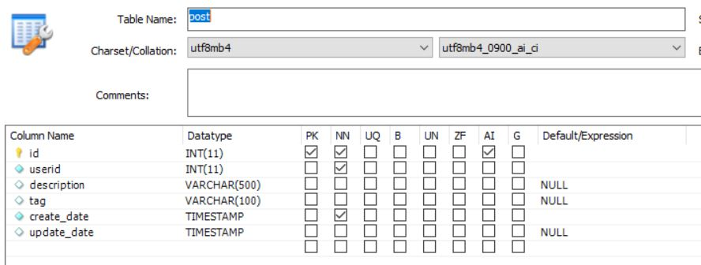
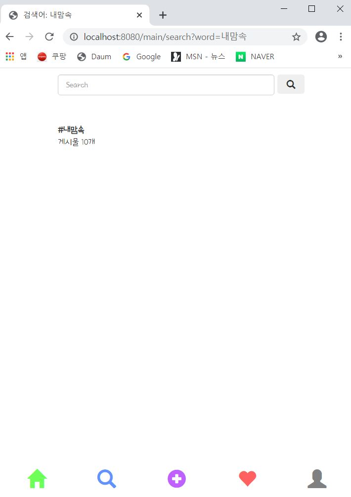

---
title: "스프링 부트 Jsp JPA Spring Security 인스타그램 따라해보기 (17) - Tag"
categories: springboot
comments: true
---

## 실행 환경  
 > STS3, MySQL  

## 사용언어(환경)  
 > Spring boot(JAVA, JSP), JPA, Bootstrap(부트스트랩), 스프링 시큐리티  

## 이전포스팅  
<https://leleluv1122.github.io/springboot/spring-boot-instagram-1/>

<https://leleluv1122.github.io/springboot/spring-boot-instagram-2/>

<https://leleluv1122.github.io/springboot/spring-boot-instagram-3/>

<https://leleluv1122.github.io/springboot/spring-boot-instagram-4/>

<https://leleluv1122.github.io/springboot/spring-boot-instagram-5/>

<https://leleluv1122.github.io/springboot/spring-boot-instagram-6/>

<https://leleluv1122.github.io/springboot/spring-boot-instagram-7/>

<https://leleluv1122.github.io/springboot/spring-boot-instagram-8/>

<https://leleluv1122.github.io/springboot/spring-boot-instagram-9/>

<https://leleluv1122.github.io/springboot/spring-boot-instagram-10/>

<https://leleluv1122.github.io/springboot/spring-boot-instagram-11/>

<https://leleluv1122.github.io/springboot/spring-boot-instagram-12/>

<https://leleluv1122.github.io/springboot/spring-boot-instagram-13/>

<https://leleluv1122.github.io/springboot/spring-boot-instagram-14/>

<https://leleluv1122.github.io/springboot/spring-boot-instagram-15/>

<https://leleluv1122.github.io/springboot/spring-boot-instagram-16/>

# 태그

post table을 조금 변경해볼게용...  
location을 써놔도 사용 못할거같아서ㅠㅠ tag로 변경!!  



## Post.java
 파일위치: src/main/java/out/stagram/domain/Post.java

location을 제거하고 tag를 추가해준당

```java
String tag;
```

## PostService.java
 파일위치: src/main/java/out/stagram/service/PostService.java
 
```java
public int save(Post p) {
	Post pi = new Post();
	Timestamp timestamp = new Timestamp(System.currentTimeMillis());

	pi.setUser(p.getUser());
	pi.setDescription(p.getDescription());
	pi.setTag(p.getTag());
	pi.setCreate_date(timestamp);

	postRepository.save(pi);

	return pi.getId();
}
```

## upload.jsp
 파일위치: src/main/webapp/WEB-INF/views/main/upload.jsp

```html
<div class="form-group">
	<input type="text" class="form-control w200" id="tag"
		name="tag" placeholder="태그 입력" />
</div>
```

## MainController.java
 파일위치: src/main/java/out/stagram/controller/MainController.java

```java
@RequestMapping("/main/posting")
public String posting(HttpServletRequest request, MultipartHttpServletRequest mtfRequest, Model model)
	.
	.
	.
	String tag = request.getParameter("tag");
	post.setTag(tag);
}
```

태그를 입력할때에는 항상 #~~ 로 입력하고 2개 이상 입력할 때에는 #~~, #@@, #%% 이런식으로만 입력하도록하자~

`#내맘속, #강아지` 요런식!

자 이제 적용했으면 원래있는 게시물에 tag들을 db로 직접... 입력을 하고오세용...

입력했으면... tag를 검색할 수 있게 고고

## PostRepository.java
 파일위치: src/main/java/out/stagram/repository/PostRepository.java

```java
int countByTagContains(String word);
List<Post> findByTagContains(String word);
``` 

## PostService.java
 파일위치: src/main/java/out/stagram/service/PostService.java

```java
public int countByTagContains(String word) {
	return postRepository.countByTagContains(word);
}

public List<Post> findByTagContains(String word) {
	return postRepository.findByTagContains(word);
}
```

## MainController.java
 파일위치: src/main/java/out/stagram/controller/MainController.java

```java
// search 함수에 추가시켜준다
model.addAttribute("tag_cnt", postService.countByTagContains(word));

// 태그를 클릭했을 때 페이지
@RequestMapping("main/search/tag/{word}")
public String search_tag(@PathVariable("word") String word, Model model) throws Exception {
	model.addAttribute("post", postService.findByTagContains(word));
	model.addAttribute("post_image", piService.findByGroupbyPostId());
	model.addAttribute("word", word);

	return "/main/search/tag";
}
```

## search.jsp
 파일위치: src/main/webapp/WEB-INF/views/main/user/search.jsp

```html
<div class="find_user">
	<c:choose>
		<c:when test="${ucnt == 0 && tag_cnt == 0}">
			<span>일치하는 유저, 태그가 없습니다</span>
		</c:when>
		<c:otherwise>
			<c:forEach var="u" items="${find_user}">
				<div class="f">
					<div class="title_image">
						<a href="/main/user/${u.id}"> <c:choose>
								<c:when test="${u.profile_photo != null}">
									
								</c:when>
								<c:otherwise>
									
								</c:otherwise>
							</c:choose>
						</a>
					</div>
					<div class="userid_txt">
						<a href="/main/user/${u.id}">${u.userId}</a>
					</div>
				</div>
			</c:forEach>

			<c:if test="${tag_cnt > 0}">
				<div class="tag" onclick="location.href='/main/search/tag/${word}'">
					<span><b>#${word}</b></span> <br /> <span>게시물 ${tag_cnt}개</span>
				</div>
			</c:if>
		</c:otherwise>
	</c:choose>
</div>
```



태그를 클릭했을 때의 페이지도 만들어보자~

## tag.jsp
 파일위치: src/main/webapp/WEB-INF/views/main/user/search/tag.jsp

```html
<body>
	<div id="contents">
		<!-- 검색하는 곳 -->
		<div class="search"> 
			<form action="/main/search" class="form-inline my-2 my-lg-0" autocomplete="off">
				<input class="form-control mr-sm-2" type="search" name="word"
					placeholder="Search" aria-label="Search">
				<button class="btn btn-outline-success my-2 my-sm-0">
					<span class="glyphicon glyphicon-search"></span>
				</button>
			</form>
		</div>
		<div class="nava">
			<span>태그 <b>#${word}</b></span>
		</div>
		<div class="search_tag">
			<c:forEach var="p" items="${post}">
				<c:forEach var="pi" items="${post_image}">
					<c:if test="${p.id == pi.postId}">
						<div onclick="location.href='/main/post/${p.id}'">
							
						</div>
					</c:if>
				</c:forEach>
			</c:forEach>
		</div>
	</div>
	<div id="footer">
		<%@ include file="../../include/bottom.jsp"%>
	</div>
</body>
```


## main.jsp
 파일위치: src/main/webapp/WEB-INF/views/main.jsp
 
description밑에 추가해주자!

```html
<div class="tag_${p.id}"></div>
<script>
	var original = '${p.tag}';
	var url = '\'/main/search/tag/';
	var pid = '${p.id}';
	var a = '';
	var arr = original.split(', '); // ,를 기준으로 나눈당

	for (var i = 0; i < arr.length; i++) {
		a += '<span style="color:blue;" onclick="location.href='
			+ url 
			+ arr[i].replace("#", "") 
			+ '\'' 
			+ '">'
			+ arr[i]
			+ ' </span>';
		}
	$(".tag_" + pid).html(a);
</script>
```


태그 누르면 각각 다른 태그로 잘 나온다~