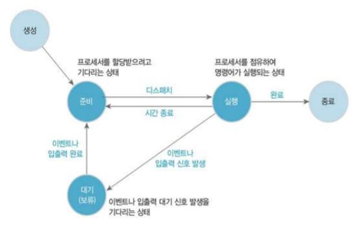
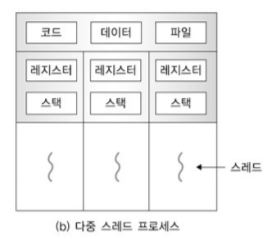

---
title: "운영체제 - 프로세스와 스레드"
categories: technical_interview
comments: true
---

# 프로세스 & 프로그램

## 프로그램(Program)
 - 어떤 작업을 위해 실행할 수 있는 파일

## 프로세스(Process)
 사용자 관점: 세그먼트(코드, 데이터, 스택 등)의 가상 주소 공간을 갖는 상태  
 시스템 관점: 실행중인 프로그램을 의미

 - 실행 중인 프로그램: 디스크에 저장되어 있던 실행 가능한 프로그램이 메모리에 적재되어 운영체제의 제어를 받는 상태를 말함.
 - 코드, 데이터, 스택, 힙의 구조로 되어있음
   - 스택: 데이터를 일시적으로 저장하는 영역
   - 힙: 코드 영역과는 별도로 유지되는 자유 영역
   - 데이터: 프로그램의 가상 주소 공간
   - 코드: 실행 명령을 포함하는 메모리이거나 목적 파일에 있는 프로그램 영역

프로그램이 텍스트(코드) 만 갖는 수동적인 개체라면, 프로세스는 메모리에 주소 공간을 갖는 능동적인 개체

### 프로세스 상태
 - 실행: 프로세스가 프로세서를 점유한 상태 (명령어가 실행되는 상태)
 - 대기(보류): 프로세서가 이벤트(입출력 종료와 같은 외부 신호)가 일어나길 기다리는 상태
 - 준비: 프로세스가 프로세서를 할당 받기 위해 기다리는 상태

대부분의 프로세스는 준비나 대기(보류) 상태이며, 어느 한 순간에 한 프로세스만 실행 상태가 됨  
**프로세서 스케줄러(작업 스케줄러)** 를 이용해 프로세스 상태 변화 관리

### 문맥교환
 현재 CPU를 사용중인 프로세스의 CPU 제어권이 다른 프로세스로 넘어가는 과정

# 스레드
 - 프로세서를 사용하는 기본 단위  
 - 명령어를 독립적으로 실행할 수 있는 하나의 제어 흐름
 - 프로세스는 스레드를 하나 이상 가짐

## 장점
 - 프로세스에 포함된 스레드들은 공통의 목적 달성을 위해 병렬로 수행  
   - 자원을 공유하여 한 프로세스에서 동시 작업 가능  
 - 시스템 성능과 효율 향상
   - 하나의 프로세스가 서로 다른 프로세서에서 프로그램의 다른 부분을 동시에 실행 가능

## 다중 스레드
 프로세스 하나에 여러 스레드를 실행하는 것

### 특징
 - 각 스레드를 별도의 프로세서에서 실행하는 측면 다중 프로세싱과 같은 의미
 - 자원 생성과 관리의 중복성을 최소화하여 실행능력 향상
 - 각 스레드는 서로 통신 가능하여 독립적으로 실행
 - 프로세스를 새로 생성하는 것보다 기존 프로세스에서 스레드를 생성하는 것이 빠르고, 같은 프로세스 내 스레드 간 교환이나 스레드 종료가 빠름
 - 프로세스를 각각의 스레드와 고유의 레지스터, 스택으로 표현, 프로세스 주소 영역을 모든 스레드가 공유
 

