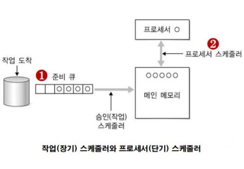

---
title: "운영체제 - 단일 프로세서 스케줄링"
categories: technical_interview
comments: true
---

# 스케줄링
 **프로세스(작업)에 프로세서를 할당하는 일련의 과정**
 
 - 여러 프로세스가 번갈아 사용하는 자원을 어떤 시점에서 어떤 프로세스에 할당할지를 결정  
 - 작업의 응답 시간 최소화

## 스케줄링의 종류
 - 장기 스케줄링
  실행할 작업을 준비 큐(입력 큐)에서 꺼내 메인 메모리에 적재함

 - 단기 스케줄링(프로세서 스케줄러)
  메인 메모리의 준비 상태에 있는 작업 중에서 실행할 작업을 선택, 프로세서를 배당함

## 스케줄링의 목적
 - 공정성, 처리율 증가, CPU 이용률 증가, 우선순위 제도, 오버헤드 최소화
 - 응답시간, 반환시간, 대기 시간 최소화
 - 균형 있는 자원의 사용, 무한 연기 회피

## 선점 스케줄링과 비선점 스케줄링
 **실행 중인 작업이나 프로세스를 실행 중 중단할 것인가?** 의 관점을 기반으로 구분

### 비선점 스케줄링
 - 이미 할당된 CPU를 다른 프로세스가 강제로 빼앗아 사용할 수 없음
 - 중요한 작업이 중요하지 않은 작업을 기다리는 경우가 발생 가능

### 선점 스케줄링
 - 하나의 프로세스가 CPU를 할당받아 실행하고 있을 때 우선순위가 높은 다른 프로세스가 CPU를 강제로 빼앗아 사용할 수 있음
 - 우선순위가 높은 프로세스를 빠르게 처리 가능
 - 많은 오버헤드 초래

## 스케줄링 알고리즘

### 비선점 스케줄링
 FCFS, SJF, HRN, 우선순위, 기한부 알고리즘

 - FCFS = FIFO
   - 선입선출(FIFO) 큐로 구현  

 - SJF (Shortest Job First)
   - 준비 상태 큐에서 기다리고 있는 프로세스들 중에서 실행 시간이 가장 짧은 프로세스에서 먼저 CPU를 할당하는 기법
   - 가장 적은 평균 대기 시간을 제공하는 최적 알고리즘

 - HRN (Hightest Response-ratio Next)
   - 실행시간이 긴 프로세스에 불리한 SJF기법을 보완하기 위한 것으로, 대기시간과 서비스 시간을 이용

 - 기한부
   - 프로세스에게 일정한 시간을 주어 그 시간 안에 완료하고 완료되지 않을 경우 제거되거나 처음부터 다시 실행

 - 우선순위 (Priority)
    - 준비상태 큐에서 기다리는 각 프로세스마다 우선순위를 부여하여 그 중 가장 높은 프로세스에게 먼저 CPU를 할당하는 기법
    - 우선순위가 동일할 경우 FCFS 기법으로 CPU를 할당

### 비선점 스케줄링
 선점 우선순위, SRT, RR, 다단계 큐, 다단계 피드백 큐

 - 선점 우선순위
   - 준비상태 큐의 프로세스들 중에서 우선순위가 가장 높은 프로세스에게 먼저 CPU를 할당하는 기법
   - 우선순위가 높은 프로세스가 들어오면 현재의 프로세스를 보류하고 새로운 프로세스를 실행

 - SRT (Shortest Remaining Time)
   - 비선점 스케줄링인 SJF기법을 선점 형태로 변경한 기법 (선점 SJF기법)
   - 현재 실행중인 프로세스의 남은 시간과 준비상태 큐에 새로 도착한 프로세스의 실행 시간을 비교하여 가장 짧은 실행 시간을 요구하는 프로세스에게 CPU를 할당하는 기법으로, 시분할 시스템에 유용

 - RR (Round Robin)
   - 시분할 시스템을 위해 고안된 방식으로, FCFS 알고리즘을 선점 형태로 변경한 기법
   - 준비상태 큐에 먼저 들어온 프로세스가 먼저 CPU를 할당받지만 각 프로세스는 시간 할당량 동안만 실행한 후 실행이 완료되지 않으면 다음 프로세스에게 CPU를 넘겨주고 준비상태 큐의 가장 뒤에 배치됨
   - 할당되는 시간이 클 경우 FCFS기법과 같아짐
   - 할당되는 시간이 작을 경우 문맥교환 및 오버헤드가 자주 발생되어 요청된 작업을 신속하게 처리할 수 없음
