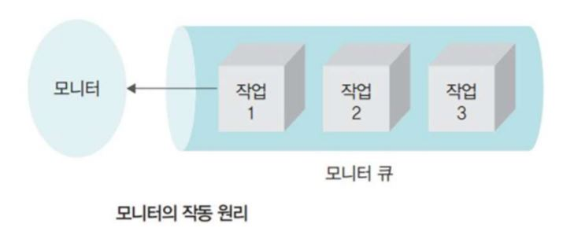

---
title: "운영체제 - 병행 프로세스와 상호배제"
categories: technical_interview
comments: true
---

# 병행 프로세스
 - 프로세스 여러 개가 동시에 실행되는 것
 - 독립적으로 수행 가능하며, 다른 프로세스와 협력하면서 기능을 수행하기도 함

## 선행 제약
 - 프로세스가 순서대로 다른 상태로 옮겨감
 - 두 프로세스 간에 선행 관계가 없으면 이들은 독립적이라 병행 실행이 가능함

# 상호 배제와 동기화
 - 동기화 실행 방법
   - 임계 영역
   - 상호 배제

 - 상호배제 (Mutual Exclusion)  
   - 특정 공유 자원을 한 순간에 한 개의 프로세스만 사용할 수 있을 때, 프로세스 하나가 공유 데이터에 접근하는 동안 다른 프로세스가 해당 데이터를 접근할 수 없게 하는 것

 - 임계 영역
   - 둘 이상의 프로세스가 공유할 수 없는 자원
   - 상호배제와 임의의 동기화 문제들을 안전하고 효과적으로 구현하기 위해 사용

 - 프로세스 간 동기화
   - 공유자원을 동시에 사용하지 못하게 실행을 제어하는 기법

## 세마포어
 - 프로세스 동기화 문제 해결을 위한 두 가지 연산 (P, V)
   - P : wait 동작으로 임계 영역에 진입하기 위한 연산 S = S - 1
   - V : 대기중인 프로세스를 깨우는 신호를 보내는 signal 동작으로 임계 영역에서 나오기 위한 연산 S = S + 1
   - S : 세마포어

## 모니터
 - 추상 데이터 형태를 공유하기 위한 동기화 메커니즘
 - 모니터 경계에서 한 번에 한 프로세스만 진입하도록 제어되므로 상호 배제 원칙을 지킴

