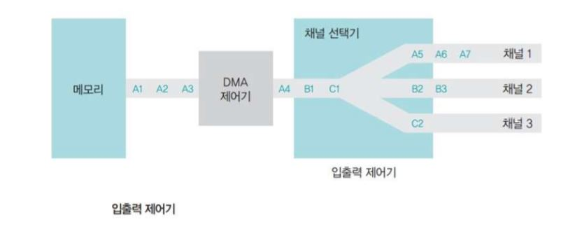
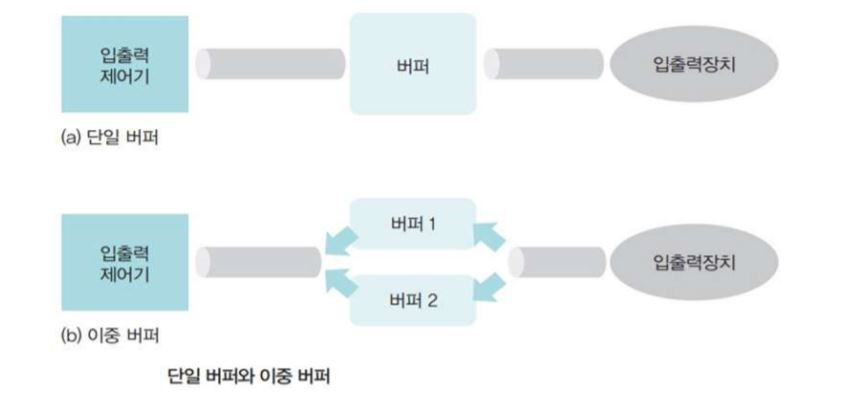
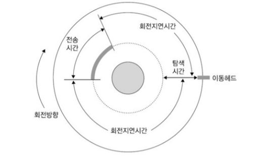
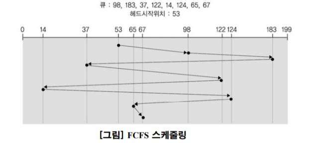
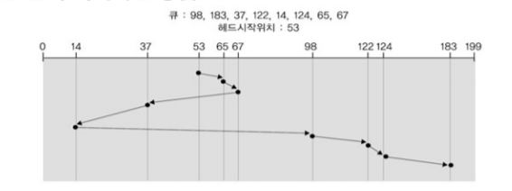
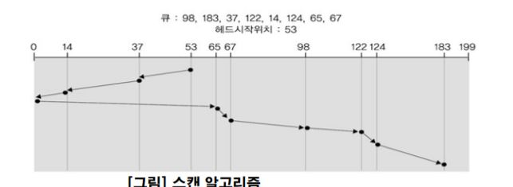
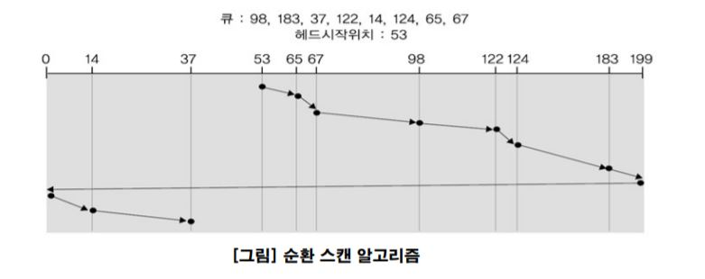
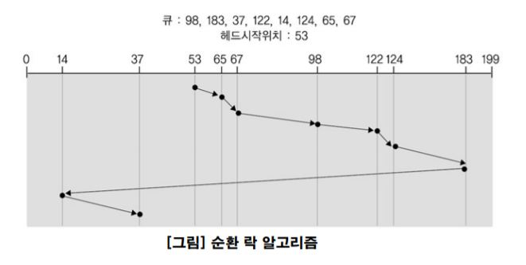
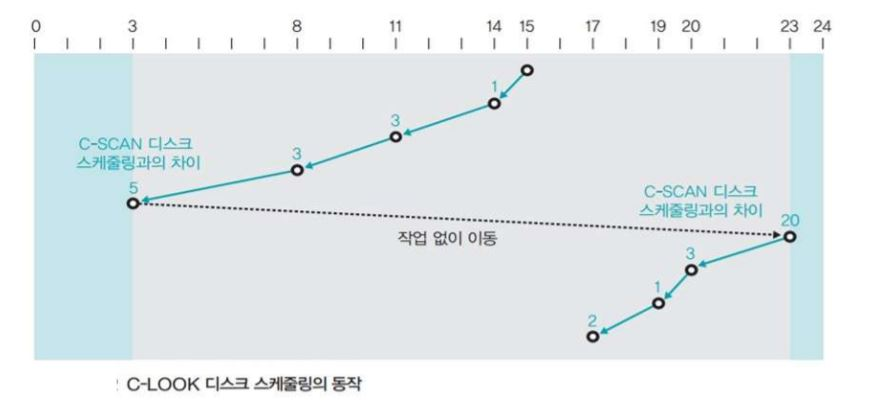

---
title: "운영체제 - 입출력 시스템과 디스크 관리"
categories: technical_interview
comments: true
---

# 직접 메모리 접근(DMA)
 - CPU의 도움 없이도 메모리에 접근할 수 있도록 입출력 제어기에 부여된 권한
 - 입출력 제어기에는 직접 메모리에 접근하기 위한 DMA 제어기가 마련되어 있음
 - 채널 선택기는 여러 채널에서 전송된 데이터 중 어떤 것을 메모리로 보낼지 결정

# 인터럽트
 주변장치의 입출력 요구나 하드웨어의 이상 현상을 CPU에 알려주는 역할을 하는 신호

## 인터럽트의 종류
 - 외부 인터럽트  
   입출력 장치로부터 오는 인터럽트뿐 아니라 전원 이상이나 기계적인 오류 때문에 발생하는 인터럽트를 포함
 - 내부 인터럽트  
   프로세스의 잘못이나 예상치 못한 문제 때문에 발생하는 인터럽트
 - 시그널  
   사용자가 직접 발생시키는 인터럽트

## 인터럽트 벡터
 - 값이 1이면 여러 인터럽트 중 어떤 인터럽트가 발생했음

## 버퍼
 - 속도가 다른 두 장치 속도 차이를 완화하는 역할을 하는 저장 공간

# 자기 디스크
 - 탐색(Seek)  
   - 디스크상의 원하는 섹터에 액세스하기 위해 헤드를 해당 트랙 또는 실린더로 이동해 위치시킴

 - 탐색 시간  
   - 탐색에 걸리는 시간
   - 디스크의 헤드가 움직이는 시간에 좌우되므로 멀리 떨어진 트랙 탐색 시 탐색시간이 길어짐

 - 회전지연시간
   - 원하는 섹터가 입출력 헤드 아래로 회전할 때를 기다리는 시간

 - 전송시간
   - 디스크와 메인 메모리 간의 섹터를 주고받는 데 걸리는 시간

## 데이터 액세스 시간
 - 고정 헤드 디스크 데이터 엑세스 시간  
   - 회전지연시간 + 전송시간
 - 이동 디스크 데이터 액세스 시간  
   - 탐색지연시간 + 회전지연시간 + 전송시간

# 디스크 스케줄링
## 목적
 - 처리량 최대화
 - 응답 시간 최소화
 - 응답 시간 편차의 최소화

## 선입 선처리 스케줄링 (FCFS, First-Come-First-Served)
 - 요청이 도착한 순서에 따라 처리
 - 프로그램하기 쉽고 어떤 요청도 무기한 연기되는 경우가 없으며 본질적으로 공평성이 유지됨
 - 문제점  
   디스크 요청이 흩어져 있는 경우 실행시간 오버헤드는 적으나 탐색시간이 오래 걸려 처리량이 감소함

## 최소 탐색시간 우선 스케줄링 (SSTF, Shortest Seek Time First) or (SPTF, Shortest Positioning Time First)
 - 디스크 요청을 처리하기 위해서 헤드가 먼 곳까지 이동하기 전에 현재 헤드 위치에 가까운 모든 요구를 먼저 처리하는 방법
 - 문제점  
   디스크 처리시간을 실질적으로 줄일 수 있으나, 디스크 요구의 기아상태 발생 가능

## 스캔(SCAN) 스케줄링
 - 현재 진행 중인 방향으로 가장 짧은 탐색 거리에 있는 요청을 먼저 서비스하는 기법

## 순환 스캔 스케줄링 (C-SCAN, Circular SCAN scheduling)
 - 스캔 스케줄링을 변형, 대기시간을 균등하게
 - 스캔 한쪽방향으로 이동하면서 요청을 처리하고 끝에 다다르면 다시 처음부터 요청을 처리

## 룩(Look) 스케줄링
 - SCAN기법을 사용하되 진행 방향의 마지막 요청을 서비스한 후 바로 역방향으로 진행하는 기법

## C-LOOK 디스크 스케줄링 (Circular LOOK disk scheduling)
 - C-SCAN 디스크 스케줄링의 LOOK 버전
 - 한쪽 방향으로만 서비스하는 C-SCAN 스케줄링과 유사하지만, 더 이상 서비스할 트랙이 없으면 헤드가 중간에서 방향을 바꿀 수 있음

# RAID (Redundant Array of Independent Disks)
 - 자동으로 백업을 하고 장애가 발생하면 이를 복구하는 시스템
 - 하나의 원본 디스크와 같은 크기의 백업 디스크에 같은 내용을 동시에 저장하고, 하나의 디스크가 고장 났을 대 다른 디스크를 사용하여 데이터를 복구

## RAID 0(스트파이핑)
 - 백업기능이 없다
 - 입출력 속도가 4배 빠르다

## RAID 1 (미러링)
 - 하나의 데이터를 2개의 디스크에 나누어 저장하여 장애 시 백업 디스크로 활용
 - 짝수 개의 디스크로 구성

## RAID 5
 - 패리티 비트를 여러 디스크에 분산하여 보관함으로써 패리티 비트 디스크의 병목 현상 완화

