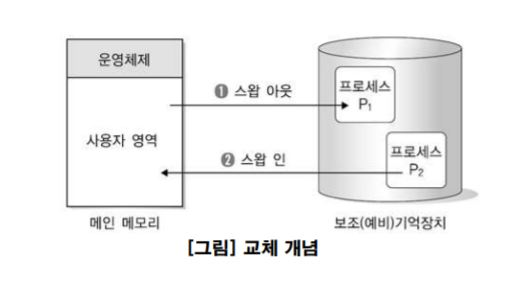

---
title: "운영체제 - 메모리 관리"
categories: technical_interview
comments: true
---

# 주기억장치 관리 전략  
## 특징  
 - 보조 기억 장치보다는 주기억장치의 액세스 시간이 적음  
 - 기억 용량이 작을수록 비트 당 기억 장치 비용이 증가  
 - 기억 장치는 각기 자신의 주소를 갖는 워드 또는 바이트들로 구성  

## 관리 전략
 - 반입(Fetch) 전략
   - 요구반입: 실행프로그램이 요구시 적재하는 방법
   - 예상반입: 앞으로 요구될 가능성이 큰 데이터 or 프로그램을 예상하여 주기억장치로 미리 옮김
 - 배치(Placement) 전략
   - 새로 반입되는 프로그램이나 데이터를 주기억장치의 어디에 위치시킬 것인지를 결정하는 전략
   - 종류  
      (1) 최초 적합: 적재 가능한 공간 중 첫 번째 공간에 배치  
      (2) 최적 적합: 적재 가능한 공간 중 단편화(남은 기억 공간)가 가장 적은 공간에 배치  
      (3) 최악 적합: 적재 가능한 공간 중 가장 큰 공간에 배치  

 - 대치 정책(교체 정책)
   - 재배치 기법으로 메인 메모리에 있는 어떤 프로세스를 제거할 것인지를 결정



## 메모리 관리 기법
### 단편화
 모든 세그먼트에 대한 적당한 기억 장소를 찾아 할당

 - 내부 단편화  
   주기억 장소에 프로세스를 할당한 다음, 할당되고 남은 공간으로는 공간이 작아서 다른 프로세스를 할당할 수 없는 경우에 발생
 - 외부 단편화  
  주기억 장소의 분할 영역보다 프로세스의 크기가 더 커서 할당 자체를 할 수 없을 경우에 발생


### 페이징 기법
 - 처리할 작업을 동일한 크기의 페이지로 나누어 처리함
 - 단순한 **내부 단편화** 현상만 생각하면 크기가 작은 페이지가 바람직함
 - 페이지 테이블 유지가 부담이 될 수 있으나, 페이지 크기를 증가시킴으로써 감소시킬 수 있음
 - 메모리를 효율적으로 사용 가능하며, 동일한 크기의 작업을 가짐

```
내부 메모리	program
30		20
30		20
30		20
30		20
```

### 세그먼트 메모리 관리 기법
 - 외부 단편화가 발생함  
 - 가변적인 데이터 구조와 모듈 처리, 공유와 보호의 자원이 편리함
 - 방지: 통합, 압축  

```
내부 메모리	program
50		50
30		30
20		20
10 남음		30 -> 못들어감   
```


