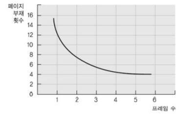
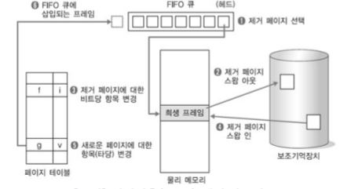
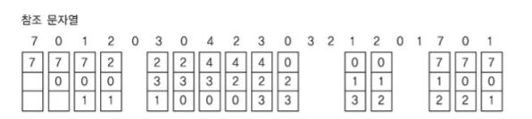
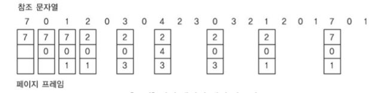
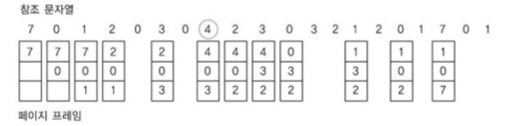
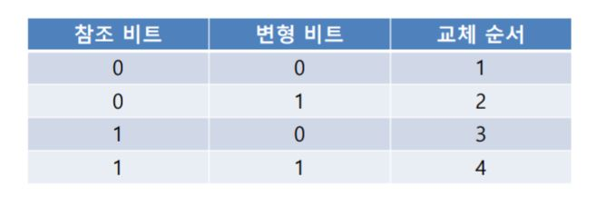

---
title: "운영체제 - 가상 메모리"
categories: technical_interview
comments: true
---

# 가상 메모리 (Virtual Memory)  
 - 보조기억장치의 일부를 주기억장치처럼 사용하는 것
 - 프로그램을 여러 개의 작은 블록 단위(보조기억장치와 주기억장치 간에 전송되는 데이터 최소단위)로 나누어서 가상기억장치에 보관해놓고, 프로그램 실행 시 요구되는 블록만 주기억장치에 불연속으로 할당
 - 구현하는 방법
   - 페이징 기법(프로그램을 동일한 크기로 나눈 단위)
   - 세그먼테이션 기법(프로그램을 가변적인 크기로 나눈 단위)

## 개념
 - 메인 메모리보다 용량이 큰 기억 공간에 주소지정이 가능한 메모리 관리 기법
 - 장점
   - 공간이 부족해도 부분 적재가 가능하여 많은 작업을 실행할 수 있어 프로세서의 이용률과 처리율 향상
 - 단점
   - 어느 시기에 어느 페이지를 적재하고 다시 복귀시킬 것인가에 대한 페이징 알고리즘의 결정
   - 페이지 부재에 대한 처리 방안 요구

## 페이지 부재(Page fault)
 - 프로그램 실행 시 참조한 페이지가 주기억장치에 없는 현상


## 페이지 대치 알고리즘
 - 프레임 수가 증가하면 페이지 부재수가 감소함



### 선입선출(FIFO, First-In-First-Out) 대치 알고리즘
 - 가장 오래된 페이지부터 우선 대치시킴



 - 예시  
 세 개의 프레임을 사용할 수 있다 가정

```
 참조문자열:7,0,1,2,0,3,0,4,2,3,0,3,2,1,2,0,1,7,0,1  
```



 페이지 부재 : 15  
 - 문제점  
   - 할당되는 프레임 수가 증가해도 페이지 부재율 증가

### 최적(Optimal) 페이지 대치 알고리즘
 - 모든 알고리즘 중 페이지 부재율이 가장 낮음
   - **앞으로 가장 오랜 기간 동안 사용하지 않을 페이지를 대치**
 
 - 예시  
 세 개의 프레임을 사용할 수 있다 가정

```
 참조문자열:7,0,1,2,0,3,0,4,2,3,0,3,2,1,2,0,1,7,0,1  
```



 페이지 부재 : 9

### 최근 최소사용 알고리즘
 - 과거의 데이터를 이용, 미래를 예측하기 위한 통계적 관념
   - 페이지 대치 시, 오랫동안 사용하지 않은 페이지를 선택
 
 - 예시  
 세 개의 프레임을 사용할 수 있다 가정

```
 참조문자열:7,0,1,2,0,3,0,4,2,3,0,3,2,1,2,0,1,7,0,1  
```



 페이지 부재 : 12

### 최소사용 빈도수 알고리즘 & 최대사용 빈도수 알고리즘
 - 최소사용: 각 페이지마다 참조 횟수에 대한 계수기가 있으며, 가장 작은 수를 가진 페이지를 대치
 - 최대사용: 앞으로 사용할 확률이 높다고 가정하여 대치 페이지 후보에서 제외시킴
 - 문제점: 성능이 떨어져서 일반적으로 사용되지 않음

### NUR(Not Used Recently) 알고리즘
 - LRU와 비슷한 알고리즘으로 최근해 사용하지 않은 페이지를 교체하는 기법
 - 참조 비트  
   페이지가 호출되지 않았을 때는 0, 호출되었을 때는 1로 지정
 - 변형 비트  
   페이지 내용이 변경되지 않았을 때는 0, 변경되었을 때는 1로 지정



## 프로세스 적재 정책
### 스레싱  
 - 페이지 교환이 계속 일어나는 현상
   - 프로세스 수행시간 < 메인메모리에 공간이 없어서 요청하는 시간
 - 해결방법  
   지역교환 알고리즘, 우선순위 교환 알고리즘
