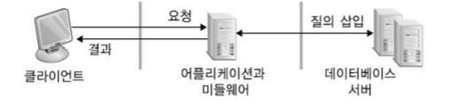

---
title: "운영체제 - 분산 및 병렬 처리 시스템"
categories: technical_interview
comments: true
---

## 네트워크 컴퓨터 구성
 - 강결합(Tightly Coupled) 시스템
   - 프로세서들이 메모리를 공유, 통신은 **공유된 메모리** 를 통해 일어남
 - 약결합(Loosely Coupled) 시스템
   - 두 개 이상의 독립된 컴퓨터 시스템이 **통신선** 을 통해 연결됨  
     분산(Distributed) 처리 시스템으로 알려짐  

## 분산 시스템
 - 네트워크로 연결된 여려 대의 컴퓨터(노드)에 하나의 프로그램이 분산, 실행되면서 하나의 프로그램처럼 움직임
 - 개발동기
   - 자원 공유
   - 연산 속도 향상
   - 신뢰성

### 분산 시스템의 투명성
 상호 연결된 컴퓨터들을 사용자가 하나의 컴퓨터 시스템으로 인식할 수 있도록 시스템의 사용자에게 분산 양상을 감추어, 
 사용자는 프로세스 사이의 통신 과정과 사용자 요청을 처리하는 프로세스, 자원의 물리적 위치를 몰라도 자원에 액세스할 수 있는 현상

 - 접근 투명성  
   서로 다른 컴퓨터 구조와 프로그램 언어들 사이의 상호 교류가 가능하도록 함  
 - 위치 투명성  
   분산 시스템에 있는 자원 위치와 각 컴퓨넌트가 상호작용하는 위치를 액세스하려는 사용자에게 감춤  
 - 고장 투명성  
   여러 자원이나 컴퓨터 오류 발생 시, 시스템의 사용자는 성능 저하 정도만을 느낄 수 있음  
 - 중복 투명성  
   시스템에 자원의 사본이 여러 개 있다는 사실을 감춤
 - 이동 투명성  
   자원을 어떤 컴퓨터에서 다른 컴퓨터로 이동하여도 그것을 의식하지 않고 사용자가 그 자원을 사용

 - 영속 투명성  
 - 자원 투명성  
 - 트랜잭션 투명성  
 - 재배치 투명성  
 - 규모 투명성  

## 네트워크 운영체제 운용방식

### Peer-to-Peer 방식
 동등하게 작동하는 LAN에 연결된 각각의 컴퓨터가 클라이언트 혹은 서버로서 상황에 따라 동작  
 파일 및 어플리케이션에 대한 중앙 저장소가 없이 분산되어 관리가 어려움  

### 클라이언트/서버 방식
 - 장점
   - 중앙 집중식 : 자원 및 데이터 보안이 서버를 통해 제어
   - 유연성 : 새로운 기술을 시스템에 쉽게 통합
   - 접근성 : 서버를 여러 플랫폼 또는 원격으로 액세스
 - 단점
   - 비용 : 전용 서버에 초기 투자가 필요
   - 의존성 : 서버가 다운되면 작업은 네트워크를 통해 중지
   - 소프트웨어 : 네트워크 운영체제 소프트웨어 필요
   - 유지 관리 : 대형 네트워크 작업을 효율적으로 동작시킬 수 있는 관리자 필요

## 미들웨어 (Middleware)
 네트워크를 통하여 클라이언트/서버 사이에서 교량적인 역할을 하고, 사용자들에게 다양한 데이터 자원을 지원하는 소프트웨어 서비스

## 클러스터
 네트워크를 통해 여러 대의 컴퓨터를 연결, 하나의 단일 컴퓨터처럼 동작하도록 제작한 컴퓨터

 - 고성능 클러스터(HPC, High-Performance Clusters)  
  대규모 연산을 계산하는 데 사용
 - 부하분산 클러스터(LBC, Load-Balancing Clusters)  
   부하 분배기(Load Balancer)가 존재  
   - 구현 방법  
     DR(Direct Routing), NAT(Network Address Translation)
   - 알고리즘  
     순환 할당(Round Robin), 최소 연결(Least-Connection) 스케줄링 사용