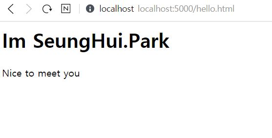

# Vue.js

## Vue.js
 vue.js는 진입장벽이 낮고 react.js 보다 쉬워서 전문적으로 frontend를 개발하는 사람 이라기보단
  Backend개발자인데 front를 알고싶은 분들이 하면 좋다!

## Firebase 서비스

### Firebase 서버 프로젝트 생성
 google서비스로 Realtime database이다. key, value 구조로 데이터를 저장, 조회할 수 있다.

[Firebase](https://console.firebase.google.com/)

프로젝트 만들기 클릭


프로젝트 이름을 작성하고 계속 버튼을 누른다


계속버튼 클릭!


Default Account for Firebase를 선택하고 프로젝트 만들기 !


### Firebase 프로젝트에 웹 앱 추가


IOS앱, 안드로이드 앱, 웹 앱 등록 버튼중 웹 클릭!


앱 닉네임은 프로젝트 이름과 같게 만들면 좋다~  
또한 이 앱의 Firebase 호스팅을 설정하세요 를 체크하고 앱 등록!

```javascript
<!-- The core Firebase JS SDK is always required and must be listed first -->
<script src="/__/firebase/7.13.1/firebase-app.js"></script>

<!-- TODO: Add SDKs for Firebase products that you want to use
     https://firebase.google.com/docs/web/setup#available-libraries -->
<script src="/__/firebase/7.13.1/firebase-analytics.js"></script>

<!-- Initialize Firebase -->
<script src="/__/firebase/init.js"></script>
```

다음 버튼 클릭

`npm install -g firebase-tools` 복사 해두고 다음 버튼 클릭후 콘솔로 이동 클릭!

### Realtime database 활성화
 Firebase 서버가 제공하는 realtime database를 활성화하자


클릭하고 데이터베이스 만들기 클릭!

테스트 모드로 시작 -> 사용설정 버튼 클릭 -> 데이터 항목 입력

```
자신의 앱닉네임: null + x   // null 작성후 +버튼 클릭 후 (값작성X)
|
--- 이름: Hello + x // Hello 작성하고 +버튼 2번 클릭 (값작성X) 
      |
      --- 이름: title    값: 승희에요
      |
      --- 이름: body   값: 반가워요!
```

하고 추가 버튼 클릭! Realtime database에 hello 항목을 생성하였다!


## Firebase CLI
 - firebase hosting 서비스
  내가 개발한 웹 앱을 firebase 서버에 설치하고 운영가능

 - firebase CLI
  firebase hosting 서비스를 사용하기 위한 명령들

 - firebase CLI 설치
  명령 프롬프트에서 `npm install -g firebase-tools` 실행하기 (vue작업을 할 폴더에서 실행해야됨)

혹시 실행이 안된다면 node.js가 없지않나유?  
얼른 설치하구 오슈~!  
node.js 설치방법은 구글검색ㄱㄱㅆ~

 - 설치 검증
 `firebase --version`


 - firebase login

 `firebase --interactive login` -> Y -> 구글로그인 -> 액세스 허용 -> 로그인 성공

로그인이 성공되었으면 프로젝트 목록을 확인해보자!  
혹시몰라서 project number는 가렸는데 원래는 숫자들이 있다~~


연결까지는 성공!

## 소스코드 프로젝트 생성
 vue.js 를 실행해 보기위한 프로젝트를 생성하자~~

### 프로젝트 디렉터리 생성

적당한 디렉터리에서 cmd창을 키자!

나같은 경우에는 c:/PJ/vue/내 앱닉네임 에 만들었다

### 프로젝트 설정 파일(package.json) 생성

그 폴더로 가서 다시 cmd창을 켜보자~ 아니면 아까 cmd창에서 cd 내앱닉네임(만든폴더) 치면 바로 갈 수 있다!

`npm init -yes` 명령을 실행해서  package.json 파일을 생성하자! (javascript, node.js 프로젝트 설정파일)

### eslint 설정 파일 생성
 이 파일은 javascript 소스 코드의 오류를 찾아준다~ 그래서 꼭 설치해야됨!  
 그리고 이 명령어는 visual studio code를 열고 프로젝트 폴더를 또 열고 터미널 창에서 실행해야된다!  
 `eslint --init` 

혹시 오류가 난다면 <https://leleluv1122.github.io/error/vue-error1/> 내가 오류난 것 중에 있을 수도 있으니까..^^; ㄱㄱ


`eslint --init` -> `To check syntax and find problems` -> `JavaScript modules (import/export)` ->
`Vue.js` -> `N` -> `Browser` -> `JSON` -> `Y`

위의 명령으로 .eslintrc.json 파일이 생성된다~ 추가로 javascript 모듈들이 프로젝트 폴더 아래로 다운로드 된다!


## Firebase 설정 파일 생성
 firebase 서비스를 이용할 수 있으려면 설정 파일이 있어야된다~

계속 이어서 visual studio code 에서 명령을 실행해보자!

`firebase init` -> `Y` -> `Hosting: ~~~` -> `Use an existing project` -> `내 서버이름` -> 엔터(입력X) -> 엔터(입력X) -> `N`  하면 완료 된다

완료 되면 `public/404.html` , `public/index.html` , `firebase.json` , `.firebaserc` , `.gitignore` 이 자동생성되었다

**드 디 어 설 정 끝 !**

## hello.html 생성
 - public/hello.html 

```html
<html>
    <head>
        <meta charset="utf-8" />
        <script src="https://cdn.jsdelivr.net/npm/vue/dist/vue.js"></script>
        <!-- vue.js엔진에 해당하는 javascript 파일에 대한 링크 -->
    </head>
    <body>
        <div id="app">
            <h1>{{ title }}</h1> <!-- title의 속성값 -->
            <p>{{ body }}</p> <!-- body의 속성값 -->
        </div>
        <script>
	// vue 앱에 해당하는 객체
            var app = new Vue({ // Vue객체를 생성하여 전역변수 app에 대입
                el: '#app', // 실행될 태그의 id를 지정
                data: { // 앱의 속성을 선언한 코드 
                    title: 'Im SeungHui.Park',
                    body: 'Nice to meet you'
                }
            })
        </script>
    </body>
</html>
```

자 이제 실행하고 싶으면 터미널로 가서 `firebase serve --only hosting` 명령을 치자

기다리면 `localhost:5000` 으로 실행되었다

`http://localhost:5000/hello.html` 을 브라우저에서 열어보자



아주 잘 된다.....!! 이제 firebase의 realtime database에 설정해두었던 title, body로 출력해보러 가자

```html
<html>
<head>
    <meta charset="utf-8" />
    <script src="https://cdn.jsdelivr.net/npm/vue/dist/vue.js"></script>
    <script defer src="/__/firebase/7.13.1/firebase-app.js"></script>
    <script defer src="/__/firebase/7.13.1/firebase-database.js"></script>
    <script defer src="/__/firebase/init.js"></script>
    <!-- firebase 서비스를 실행하기 위해 필요한 파일들 링크 -->
    <!-- defer은 웹 브라우저가 다 실행된 후 다운로드 되서 웹페이지가 좀 더 빨리 화면에 나타난다 -->
</head>
<body>
    <div id="app">
        <h1>{{ title }}</h1>
        <p>{{ body }}</p>
    </div>
    <script>
        var app = new Vue({
            el: '#app',
            data: {
                title: 'Im SeungHui.Park',
                body: 'Nice to meet you'
            }
        })
        window.onload = function () { // callback함수를 등록하기 위한 속성이다.
	// helloRef에 firebase 데이터베이스의 hello항목을 대입한다.
            let helloRef = firebase.database().ref("hello");
	
	// 원격으로 참조된 객체가 참조하는 db항목값이 변경되자마자 (snapshot) => {} 이 실행된다
            helloRef.on('value', (snapshot) => { 
                let hello = snapshot.val(); // hello에 전달된 db항목 값을 대입
                app.title = hello.title; // db의 title속성값을 앱의 title에 대입
                app.body = hello.body;
            });
        };
    </script>
</body>
</html>
```


## 서버에 설치

터미널에서 `firebase deploy` 명령을 실행하자

완료되면 Hosting URL: ~~~ 이 뜰것이다

hosting URL에 /hello.html 까지 입력해서 브라우저에서 실행해보면 잘 나온다!