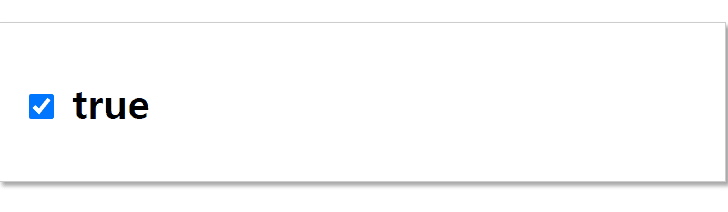
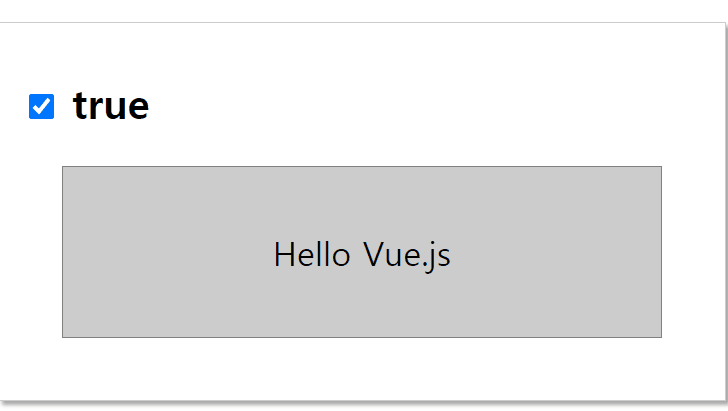

---
title: "Vue 기초 속성(toggle&v-show, v-if)"
categories: vue
comments: true
---

# Vue.js 기초
 
## toggle & v-show

```html
<body>
    <div id="app">
        <h1>
	<!-- 체크박스의 상태와 앱이 visible 속성을 연결 -->
            <input type="checkbox" v-model="visible" />
            {{ visible }}
        </h1>
    </div>
    <script type="text/javascript">
        var app = new Vue({
            el: '#app',
            data: {
                visible: true // 초기값: true
            }
        })
    </script>
</body>
```



```html
<body>
    <div id="app">
        <h1>
            <input type="checkbox" v-model="visible" />
            {{ visible }}
        </h1>
        <!-- visible이 true이면 show됨 -->
        <div id="hello" v-show="visible">Hello Vue.js</div>
    </div>
    <script type="text/javascript">
        var app = new Vue({
            el: '#app',
            data: {
                visible: true
            }
        })
    </script>
</body>
```



## v-if

```html
<body>
    <div id="app">
        <h1>
            <input type="checkbox" v-model="visible" />
            visible: {{ visible }}
        </h1>
        <!-- **v-if** 는 false일때 아얘 존재하지 않는상태로 바꿔줌-->
        <div id="hello" v-if="visible">Hello Vue.js</div>
    </div>
    <script type="text/javascript">
        var app = new Vue({
            el: '#app',
            data: {
                visible: true
            }
        })
    </script>
</body>
```

실행은 위와 같다 하지만 v-if는 저 <div id="hello">를 아얘 존재하지 않는 상태로 만들어줌  

